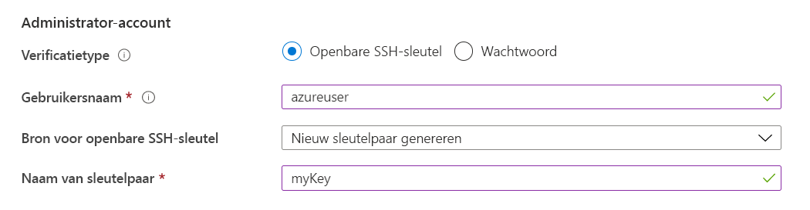

# <a name="quickstart-create-a-linux-virtual-machine-in-the-azure-portal"></a>Snelstart: Een virtuele Linux-machine maken op de Azure Portal

Virtuele Azure-machines (VM's)kunnen worden gemaakt via Azure Portal. De Azure-portal is een browsergebaseerde gebruikersinterface om Azure-bronnen te maken. Deze quickstart laat zien hoe u de Azure-portal gebruiken om een Virtuele Linux-machine (VM) met Ubuntu 18.04 LTS te implementeren. Wanner u uw virtuele machine in actie wilt zien, voert u ook SSH voor de virtuele machine uit en installeert u de NGINX-webserver.

Als u geen Azure-abonnement hebt, maakt u een [gratis account](https://azure.microsoft.com/free/?WT.mc_id=A261C142F) voordat u begint.

## <a name="create-ssh-key-pair"></a>Een SSH-sleutelpaar maken

U hebt een SSH-sleutelpaar nodig om deze snelstart te volgen. Als u al een SSH-sleutelpaar hebt, kunt u deze stap overslaan.

Open een bash-shell en gebruik [ssh-keygen](https://www.ssh.com/ssh/keygen/) om een SSH-sleutelpaar te maken. Als u geen een bash-shell op uw lokale computer hebt, kunt u de [Azure Cloud Shell](https://shell.azure.com/bash) gebruiken.


1. Meld u aan bij de [Azure-portal](https://portal.azure.com).
1. Selecteer in het menu boven aan `>_` de pagina het pictogram om Cloud Shell te openen.
1. Zorg ervoor dat de CloudShell **zegt Bash** in de linkerbovenhoek. Als er PowerShell in staat, gebruikt u de vervolgkeuzelijst om **Bash** te selecteren en selecteert **u Bevestigen** om te wijzigen in de Bash-shell.
1. Typ `ssh-keygen -t rsa -b 2048` om de ssh-toets te maken. 
1. U wordt gevraagd een bestand in te voeren waarin u het sleutelpaar opslaan. Druk op **Enter** om op te slaan op de standaardlocatie, die tussen haakjes wordt weergegeven. 
1. U wordt gevraagd om een wachtwoordzin in te voeren. U een wachtwoordzin typen voor uw SSH-toets of op **Enter drukken** om verder te gaan zonder een wachtwoordzin.
1. De `ssh-keygen` opdracht genereert openbare en privésleutels `id_rsa` met `~/.ssh directory`de standaardnaam van in de . Met de opdracht wordt het volledige pad naar de openbare sleutel geretourneerd. Gebruik het pad naar de openbare `cat` sleutel `cat ~/.ssh/id_rsa.pub`om de inhoud ervan weer te geven door te typen .
1. Kopieer de uitvoer van deze opdracht en sla deze ergens op om later in dit artikel te gebruiken. Dit is uw openbare sleutel en u hebt deze nodig bij het configureren van uw beheerdersaccount om u aan te melden bij uw VM.

## <a name="sign-in-to-azure"></a>Aanmelden bij Azure

Meld u aan bij de [Azure-portal](https://portal.azure.com) als u dat nog niet hebt gedaan.

## <a name="create-virtual-machine"></a>Virtuele machine maken

1. Typ **virtuele machines** in de zoekopdracht.
1. Selecteer **onder Services**virtuele **machines**.
1. Selecteer op de pagina **Virtuele machines** de optie **Toevoegen**. De pagina **Een virtuele machine maken** wordt geopend.
1. Zorg ervoor dat op het tabblad **Basics** onder **Projectgegevens** het juiste abonnement is geselecteerd, en kies **Nieuwe maken** om een nieuwe resourcegroep te maken. Typ *myResourceGroup* voor de naam.*. 

    

1. Typ **onder Instantie details** *myVM* voor de naam van de virtuele **machine,** kies *Oost-VS* voor uw **regio**en kies *Ubuntu 18.04 LTS* voor uw **afbeelding**. Houd voor de rest de standaardinstellingen aan.

    

1. Selecteer **onder Administrator-account** **de optie SSH-openbare sleutel,** typ uw gebruikersnaam en plak vervolgens in uw openbare sleutel. Verwijder eventuele voorloop- en volgspaties van uw openbare sleutel.

    

1. Kies **geselecteerde poorten toestaan** en selecteer Vervolgens **SSH (22)** en **HTTP (80)** in de vervolgkeuzelijst **onder Binnenkomende poortregels.** > **Public inbound ports** 

    

1. Laat de resterende standaardwaarden staan ​​en selecteer vervolgens de knop **Beoordelen en maken** aan de onderkant van de pagina.

1. Op de pagina **Een virtuele machine maken** ziet u de details van de virtuele machine die u gaat maken. Wanneer u klaar bent, selecteert u **Maken**.

Het duurt een paar minuten voor uw virtuele machine is geïmplementeerd. Wanneer de implementatie is voltooid, gaat u verder naar de volgende sectie.

    
## <a name="connect-to-virtual-machine"></a>Verbinding maken met de virtuele machine

Maak een SSH-verbinding met de VM.

1. Selecteer de knop **Verbinden** op de overzichtspagina van uw VM. 

    

2. Laat op de pagina **Verbinding maken met virtuele machine** de standaardopties staan om verbinding te maken met een IP-adres via poort 22. In **Aanmelden met lokaal VM-account** wordt een verbindingsopdracht weergegeven. Selecteer de knop om de opdracht te kopiëren. Het volgende voorbeeld laat zien hoe de SSH-verbindingsopdracht eruitziet:

    ```bash
    ssh azureuser@10.111.12.123
    ```

3. Met behulp van dezelfde bash shell die u gebruikt om uw SSH-sleutelpaar te maken (u de Cloud Shell opnieuw openen door opnieuw te selecteren `>_` of naar), `https://shell.azure.com/bash`plak de SSH-verbinding opdracht in de shell om een SSH-sessie te maken.

## <a name="install-web-server"></a>Webserver installeren

Als u uw VM in actie wilt zien, installeert u de NGINX-webserver. Werk vanuit uw SSH-sessie de pakketbronnen bij en installeer het meest recente NGINX-pakket.

```bash
sudo apt-get -y update
sudo apt-get -y install nginx
```

Wanneer u klaar bent, typt u `exit` om de SSH-sessie te verlaten.


## <a name="view-the-web-server-in-action"></a>De webserver in actie zien

Gebruik een webbrowser naar keuze om de standaard NGINX-welkomstpagina weer te geven. Typ het openbare IP-adres van de virtuele machine als webadres. Het openbare IP-adres kan worden gevonden op de overzichtspagina van de virtuele machine of als onderdeel van de SSH-verbindingsreeks die u eerder hebt gebruikt.


## <a name="clean-up-resources"></a>Resources opschonen

Wanneer u de VM niet meer nodig hebt, kunt u de resourcegroep, de machine zelf én alle gerelateerde resources verwijderen. Wanneer u dit wilt doen, selecteert u de resourcegroep voor de virtuele machine en selecteert u **Verwijderen**. Vervolgens bevestigt u de naam van de resourcegroep die u wilt verwijderen.

## <a name="next-steps"></a>Volgende stappen

In deze snelstart hebt u een eenvoudige virtuele machine geïmplementeerd, een netwerkbeveiligingsgroep en -regel gemaakt en een eenvoudige webserver geïnstalleerd. Voor meer informatie over virtuele machines in Azure, gaat u verder met de zelfstudie voor virtuele Linux-machines.

> [!div class="nextstepaction"]
> [Zelfstudies over virtuele Linux-machines](./tutorial-manage-vm.md)
