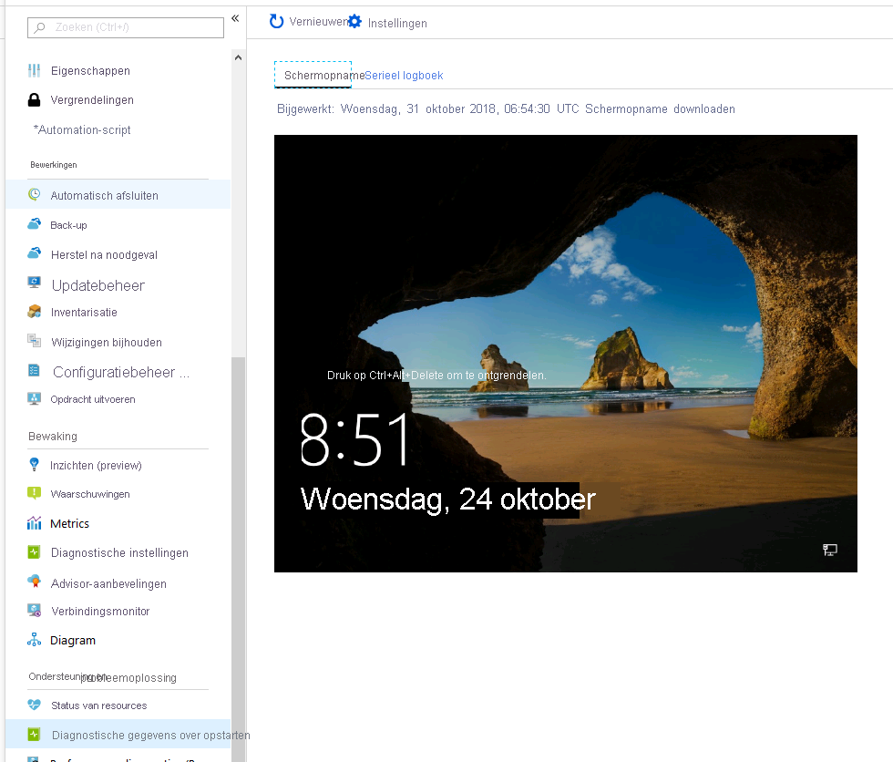
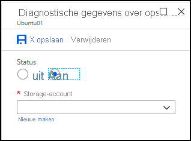

# <a name="how-to-use-boot-diagnostics-to-troubleshoot-virtual-machines-in-azure"></a>Diagnostische gegevens over opstarten gebruiken om problemen met virtuele machines in azure op te lossen

Er kunnen verschillende redenen zijn waarom een virtuele machine een niet-opstart bare status krijgt. Als u problemen wilt oplossen met uw virtuele machines die zijn gemaakt met het Resource Manager-implementatie model, kunt u de volgende functies voor fout opsporing gebruiken: console-uitvoer en scherm afbeeldingen-ondersteuning voor virtuele machines van Azure. 

Voor virtuele Linux-machines kunt u de uitvoer van uw console logboek vanuit de portal bekijken. Voor virtuele Windows-en Linux-machines kunt u met Azure een scherm opname van de virtuele machine in de Hyper Visor bekijken. Beide functies worden ondersteund voor virtuele Azure-machines in alle regio's. Houd er rekening mee dat scherm afbeeldingen en uitvoer Maxi maal tien minuten in uw opslag account kunnen worden weer gegeven.

U kunt de optie **Diagnostische gegevens over opstarten** selecteren om het logboek en de scherm opname weer te geven.



## <a name="common-boot-errors"></a>Veelvoorkomende opstartfouten

- [0xC000000E](https://support.microsoft.com/help/4010129)
- [0xC000000F](https://support.microsoft.com/help/4010130)
- [0xC0000011](https://support.microsoft.com/help/4010134)
- [0xC0000034](https://support.microsoft.com/help/4010140)
- [0xC0000098](https://support.microsoft.com/help/4010137)
- [0xC00000BA](https://support.microsoft.com/help/4010136)
- [0xC000014C](https://support.microsoft.com/help/4010141)
- [0xC0000221](https://support.microsoft.com/help/4010132)
- [0xC0000225](https://support.microsoft.com/help/4010138)
- [0xC0000359](https://support.microsoft.com/help/4010135)
- [0xC0000605](https://support.microsoft.com/help/4010131)
- [Er is geen besturingssysteem gevonden](https://support.microsoft.com/help/4010142)
- [Opstartfout of OPSTARTAPPARAAT_NIET_TOEGANKELIJK](https://support.microsoft.com/help/4010143)

## <a name="enable-diagnostics-on-a-virtual-machine-created-using-the-azure-portal"></a>Diagnostische gegevens inschakelen op een virtuele machine die is gemaakt met behulp van Azure Portal

De volgende procedure is voor een virtuele machine die is gemaakt met het Resource Manager-implementatie model.

Controleer op het tabblad **beheer** in het gedeelte **bewaking** of **Diagnostische gegevens over opstarten** zijn ingeschakeld. Selecteer in de vervolg keuzelijst **Diagnostische opslag account** een opslag account waarin u de diagnostische bestanden wilt plaatsen.
 


> [!NOTE]
> De functie diagnostische gegevens over opstarten biedt geen ondersteuning voor het Premium Storage-account. Als u het Premium-opslag account gebruikt voor diagnostische gegevens over opstarten, kan de StorageAccountTypeNotSupported-fout worden weer gegeven wanneer u de virtuele machine start.
>

### <a name="deploying-from-an-azure-resource-manager-template"></a>Implementeren vanuit een Azure Resource Manager sjabloon

Als u vanuit een Azure Resource Manager-sjabloon implementeert, navigeert u naar de resource van de virtuele machine en voegt u de sectie diagnostische profiel toe. Stel de API-versie header in op ' 2015-06-15 ' of hoger. De nieuwste versie is 2018-10-01.

```json
{
  "apiVersion": "2018-10-01",
  "type": "Microsoft.Compute/virtualMachines",
  … 
```

Met het diagnostische profiel kunt u het opslagaccount selecteren waarin u deze logboeken wilt opslaan.

```json
    "diagnosticsProfile": {
    "bootDiagnostics": {
    "enabled": true,
    "storageUri": "[concat('https://', parameters('newStorageAccountName'), '.blob.core.windows.net')]"
    }
    }
    }
}
```

Voor meer informatie over het implementeren van resources met behulp van sjablonen raadpleegt u [Quick Start: Azure Resource Manager sjablonen maken en implementeren met behulp van de Azure Portal](../../azure-resource-manager/templates/quickstart-create-templates-use-the-portal.md).

## <a name="enable-boot-diagnostics-on-existing-virtual-machine"></a>Diagnostische gegevens over opstarten op bestaande virtuele machine inschakelen 

Voer de volgende stappen uit om diagnostische gegevens over opstarten op een bestaande virtuele machine in te scha kelen:

1. Meld u aan bij de [Azure Portal](https://portal.azure.com)en selecteer vervolgens de virtuele machine.
2. Selecteer in de sectie **ondersteuning en probleem oplossing** de optie **Diagnostische gegevens over opstarten**en selecteer vervolgens het tabblad **instellingen** .
3. In de instellingen voor **Diagnostische gegevens over opstarten** wijzigt u de status in **op**aan en selecteert u in de vervolg keuzelijst **opslag account** een opslag account. 
4. Sla de wijziging op.

    

### <a name="enable-boot-diagnostics-using-the-azure-cli"></a>Diagnostische gegevens over opstarten inschakelen met behulp van Azure CLI

U kunt de Azure CLI gebruiken om diagnostische gegevens over opstarten in te scha kelen op een bestaande virtuele machine van Azure. Zie [AZ VM boot-Diagnostics](/cli/azure/vm/boot-diagnostics?view=azure-cli-latest)(Engelstalig) voor meer informatie.
