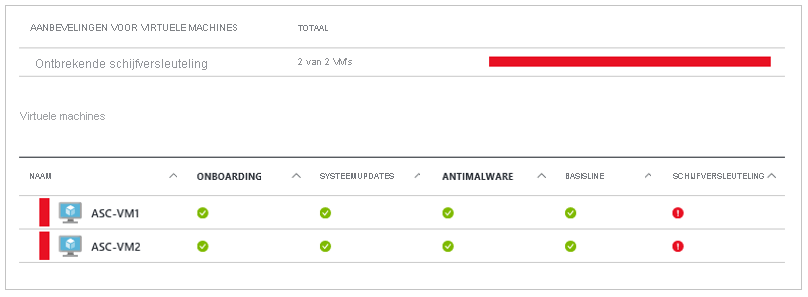

# Azure Disk Encryption voor Windows-Vm's 

Azure Disk Encryption helpt om uw gegevens te beschermen en te beveiligen, zodat u aan de beveiligings- en nalevingsafspraken van uw organisatie voldoet. De [BitLocker](https://en.wikipedia.org/wiki/BitLocker) -functie van Windows wordt gebruikt voor volume versleuteling voor het besturings systeem en de gegevens schijven van virtuele Azure-machines (vm's), en is geïntegreerd met [Azure Key Vault](../../key-vault/index.yml) om u te helpen de coderings sleutels en geheimen van de schijf te beheren en te controleren. 

Als u [Azure Security Center](../../security-center/index.yml)gebruikt, wordt u gewaarschuwd als u virtuele machines hebt die niet zijn versleuteld. De waarschuwingen worden weer gegeven als hoge ernst en de aanbeveling is om deze Vm's te versleutelen.

> [!WARNING]
> - Als u eerder Azure Disk Encryption met Azure AD hebt gebruikt om een virtuele machine te versleutelen, moet u deze optie blijven gebruiken om uw virtuele machine te versleutelen. Zie [Azure Disk Encryption met Azure AD (vorige versie)](disk-encryption-overview-aad.md) voor meer informatie. 
> - Bepaalde aanbevelingen kunnen leiden tot meer gegevens, het netwerk of het gebruik van reken bronnen, wat leidt tot extra licentie-of abonnements kosten. U moet een geldig actief Azure-abonnement hebben om resources te maken in Azure in de ondersteunde regio's.

Meer informatie over de basis principes van Azure Disk Encryption voor Windows in slechts enkele minuten kunt u het beste een [Windows-VM maken en versleutelen met Azure cli Quick](disk-encryption-cli-quickstart.md) start of [een Windows-VM maken en versleutelen met Azure Power shell Quick](disk-encryption-powershell-quickstart.md)start.

## Ondersteunde Vm's en besturings systemen

### Ondersteunde Vm's

Virtuele Windows-machines zijn beschikbaar in [verschillende grootten](sizes-general.md). Azure Disk Encryption is niet beschikbaar op [de Basic-, a-Series vm's](https://azure.microsoft.com/pricing/details/virtual-machines/series/)of op virtuele machines met minder dan 2 GB geheugen.

Azure Disk Encryption is ook beschikbaar voor virtuele machines met Premium Storage.

Azure Disk Encryption is niet beschikbaar op [virtuele machines van de tweede generatie](generation-2.md#generation-1-vs-generation-2-capabilities)) en vm's uit de [Lsv2-serie](../lsv2-series.md). Zie [Azure Disk Encryption: niet-ondersteunde scenario's](disk-encryption-windows.md#unsupported-scenarios)voor meer uitzonde ringen.

### Ondersteunde besturingssystemen

- Windows-client: Windows 8 en hoger.
- Windows Server: Windows Server 2008 R2 of hoger.  
 
> [!NOTE]
> Voor Windows Server 2008 R2 moet .NET Framework 4,5 zijn geïnstalleerd voor versleuteling. Installeer het van Windows Update met de optionele update Microsoft .NET Framework 4.5.2 voor Windows Server 2008 R2 x64-systemen ([KB2901983](https://www.catalog.update.microsoft.com/Search.aspx?q=KB2901983)).  
>  
> Windows Server 2012 R2 core en Windows Server 2016 core vereist dat het onderdeel bdehdcfg op de virtuele machine wordt geïnstalleerd voor versleuteling.

## Netwerk vereisten
Om Azure Disk Encryption in te scha kelen, moeten de virtuele machines voldoen aan de volgende vereisten voor netwerk eindpunt configuratie:
  - Om een token te krijgen om verbinding te maken met uw sleutel kluis, moet de Windows-VM verbinding kunnen maken met een \[Azure Active Directory\]-eind punt, login.microsoftonline.com.
  - Voor het schrijven van de versleutelings sleutels naar uw sleutel kluis moet de Windows-VM verbinding kunnen maken met het eind punt van de sleutel kluis.
  - De Windows-VM moet verbinding kunnen maken met een Azure Storage-eind punt dat als host fungeert voor de Azure extension-opslag plaats en een Azure-opslag account dat als host fungeert voor de VHD-bestanden.
  -  Als uw beveiligings beleid de toegang tot het Internet beperkt met Azure-Vm's, kunt u de voor gaande URI omzetten en een specifieke regel configureren om uitgaande connectiviteit met de IP-adressen toe te staan. Zie [Azure Key Vault achter een firewall](../../key-vault/general/access-behind-firewall.md)voor meer informatie.    

## groepsbeleid vereisten

Azure Disk Encryption gebruikt de externe BitLocker-sleutel beveiliging voor Windows-Vm's. Voor virtuele machines die zijn toegevoegd aan een domein, moet u geen groeps beleid pushen waarmee TPM-beveiligingen worden afgedwongen. Zie [referentie voor BitLocker-Groepsbeleid](/windows/security/information-protection/bitlocker/bitlocker-group-policy-settings#bkmk-unlockpol1)voor informatie over het groeps beleid voor het toestaan van BitLocker zonder compatibele TPM.

Het BitLocker-beleid voor virtuele machines die lid zijn van een domein met aangepast groeps beleid moet de volgende instelling hebben: [gebruikers opslag configureren voor BitLocker-herstel gegevens-> herstel sleutel van 256-bits toestaan](/windows/security/information-protection/bitlocker/bitlocker-group-policy-settings). Azure Disk Encryption mislukt wanneer aangepaste groeps beleids instellingen voor BitLocker incompatibel zijn. Op computers die niet over de juiste beleids instelling beschikken, past u het nieuwe beleid toe, dwingt u het nieuwe beleid af om bij te werken (GPUpdate. exe/Force), en vervolgens moet u de computer mogelijk opnieuw opstarten.

Azure Disk Encryption mislukt als groeps beleid op domein niveau het AES-CBC-algoritme blokkeert dat door BitLocker wordt gebruikt.

## Opslag vereisten voor de versleutelings sleutel  

Voor Azure Disk Encryption is een Azure Key Vault vereist om sleutels en geheimen voor schijf versleuteling te beheren en te beheren. Uw sleutel kluis en Vm's moeten zich in dezelfde Azure-regio en hetzelfde abonnement bevinden.

Zie [een sleutel kluis maken en configureren voor Azure Disk Encryption](disk-encryption-key-vault.md)voor meer informatie.

## Terminologie
In de volgende tabel worden enkele algemene termen gedefinieerd die worden gebruikt in azure Disk Encryption Documentation:

| Terminologie | Definitie |
| --- | --- |
| Azure Key Vault | Key Vault is een cryptografische service voor sleutel beheer die is gebaseerd op FIPS (Federal Information Processing Standards) gevalideerde hardware security modules. Deze standaarden helpen u bij het beveiligen van uw cryptografische sleutels en gevoelige geheimen. Zie voor meer informatie de [Azure Key Vault](https://azure.microsoft.com/services/key-vault/) -documentatie en het [maken en configureren van een sleutel kluis voor Azure Disk Encryption](disk-encryption-key-vault.md). |
| Azure CLI | [De Azure cli](/cli/azure/install-azure-cli) is geoptimaliseerd voor het beheren en beheren van Azure-resources vanaf de opdracht regel.|
| BitLocker |[BitLocker](https://technet.microsoft.com/library/hh831713.aspx) is een door de branche herkende Windows-coderings technologie die wordt gebruikt om schijf versleuteling in te scha kelen op Windows-vm's. |
| Sleutel versleutelings sleutel (KEK) | De asymmetrische sleutel (RSA 2048) die u kunt gebruiken om het geheim te beveiligen of in te pakken. U kunt een door HSM (Hardware Security module) beveiligde of met software beschermde sleutel opgeven. Zie voor meer informatie de [Azure Key Vault](https://azure.microsoft.com/services/key-vault/) -documentatie en het [maken en configureren van een sleutel kluis voor Azure Disk Encryption](disk-encryption-key-vault.md). |
| PowerShell-cmdlets | Zie [Azure PowerShell-cmdlets](/powershell/azure/overview)voor meer informatie. |

## Volgende stappen

- [Quick Start: een Windows-VM maken en versleutelen met Azure CLI](disk-encryption-cli-quickstart.md)
- [Quick Start: een Windows-VM maken en versleutelen met Azure Power shell](disk-encryption-powershell-quickstart.md)
- [Azure Disk Encryption-scenario's voor Windows-VM's](disk-encryption-windows.md)
- [SysteemAzure Disk Encryption vereisten CLI-script](https://github.com/ejarvi/ade-cli-getting-started)
- [Azure Disk Encryption van vereisten Power shell-script](https://github.com/Azure/azure-powershell/tree/master/src/Compute/Compute/Extension/AzureDiskEncryption/Scripts)
- [Een sleutelkluis voor Azure Disk Encryption maken en configureren](disk-encryption-key-vault.md)

