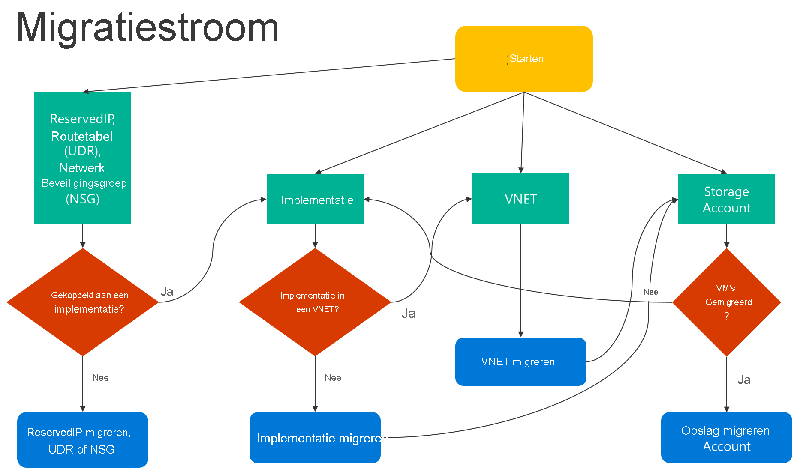

# <a name="migrate-iaas-resources-from-classic-to-azure-resource-manager-by-using-powershell"></a>IaaS-resources van klassiek naar Azure Resource Manager migreren met behulp van Power shell
In deze stappen ziet u hoe u Azure PowerShell-opdrachten kunt gebruiken om IaaS-resources (Infrastructure as a Service) te migreren van het klassieke implementatie model naar het Azure Resource Manager-implementatie model.

Als u wilt, kunt u ook resources migreren met behulp van de [Azure cli](../linux/migration-classic-resource-manager-cli.md).

* Zie [door het platform ondersteunde migratie van IaaS-resources van klassiek naar Azure Resource Manager](migration-classic-resource-manager-overview.md)voor achtergrond informatie over ondersteunde migratie scenario's.
* Voor gedetailleerde richt lijnen en een migratie procedure raadpleegt [u technisch diep gaande over de door het platform ondersteunde migratie van klassiek naar Azure Resource Manager](migration-classic-resource-manager-deep-dive.md).
* [Bekijk de meest voorkomende migratie fouten](migration-classic-resource-manager-errors.md).

<br>
Hier volgt een stroom diagram om de volg orde te bepalen waarin de stappen moeten worden uitgevoerd tijdens een migratie proces.



 

## <a name="step-1-plan-for-migration"></a>Stap 1: plan voor migratie
Hier volgen enkele aanbevolen procedures voor het bepalen van de migratie van IaaS-resources van klassiek naar Resource Manager:

* Lees de [ondersteunde en niet-ondersteunde functies en configuraties](migration-classic-resource-manager-overview.md). Als u virtuele machines hebt die niet-ondersteunde configuraties of functies gebruiken, wacht u totdat de ondersteuning van de configuratie of functie wordt aangekondigd. U kunt ook, als deze aan uw behoeften voldoet, deze functie verwijderen of de configuratie verplaatsen om de migratie mogelijk te maken.
* Als u geautomatiseerde scripts hebt waarmee u vandaag nog uw infra structuur en toepassingen implementeert, kunt u een vergelijk bare test configuratie maken met behulp van deze scripts voor migratie. U kunt ook voorbeeld omgevingen instellen met behulp van de Azure Portal.

> [!IMPORTANT]
> Toepassings gateways worden momenteel niet ondersteund voor migratie van klassiek naar Resource Manager. Als u een virtueel netwerk met een toepassings gateway wilt migreren, verwijdert u de gateway voordat u een voorbereidings bewerking uitvoert om het netwerk te verplaatsen. Nadat u de migratie hebt voltooid, maakt u opnieuw verbinding met de gateway in Azure Resource Manager.
>
> Azure ExpressRoute-gateways die verbinding maken met ExpressRoute-circuits in een ander abonnement, kunnen niet automatisch worden gemigreerd. In dergelijke gevallen verwijdert u de ExpressRoute-gateway, migreert u het virtuele netwerk en maakt u de gateway opnieuw. Zie [ExpressRoute-circuits en gekoppelde virtuele netwerken van het klassieke naar het Resource Manager-implementatie model migreren](../../expressroute/expressroute-migration-classic-resource-manager.md)voor meer informatie.

## <a name="step-2-install-the-latest-version-of-powershell"></a>Stap 2: de nieuwste versie van Power Shell installeren
Er zijn twee belang rijke opties voor het installeren van Azure PowerShell: [PowerShell Gallery](https://www.powershellgallery.com/profiles/azure-sdk/) of [Web platform Installer (WebPI)](https://aka.ms/webpi-azps). WebPI ontvangt maandelijkse updates. PowerShell Gallery updates doorlopend worden ontvangen. Dit artikel is gebaseerd op Azure PowerShell versie 2.1.0.

Zie [Azure PowerShell installeren en configureren](/powershell/azure/overview)voor installatie-instructies.

<br>

## <a name="step-3-ensure-that-youre-an-administrator-for-the-subscription"></a>Stap 3: Zorg ervoor dat u een beheerder bent voor het abonnement
Als u deze migratie wilt uitvoeren, moet u worden toegevoegd als een cobeheerder voor het abonnement in de [Azure Portal](https://portal.azure.com).

1. Meld u aan bij de [Azure-portal](https://portal.azure.com).
2. Selecteer in het menu **hub** de optie **abonnement**. Als u deze niet ziet, selecteert u **alle services**.
3. Zoek de juiste abonnements vermelding en Bekijk het veld **mijn rol** . Voor een cobeheerder moet de waarde _account beheerder_zijn.

Als u geen cobeheerder kunt toevoegen, neemt u contact op met een service beheerder of cobeheerder voor het abonnement om uzelf toe te voegen.

## <a name="step-4-set-your-subscription-and-sign-up-for-migration"></a>Stap 4: uw abonnement instellen en u registreren voor migratie
Start eerst een Power shell-prompt. Stel uw omgeving in voor de klassieke en Resource Manager voor migratie.

Meld u aan bij uw account voor het Resource Manager-model.

```powershell
    Connect-AzAccount
```

Haal de beschik bare abonnementen op met behulp van de volgende opdracht:

```powershell
    Get-AzSubscription | Sort Name | Select Name
```

Stel uw Azure-abonnement in voor de huidige sessie. In dit voor beeld wordt de standaard naam van het abonnement ingesteld op **mijn Azure-abonnement**. Vervang de naam van het voor beeld-abonnement door uw eigen.

```powershell
    Select-AzSubscription –SubscriptionName "My Azure Subscription"
```

> [!NOTE]
> Registratie is een eenmalige stap, maar u moet het eenmaal doen voordat u de migratie uitvoert. Zonder te registreren, wordt het volgende fout bericht weer gegeven:
>
> *Onjuiste aanvraag: het abonnement is niet geregistreerd voor migratie.*

Meld u bij de resource provider voor migratie aan met de volgende opdracht:

```powershell
    Register-AzResourceProvider -ProviderNamespace Microsoft.ClassicInfrastructureMigrate
```

Wacht vijf minuten totdat de registratie is voltooid. Controleer de status van de goed keuring met behulp van de volgende opdracht:

```powershell
    Get-AzResourceProvider -ProviderNamespace Microsoft.ClassicInfrastructureMigrate
```

Zorg ervoor dat RegistrationState is `Registered` voordat u doorgaat.

Meld u nu aan bij uw account voor het klassieke implementatie model.

```powershell
    Add-AzureAccount
```

Haal de beschik bare abonnementen op met behulp van de volgende opdracht:

```powershell
    Get-AzureSubscription | Sort SubscriptionName | Select SubscriptionName
```

Stel uw Azure-abonnement in voor de huidige sessie. In dit voor beeld wordt het standaard abonnement ingesteld op **mijn Azure-abonnement**. Vervang de naam van het voor beeld-abonnement door uw eigen.

```powershell
    Select-AzureSubscription –SubscriptionName "My Azure Subscription"
```

<br>

## <a name="step-5-have-enough-resource-manager-vm-vcpus"></a>Stap 5: voldoende Resource Manager VM-Vcpu's
Zorg ervoor dat u voldoende Azure Resource Manager virtuele-Vcpu's in de Azure-regio van uw huidige implementatie of virtueel netwerk hebt. U kunt de volgende Power shell-opdracht gebruiken om het huidige aantal Vcpu's te controleren dat zich in Azure Resource Manager bevindt. Zie [limieten en de Azure Resource Manager](../../azure-resource-manager/management/azure-subscription-service-limits.md#managing-limits)voor meer informatie over vCPU-quota's.

In dit voor beeld wordt de beschik baarheid in de regio **VS-West** gecontroleerd. Vervang de naam van het voorbeeld gebied door eigen.

```powershell
Get-AzVMUsage -Location "West US"
```

## <a name="step-6-run-commands-to-migrate-your-iaas-resources"></a>Stap 6: opdrachten uitvoeren voor het migreren van uw IaaS-resources
* [Vm's migreren in een Cloud service (niet in een virtueel netwerk)](#step-61-option-1---migrate-virtual-machines-in-a-cloud-service-not-in-a-virtual-network)
* [Vm's migreren in een virtueel netwerk](#step-61-option-2---migrate-virtual-machines-in-a-virtual-network)
* [Een opslag account migreren](#step-62-migrate-a-storage-account)

> [!NOTE]
> Alle bewerkingen die hier worden beschreven, zijn idempotent. Als er een ander probleem is dan een niet-ondersteunde functie of een configuratie fout, raden wij u aan de bewerking voor voorbereiden, afbreken of door voeren opnieuw uit. Het platform voert vervolgens de actie opnieuw uit.


### <a name="step-61-option-1---migrate-virtual-machines-in-a-cloud-service-not-in-a-virtual-network"></a>Stap 6,1: optie 1-virtuele machines in een Cloud service migreren (niet in een virtueel netwerk)
De lijst met Cloud Services ophalen met behulp van de volgende opdracht. Kies vervolgens de Cloud service die u wilt migreren. Als de virtuele machines in de Cloud service zich in een virtueel netwerk bevinden of als ze beschikken over web-of werk rollen, retourneert de opdracht een fout bericht.

```powershell
    Get-AzureService | ft Servicename
```

Haal de implementatie naam op voor de Cloud service. In dit voor beeld is de service naam **mijn service**. Vervang de naam van de voorbeeld service door uw eigen service naam.

```powershell
    $serviceName = "My Service"
    $deployment = Get-AzureDeployment -ServiceName $serviceName
    $deploymentName = $deployment.DeploymentName
```

Bereid de virtuele machines in de Cloud service voor op migratie. U kunt kiezen uit twee opties.

* **Optie 1: Migreer de Vm's naar een virtueel netwerk dat door het platform is gemaakt.**

    Controleer eerst of u de Cloud service kunt migreren met behulp van de volgende opdrachten:

    ```powershell
    $validate = Move-AzureService -Validate -ServiceName $serviceName `
        -DeploymentName $deploymentName -CreateNewVirtualNetwork
    $validate.ValidationMessages
    ```

    Met de volgende opdracht worden eventuele waarschuwingen en fouten die de migratie blok keren weer gegeven. Als de validatie is geslaagd, kunt u door gaan naar de stap voorbereiden.

    ```powershell
    Move-AzureService -Prepare -ServiceName $serviceName `
        -DeploymentName $deploymentName -CreateNewVirtualNetwork
    ```
* **Optie 2: migreren naar een bestaand virtueel netwerk in het Resource Manager-implementatie model.**

    In dit voor beeld wordt de naam van de resource groep ingesteld op **myResourceGroup**, de naam van het virtuele netwerk in **myVirtualNetwork**en de naam van het subnet op **mySubNet**. Vervang de namen in het voor beeld door de namen van uw eigen resources.

    ```powershell
    $existingVnetRGName = "myResourceGroup"
    $vnetName = "myVirtualNetwork"
    $subnetName = "mySubNet"
    ```

    Controleer eerst of u het virtuele netwerk kunt migreren met behulp van de volgende opdracht:

    ```powershell
    $validate = Move-AzureService -Validate -ServiceName $serviceName `
        -DeploymentName $deploymentName -UseExistingVirtualNetwork -VirtualNetworkResourceGroupName $existingVnetRGName -VirtualNetworkName $vnetName -SubnetName $subnetName
    $validate.ValidationMessages
    ```

    Met de volgende opdracht worden eventuele waarschuwingen en fouten die de migratie blok keren weer gegeven. Als de validatie is geslaagd, kunt u door gaan met de volgende stap voor bereiding:

    ```powershell
        Move-AzureService -Prepare -ServiceName $serviceName -DeploymentName $deploymentName `
        -UseExistingVirtualNetwork -VirtualNetworkResourceGroupName $existingVnetRGName `
        -VirtualNetworkName $vnetName -SubnetName $subnetName
    ```

Nadat de voor bereiding is voltooid met een van de voor gaande opties, doorzoekt u de migratie status van de Vm's. Zorg ervoor dat ze de `Prepared` status hebben.

In dit voor beeld wordt de naam van de virtuele machine ingesteld op **myVM**. Vervang de voorbeeld naam door de naam van uw eigen virtuele machine.

```powershell
    $vmName = "myVM"
    $vm = Get-AzureVM -ServiceName $serviceName -Name $vmName
    $vm.VM.MigrationState
```

Controleer de configuratie voor de voor bereide bronnen met behulp van Power shell of de Azure Portal. Als u niet gereed bent voor migratie en u wilt terugkeren naar de oude status, gebruikt u de volgende opdracht:

```powershell
    Move-AzureService -Abort -ServiceName $serviceName -DeploymentName $deploymentName
```

Als de voor bereide configuratie goed lijkt, kunt u de resources door lopen en door voeren met de volgende opdracht:

```powershell
    Move-AzureService -Commit -ServiceName $serviceName -DeploymentName $deploymentName
```

### <a name="step-61-option-2---migrate-virtual-machines-in-a-virtual-network"></a>Stap 6,1: optie 2-virtuele machines in een virtueel netwerk migreren

Als u virtuele machines in een virtueel netwerk wilt migreren, migreert u het virtuele netwerk. De virtuele machines worden automatisch gemigreerd met het virtuele netwerk. Kies het virtuele netwerk dat u wilt migreren.
> [!NOTE]
> [Migreer één virtuele machine](migrate-single-classic-to-resource-manager.md) die is gemaakt met behulp van het klassieke implementatie model door een nieuwe virtuele machine van Resource Manager met Managed disks te maken met behulp van de VHD-(OS-en gegevens bestanden) van de virtuele machine.
<br>

> [!NOTE]
> De naam van het virtuele netwerk kan afwijken van wat er in de nieuwe portal wordt weer gegeven. De nieuwe Azure Portal geeft de naam weer als `[vnet-name]`, maar de werkelijke naam van het virtuele netwerk is van het type `Group [resource-group-name] [vnet-name]`. Voordat u met de migratie begint, zoekt u de werkelijke naam van het virtuele netwerk op met behulp van de opdracht `Get-AzureVnetSite | Select -Property Name` of bekijkt u het in de oude Azure Portal. 

In dit voor beeld wordt de naam van het virtuele netwerk ingesteld op **myVnet**. Vervang het voor beeld van een virtueel netwerk door uw eigen naam.

```powershell
    $vnetName = "myVnet"
```

> [!NOTE]
> Als het virtuele netwerk web-of werk rollen bevat of Vm's met niet-ondersteunde configuraties, krijgt u een validatie fout bericht.

Controleer eerst of u het virtuele netwerk kunt migreren met behulp van de volgende opdracht:

```powershell
    Move-AzureVirtualNetwork -Validate -VirtualNetworkName $vnetName
```

Met de volgende opdracht worden eventuele waarschuwingen en fouten die de migratie blok keren weer gegeven. Als de validatie is geslaagd, kunt u door gaan met de volgende stap voor bereiding:

```powershell
    Move-AzureVirtualNetwork -Prepare -VirtualNetworkName $vnetName
```

Controleer de configuratie voor de voor bereide virtuele machines met behulp van Azure PowerShell of de Azure Portal. Als u niet gereed bent voor migratie en u wilt terugkeren naar de oude status, gebruikt u de volgende opdracht:

```powershell
    Move-AzureVirtualNetwork -Abort -VirtualNetworkName $vnetName
```

Als de voor bereide configuratie goed lijkt, kunt u de resources door lopen en door voeren met de volgende opdracht:

```powershell
    Move-AzureVirtualNetwork -Commit -VirtualNetworkName $vnetName
```

### <a name="step-62-migrate-a-storage-account"></a>Stap 6,2: een opslag account migreren
Nadat u klaar bent met het migreren van de virtuele machines, voert u de volgende controles uit voordat u de opslag accounts migreert.

> [!NOTE]
> Als uw opslag account geen gekoppelde schijven of VM-gegevens heeft, kunt u rechtstreeks door gaan naar de sectie opslag accounts valideren en migratie starten.

* Controles van vereisten als u virtuele machines hebt gemigreerd of als uw opslag account schijf bronnen heeft:
    * Migreer de virtuele machines waarvan de schijven zijn opgeslagen in het opslag account.

        Met de volgende opdracht worden de eigenschappen van rolnaam en de eigenschap schijfwitness geretourneerd van alle VM-schijven in het opslag account. Rolnaam is de naam van de virtuele machine waaraan een schijf is gekoppeld. Als met deze opdracht schijven worden geretourneerd, moet u ervoor zorgen dat de virtuele machines waaraan deze schijven zijn gekoppeld, worden gemigreerd voordat u het opslag account migreert.
        ```powershell
         $storageAccountName = 'yourStorageAccountName'
          Get-AzureDisk | where-Object {$_.MediaLink.Host.Contains($storageAccountName)} | Select-Object -ExpandProperty AttachedTo -Property `
          DiskName | Format-List -Property RoleName, DiskName

        ```
    * Verwijder niet-gekoppelde VM-schijven die zijn opgeslagen in het opslag account.

        Zoek niet-gekoppelde VM-schijven in het opslag account met behulp van de volgende opdracht:

        ```powershell
            $storageAccountName = 'yourStorageAccountName'
            Get-AzureDisk | where-Object {$_.MediaLink.Host.Contains($storageAccountName)} | Where-Object -Property AttachedTo -EQ $null | Format-List -Property DiskName  

        ```
        Als de vorige opdracht schijven retourneert, verwijdert u deze schijven met behulp van de volgende opdracht:

        ```powershell
           Remove-AzureDisk -DiskName 'yourDiskName'
        ```
    * Verwijder de VM-installatie kopieën die zijn opgeslagen in het opslag account.

        Met de volgende opdracht worden alle VM-installatie kopieën geretourneerd met besturingssysteem schijven die zijn opgeslagen in het opslag account.
         ```powershell
            Get-AzureVmImage | Where-Object { $_.OSDiskConfiguration.MediaLink -ne $null -and $_.OSDiskConfiguration.MediaLink.Host.Contains($storageAccountName)`
                                    } | Select-Object -Property ImageName, ImageLabel
         ```
         Met de volgende opdracht worden alle VM-installatie kopieën geretourneerd met gegevens schijven die zijn opgeslagen in het opslag account.
         ```powershell

            Get-AzureVmImage | Where-Object {$_.DataDiskConfigurations -ne $null `
                                             -and ($_.DataDiskConfigurations | Where-Object {$_.MediaLink -ne $null -and $_.MediaLink.Host.Contains($storageAccountName)}).Count -gt 0 `
                                            } | Select-Object -Property ImageName, ImageLabel
         ```
        Verwijder alle VM-installatie kopieën die door de vorige opdrachten worden geretourneerd met behulp van deze opdracht:
        ```powershell
        Remove-AzureVMImage -ImageName 'yourImageName'
        ```
* Valideer opslag accounts en begin met de migratie.

    Valideer elk opslag account voor migratie met behulp van de volgende opdracht. In dit voor beeld is de naam van het opslag account **myStorageAccount**. Vervang de naam van het voor beeld door de naam van uw eigen opslag account.

    ```powershell
        $storageAccountName = "myStorageAccount"
        Move-AzureStorageAccount -Validate -StorageAccountName $storageAccountName
    ```

    De volgende stap is het voorbereiden van het opslag account voor migratie.

    ```powershell
        $storageAccountName = "myStorageAccount"
        Move-AzureStorageAccount -Prepare -StorageAccountName $storageAccountName
    ```

    Controleer de configuratie voor het voor bereide opslag account met behulp van Azure PowerShell of de Azure Portal. Als u niet gereed bent voor migratie en u wilt terugkeren naar de oude status, gebruikt u de volgende opdracht:

    ```powershell
        Move-AzureStorageAccount -Abort -StorageAccountName $storageAccountName
    ```

    Als de voor bereide configuratie goed lijkt, kunt u de resources door lopen en door voeren met de volgende opdracht:

    ```powershell
        Move-AzureStorageAccount -Commit -StorageAccountName $storageAccountName
    ```

## <a name="next-steps"></a>Volgende stappen
* [Overzicht van door het platform ondersteunde migratie van IaaS-resources van klassiek naar Azure Resource Manager](migration-classic-resource-manager-overview.md?toc=%2fazure%2fvirtual-machines%2fwindows%2ftoc.json)
* [Technische details over door platforms ondersteunde migratie van klassiek naar Azure Resource Manager](migration-classic-resource-manager-deep-dive.md?toc=%2fazure%2fvirtual-machines%2fwindows%2ftoc.json)
* [Planning voor de migratie van IaaS-resources van het klassieke implementatiemodel naar Azure Resource Manager](migration-classic-resource-manager-plan.md?toc=%2fazure%2fvirtual-machines%2fwindows%2ftoc.json)
* [CLI gebruiken voor het migreren van IaaS-resources van klassiek naar Azure Resource Manager](../linux/migration-classic-resource-manager-cli.md?toc=%2fazure%2fvirtual-machines%2fwindows%2ftoc.json)
* [Community tools voor hulp bij de migratie van IaaS-resources van klassiek naar Azure Resource Manager](migration-classic-resource-manager-community-tools.md?toc=%2fazure%2fvirtual-machines%2fwindows%2ftoc.json)
* [Bekijk de meest voorkomende migratiefouten](migration-classic-resource-manager-errors.md?toc=%2fazure%2fvirtual-machines%2fwindows%2ftoc.json)
* [Bekijk de veelgestelde vragen over het migreren van IaaS-resources van klassiek naar Azure Resource Manager](migration-classic-resource-manager-faq.md?toc=%2fazure%2fvirtual-machines%2fwindows%2ftoc.json)
