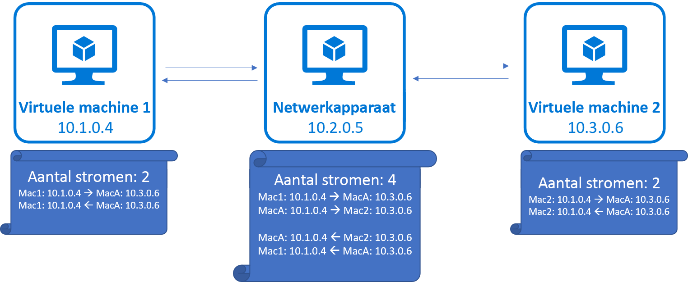
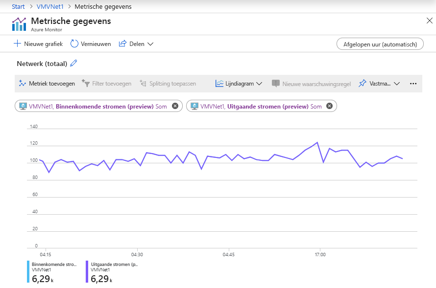

# Bandbreedte van het virtuele machinenetwerk

Azure biedt een verscheidenheid aan VM-formaten en -typen, elk met een andere mix van prestatiemogelijkheden. Een mogelijkheid is netwerkdoorvoer (of bandbreedte), gemeten in megabits per seconde (Mbps). Omdat virtuele machines worden gehost op gedeelde hardware, moet de netwerkcapaciteit eerlijk worden gedeeld tussen de virtuele machines die dezelfde hardware delen. Grotere virtuele machines krijgen relatief meer bandbreedte dan kleinere virtuele machines.
 
De netwerkbandbreedte die aan elke virtuele machine wordt toegewezen, wordt gemeten op uitgaande (uitgaande) verkeer van de virtuele machine. Al het netwerkverkeer dat de virtuele machine verlaat, wordt meegeteld voor de toegewezen limiet, ongeacht de bestemming. Als een virtuele machine bijvoorbeeld een limiet van 1000 Mbps heeft, geldt die limiet of het uitgaande verkeer is bestemd voor een andere virtuele machine in hetzelfde virtuele netwerk of buiten Azure.
 
Ingress is niet direct gemeten of beperkt. Er zijn echter andere factoren, zoals CPU- en opslaglimieten, die van invloed kunnen zijn op het vermogen van een virtuele machine om binnenkomende gegevens te verwerken.

Versnelde netwerken is een functie die is ontworpen om de netwerkprestaties te verbeteren, inclusief latentie, doorvoer en CPU-gebruik. Hoewel versnelde netwerken de doorvoer van een virtuele machine kunnen verbeteren, kan dit alleen tot aan de toegewezen bandbreedte van de virtuele machine. Zie Versnelde netwerken voor [virtuele Windows-](create-vm-accelerated-networking-powershell.md) of [Linux-machines](create-vm-accelerated-networking-cli.md) voor meer informatie over versnelde netwerken.
 
Azure virtuele machines moeten een, maar kan meerdere, netwerkinterfaces aan hen zijn gekoppeld. Bandbreedte toegewezen aan een virtuele machine is de som van al het uitgaande verkeer over alle netwerkinterfaces die zijn gekoppeld aan een virtuele machine. Met andere woorden, de toegewezen bandbreedte is per virtuele machine, ongeacht het aantal netwerkinterfaces dat aan de virtuele machine is gekoppeld. Zie Azure [Windows-](../virtual-machines/windows/sizes.md?toc=%2fazure%2fvirtual-network%2ftoc.json) en [Linux](../virtual-machines/linux/sizes.md?toc=%2fazure%2fvirtual-network%2ftoc.json) VM-formaten voor meer informatie over het aantal ondersteuningen voor verschillende Azure VM-formaten. 

## Verwachte netwerkdoorvoer

De verwachte uitgaande doorvoer en het aantal netwerkinterfaces dat wordt ondersteund door elke VM-grootte wordt gedetailleerd in Azure [Windows-](../virtual-machines/windows/sizes.md?toc=%2fazure%2fvirtual-network%2ftoc.json) en [Linux](../virtual-machines/linux/sizes.md?toc=%2fazure%2fvirtual-network%2ftoc.json) VM-formaten. Selecteer een type, zoals Algemeen doel, en selecteer vervolgens een groottereeks op de resulterende pagina, zoals de Dv2-serie. Elke serie heeft een tabel met netwerkspecificaties in de laatste kolom met de titel **Max NIC's / Verwachte netwerkprestaties (Mbps).** 

De doorvoerlimiet is van toepassing op de virtuele machine. Doorvoer wordt niet beïnvloed door de volgende factoren:
- **Aantal netwerkinterfaces**: De bandbreedtelimiet is cumulatief van al het uitgaande verkeer van de virtuele machine.
- **Versnelde netwerken:** Hoewel de functie nuttig kan zijn bij het bereiken van de gepubliceerde limiet, verandert de limiet niet.
- **Verkeersbestemming**: Alle bestemmingen tellen mee voor de uitgaande limiet.
- **Protocol:** Al het uitgaande verkeer over alle protocollen telt mee voor de limiet.

## Netwerkstroomlimieten

Naast bandbreedte kan het aantal netwerkverbindingen dat op een vm op een bepaald moment aanwezig is, de netwerkprestaties beïnvloeden. De Azure-netwerkstack behoudt de status voor elke richting van een TCP/UDP-verbinding in gegevensstructuren die 'stromen' worden genoemd. Er wordt twee stromen gemaakt voor een typische TCP/UDP-verbinding, één voor de binnenkomende en een andere voor de uitgaande richting. 

Voor gegevensoverdracht tussen eindpunten moeten er meerdere stromen worden gemaakt, naast die welke de gegevensoverdracht uitvoeren. Enkele voorbeelden zijn stromen die zijn gemaakt voor DNS-resolutie en stromen die zijn gemaakt voor statussprobes voor load balancer. Houd er ook rekening mee dat netwerkvirtuele apparaten (NVA's) zoals gateways, proxy's, firewalls, stromen zien die worden gemaakt voor verbindingen die bij het toestel worden beëindigd en afkomstig zijn van het toestel. 

## Stroomlimieten en aanbevelingen

Vandaag de dag ondersteunt de Azure-netwerkstack de totale netwerkstromen van 250K met goede prestaties voor VM's met meer dan 8 CPU-cores en 100k totale stromen met goede prestaties voor VM's met minder dan 8 CPU-cores. Voorbij deze limiet desgradeert de netwerkprestaties sierlijk voor extra stromen tot een harde limiet van 500K totale stromen, 250K inkomende en 250K uitgaande, waarna extra stromen worden geschrapt.

||VM's met <8 CPU-cores|VM's met 8+ CPU-cores|
|---|---|---|
|<b>Goede prestaties</b>|100.000 stromen |250.000 stromen|
|<b>Gedegradeerde prestaties</b>|Boven de 100k stromen|Boven de 250K stromen|
|<b>Stroomlimiet</b>|500K stromen|500K stromen|

Statistieken zijn beschikbaar in [Azure Monitor](../azure-monitor/platform/metrics-supported.md#microsoftcomputevirtualmachines) om het aantal netwerkstromen en de stroomcreatiesnelheid op uw VM- of VMSS-exemplaren bij te houden.

Verbindings- en beëindigingstarieven kunnen ook van invloed zijn op de netwerkprestaties, omdat verbindingsinstellingen en beëindiging CPU-gegevens deelt met pakketverwerkingsroutines. We raden u aan workloads te vergelijken met verwachte verkeerspatronen en workloads op de juiste manier uit te schalen om aan uw prestatiebehoeften te voldoen. 

## Volgende stappen

- [Netwerkdoorvoer optimaliseren voor het besturingssysteem van een virtuele machine](virtual-network-optimize-network-bandwidth.md)
- [Test de netwerkdoorvoer](virtual-network-bandwidth-testing.md) voor een virtuele machine.
