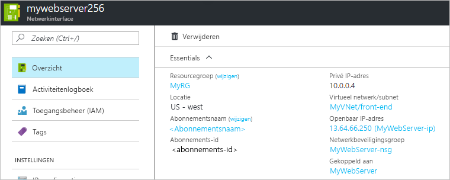

# Een netwerk interface maken, wijzigen of verwijderen

Meer informatie over het maken, wijzigen en verwijderen van een netwerk interface. Met een netwerk interface kan een virtuele machine van Azure communiceren met internet-, Azure-en on-premises resources. Wanneer u een virtuele machine maakt met behulp van de Azure Portal, maakt de portal één netwerk interface met de standaard instellingen voor u. U kunt in plaats daarvan kiezen om netwerk interfaces te maken met aangepaste instellingen en een of meer netwerk interfaces toe te voegen aan een virtuele machine wanneer u deze maakt. Mogelijk wilt u ook de standaard instellingen van de netwerk interface voor een bestaande netwerk interface wijzigen. In dit artikel wordt uitgelegd hoe u een netwerk interface maakt met aangepaste instellingen, bestaande instellingen wijzigt, zoals netwerk filter (netwerk beveiligings groep) toewijzing, toewijzing van subnetten, DNS-server instellingen en door sturen via IP, en een netwerk interface verwijderen.

Zie [IP-adressen beheren](virtual-network-network-interface-addresses.md)als u IP-adressen voor een netwerk interface wilt toevoegen, wijzigen of verwijderen. Als u netwerk interfaces wilt toevoegen aan of netwerk interfaces van virtuele machines wilt verwijderen, raadpleegt u [netwerk interfaces toevoegen of verwijderen](virtual-network-network-interface-vm.md).

## Voordat u begint

[!INCLUDE [updated-for-az](../../includes/updated-for-az.md)]

Voer de volgende taken uit voordat u de stappen in een van de secties van dit artikel uitvoert:

- Als u nog geen Azure-account hebt, kunt u zich aanmelden voor een [gratis proef account](https://azure.microsoft.com/free).
- Als u de portal gebruikt, opent https://portal.azure.com u en meldt u zich aan met uw Azure-account.
- Als u Power shell-opdrachten gebruikt om taken in dit artikel te volt ooien, moet u de opdrachten uitvoeren in de [Azure Cloud shell](https://shell.azure.com/powershell)of Power shell uitvoeren vanaf uw computer. Azure Cloud Shell is een gratis interactieve shell waarmee u de stappen in dit artikel kunt uitvoeren. In deze shell zijn algemene Azure-hulpprogramma's vooraf geïnstalleerd en geconfigureerd voor gebruik met uw account. Voor deze zelf studie is de Azure PowerShell module versie 1.0.0 of hoger vereist. Voer `Get-Module -ListAvailable Az` uit om te kijken welke versie is geïnstalleerd. Als u PowerShell wilt upgraden, raadpleegt u [De Azure PowerShell-module installeren](/powershell/azure/install-az-ps). Als u PowerShell lokaal uitvoert, moet u ook `Connect-AzAccount` uitvoeren om verbinding te kunnen maken met Azure.
- Als u Azure-opdracht regel interface opdrachten gebruikt om taken in dit artikel te volt ooien, moet u de opdrachten uitvoeren in de [Azure Cloud shell](https://shell.azure.com/bash)of door de CLI vanaf uw computer uit te voeren. Voor deze zelf studie is de Azure CLI-versie 2.0.28 of hoger vereist. Voer `az --version` uit om te kijken welke versie is geïnstalleerd. Zie [Azure CLI installeren](/cli/azure/install-azure-cli) als u de CLI wilt installeren of een upgrade wilt uitvoeren. Als u de Azure CLI lokaal uitvoert, moet u ook uitvoeren `az login` om een verbinding te maken met Azure.

Het account waarmee u zich aanmeldt of verbinding maakt met Azure met, moet worden toegewezen aan de rol [netwerk bijdrager](../role-based-access-control/built-in-roles.md?toc=%2fazure%2fvirtual-network%2ftoc.json#network-contributor) of aan een [aangepaste rol](../role-based-access-control/custom-roles.md?toc=%2fazure%2fvirtual-network%2ftoc.json) waaraan de juiste acties zijn toegewezen die worden vermeld in [machtigingen](#permissions).

## Een netwerk interface maken

Wanneer u een virtuele machine maakt met behulp van de Azure Portal, maakt de portal een netwerk interface met de standaard instellingen voor u. Als u liever al uw netwerk interface-instellingen opgeeft, kunt u een netwerk interface met aangepaste instellingen maken en de netwerk interface koppelen aan een virtuele machine bij het maken van de virtuele machine (met behulp van Power shell of de Azure CLI). U kunt ook een netwerk interface maken en toevoegen aan een bestaande virtuele machine (met Power shell of de Azure CLI). Zie [netwerk interfaces toevoegen of verwijderen](virtual-network-network-interface-vm.md)voor meer informatie over het maken van een virtuele machine met een bestaande netwerk interface of voor het verwijderen van netwerk interfaces van bestaande virtuele machines. Voordat u een netwerk interface maakt, moet u een bestaand [virtueel netwerk](manage-virtual-network.md) hebben op dezelfde locatie en hetzelfde abonnement waar u een netwerk interface in hebt gemaakt.

1. In het vak met de tekst *zoeken resources* boven aan de Azure Portal, typt u *netwerk interfaces*. Wanneer de **netwerk interfaces** in de zoek resultaten worden weer gegeven, selecteert u deze.
2. Selecteer **+ toevoegen** onder **netwerk interfaces**.
3. Typ of selecteer waarden voor de volgende instellingen en selecteer vervolgens **maken**:

    |Instelling|Vereist?|Details|
    |---|---|---|
    |Name|Yes|De naam moet uniek zijn binnen de resource groep die u selecteert. In de loop van de tijd hebt u waarschijnlijk verschillende netwerk interfaces in uw Azure-abonnement. Zie [naamgevings conventies](/azure/cloud-adoption-framework/ready/azure-best-practices/naming-and-tagging#resource-naming)voor suggesties bij het maken van een naamgevings Conventie om het beheren van verschillende netwerk interfaces eenvoudiger te maken. De naam kan niet worden gewijzigd nadat de netwerk interface is gemaakt.|
    |Virtueel netwerk|Yes|Selecteer het virtuele netwerk voor de netwerk interface. U kunt alleen een netwerk interface toewijzen aan een virtueel netwerk dat zich in hetzelfde abonnement en dezelfde locatie bevindt als de netwerk interface. Zodra een netwerk interface is gemaakt, kunt u het virtuele netwerk dat aan is toegewezen niet wijzigen. De virtuele machine waaraan u de netwerk interface toevoegt, moet ook aanwezig zijn op dezelfde locatie en hetzelfde abonnement als de netwerk interface.|
    |Subnet|Yes|Selecteer een subnet binnen het virtuele netwerk dat u hebt geselecteerd. U kunt het subnet waaraan de netwerk interface is toegewezen, wijzigen nadat het is gemaakt.|
    |Toewijzing van privé-IP-adres|Yes| In deze instelling kiest u de toewijzings methode voor het IPv4-adres. Kies uit de volgende toewijzings methoden: **dynamisch:** wanneer u deze optie selecteert, wijst Azure automatisch het volgende beschik bare adres toe uit de adres ruimte van het subnet dat u hebt geselecteerd. **Statisch:** Wanneer u deze optie selecteert, moet u hand matig een beschikbaar IP-adres toewijzen in de adres ruimte van het subnet dat u hebt geselecteerd. Statische en dynamische adressen worden pas gewijzigd als u deze wijzigt of als de netwerk interface wordt verwijderd. U kunt de toewijzings methode wijzigen nadat de netwerk interface is gemaakt. De Azure DHCP-server wijst dit adres toe aan de netwerk interface binnen het besturings systeem van de virtuele machine.|
    |Netwerkbeveiligingsgroep|No| Stel deze optie in op **geen**, selecteer een bestaande [netwerk beveiligings groep](security-overview.md)of [Maak een netwerk beveiligings groep](tutorial-filter-network-traffic.md). Met netwerk beveiligings groepen kunt u netwerk verkeer in en uit een netwerk interface filteren. U kunt nul of één netwerk beveiligings groep Toep assen op een netwerk interface. Nul of één netwerk beveiligings groep kan ook worden toegepast op het subnet waarin de netwerk interface is toegewezen. Als er een netwerk beveiligings groep wordt toegepast op een netwerk interface en het subnet waaraan de netwerk interface is toegewezen, treedt er soms onverwachte resultaten op. Zie [problemen met netwerk beveiligings groepen oplossen](diagnose-network-traffic-filter-problem.md)voor het oplossen van problemen met netwerk beveiligings groepen die zijn toegepast op netwerk interfaces en subnetten.|
    |Abonnement|Yes|Selecteer een van uw Azure- [abonnementen](../azure-glossary-cloud-terminology.md?toc=%2fazure%2fvirtual-network%2ftoc.json#subscription). De virtuele machine waaraan u een netwerk interface koppelt en het virtuele netwerk waarmee u verbinding maakt, moet zich in hetzelfde abonnement bevinden.|
    |Privé-IP-adres (IPv6)|No| Als u dit selectie vakje inschakelt, wordt er een IPv6-adres toegewezen aan de netwerk interface, naast het IPv4-adres dat is toegewezen aan de netwerk interface. Zie de sectie IPv6 van dit artikel voor belang rijke informatie over het gebruik van IPv6 met netwerk interfaces. U kunt geen toewijzings methode selecteren voor het IPv6-adres. Als u een IPv6-adres wilt toewijzen, wordt dit toegewezen met de dynamische methode.
    |IPv6-naam (wordt alleen weer gegeven wanneer het selectie vakje **privé IP-adres (IPv6)** is ingeschakeld) |Ja, als het selectie vakje **privé IP-adres (IPv6)** is ingeschakeld.| Deze naam wordt toegewezen aan een secundaire IP-configuratie voor de netwerk interface. Zie [netwerk interface-instellingen weer geven](#view-network-interface-settings)voor meer informatie over IP-configuraties.|
    |Resourcegroep|Yes|Selecteer een bestaande [resource groep](../azure-glossary-cloud-terminology.md?toc=%2fazure%2fvirtual-network%2ftoc.json#resource-group) of maak een. Een netwerk interface kan zich in dezelfde of een andere resource groep bevinden dan de virtuele machine waaraan u deze hebt gekoppeld, of het virtuele netwerk waarmee u het apparaat verbindt.|
    |Locatie|Ja|De virtuele machine waaraan u een netwerk interface koppelt en het virtuele netwerk waarmee u verbinding maakt, moet zich op dezelfde [locatie](https://azure.microsoft.com/regions)bevinden, ook wel regio genoemd.|

De portal biedt geen optie om een openbaar IP-adres toe te wijzen aan de netwerk interface wanneer u dit maakt, terwijl de portal een openbaar IP-adres maakt en dit toewijst aan een netwerk interface wanneer u een virtuele machine maakt met behulp van de portal. Zie [IP-adressen beheren](virtual-network-network-interface-addresses.md)voor meer informatie over het toevoegen van een openbaar IP-adres aan de netwerk interface nadat het is gemaakt. Als u een netwerk interface met een openbaar IP-adres wilt maken, moet u de CLI of Power shell gebruiken om de netwerk interface te maken.

De portal biedt geen optie om de netwerk interface toe te wijzen aan toepassings beveiligings groepen bij het maken van een netwerk interface, maar de Azure CLI en Power shell. U kunt een bestaande netwerk interface toewijzen aan een toepassings beveiligings groep met behulp van de portal, op voor waarde dat de netwerk interface is gekoppeld aan een virtuele machine. Zie [toevoegen aan of verwijderen uit toepassings beveiligings groepen](#add-to-or-remove-from-application-security-groups)voor meer informatie over het toewijzen van een netwerk interface aan een toepassings beveiligings groep.

>[!Note]
> Azure wijst pas een MAC-adres toe aan de netwerk interface nadat de netwerk interface is gekoppeld aan een virtuele machine en de virtuele machine de eerste keer wordt gestart. U kunt het MAC-adres dat door Azure wordt toegewezen aan de netwerk interface niet opgeven. Het MAC-adres blijft toegewezen aan de netwerk interface totdat de netwerk interface is verwijderd of het privé-IP-adres dat is toegewezen aan de primaire IP-configuratie van de primaire netwerk interface, wordt gewijzigd. Zie [IP-adressen beheren](virtual-network-network-interface-addresses.md) voor meer informatie over IP-adressen en IP-configuraties

**Opdracht**

|Hulpprogramma|Opdracht|
|---|---|
|CLI|[az network nic create](/cli/azure/network/nic)|
|PowerShell|[New-AzNetworkInterface](/powershell/module/az.network/new-aznetworkinterface)|

## Netwerk interface-instellingen weer geven

U kunt de meeste instellingen voor een netwerk interface weer geven en wijzigen nadat deze is gemaakt. Het DNS-achtervoegsel of het lidmaatschap van de beveiligings groep van de toepassing voor de netwerk interface wordt niet weer gegeven in de portal. U kunt de Power shell-of Azure CLI- [opdrachten](#view-settings-commands) gebruiken voor het weer geven van het DNS-achtervoegsel en het lidmaatschap van de beveiligings groep van de toepassing.

1. In het vak met de tekst *zoeken resources* boven aan de Azure Portal, typt u *netwerk interfaces*. Wanneer de **netwerk interfaces** in de zoek resultaten worden weer gegeven, selecteert u deze.
2. Selecteer de netwerk interface waarvan u de instellingen wilt weer geven of wijzigen in de lijst.
3. De volgende items worden weer gegeven voor de netwerk interface die u hebt geselecteerd:
   - **Overzicht:** Bevat informatie over de netwerk interface, zoals de toegewezen IP-adressen, het virtuele netwerk/subnet waaraan de netwerk interface is toegewezen en de virtuele machine waaraan de netwerk interface is gekoppeld (als deze is gekoppeld aan een). In de volgende afbeelding ziet u de overzichts instellingen voor een netwerk interface met de naam **mywebserver256**: overzicht van de 

     U kunt een netwerk interface verplaatsen naar een andere resource groep of een ander abonnement door (**wijzigen**) naast de naam van de **resource groep** of het **abonnement**te selecteren. Als u de netwerk interface verplaatst, moet u alle resources met betrekking tot de netwerk interface verplaatsen. Als de netwerk interface is gekoppeld aan een virtuele machine, moet u ook de virtuele machine en andere resources met betrekking tot virtuele machines verplaatsen. Als u een netwerk interface wilt verplaatsen, raadpleegt [u resource verplaatsen naar een nieuwe resource groep of een nieuw abonnement](../azure-resource-manager/management/move-resource-group-and-subscription.md?toc=%2fazure%2fvirtual-network%2ftoc.json#use-the-portal). In het artikel vindt u vereisten en het verplaatsen van resources met behulp van de Azure Portal, Power shell en de Azure CLI.
   - **IP-configuraties:** De open bare en particuliere IPv4-en IPv6-adressen die zijn toegewezen aan IP-configuraties, worden hier weer gegeven. Als een IPv6-adres is toegewezen aan een IP-configuratie, wordt het adres niet weer gegeven. Zie [IP-adressen configureren voor een Azure-netwerk interface voor](virtual-network-network-interface-addresses.md)meer informatie over IP-configuraties en het toevoegen en verwijderen van IP-adressen. Het door sturen van IP-adressen en de toewijzing van subnetten worden ook in deze sectie geconfigureerd. Zie [IP-door sturen in-of uitschakelen](#enable-or-disable-ip-forwarding) en [toewijzing van subnet wijzigen](#change-subnet-assignment)voor meer informatie over deze instellingen.
   - **DNS-servers:** U kunt opgeven welke DNS-server een netwerk interface wordt toegewezen door de Azure DHCP-servers. De netwerk interface kan de instelling overnemen van het virtuele netwerk waaraan de netwerk interface is toegewezen, of een aangepaste instelling hebben die de instelling overschrijft voor het virtuele netwerk waaraan deze is toegewezen. Zie [DNS-servers wijzigen](#change-dns-servers)als u de weer gave wilt wijzigen.
   - **Netwerk beveiligings groep (NSG):** Hiermee wordt weer gegeven welke NSG is gekoppeld aan de netwerk interface (indien van toepassing). Een NSG bevat regels voor binnenkomende en uitgaande verbindingen om het netwerk verkeer voor de netwerk interface te filteren. Als een NSG is gekoppeld aan de netwerk interface, wordt de naam van de bijbehorende NSG weer gegeven. Zie [een netwerk beveiligings groep koppelen of loskoppelen](#associate-or-dissociate-a-network-security-group)om te wijzigen wat er wordt weer gegeven.
   - **Eigenschappen:** Geeft de sleutel instellingen weer over de netwerk interface, met inbegrip van het MAC-adres (leeg als de netwerk interface niet is gekoppeld aan een virtuele machine) en het abonnement dat bestaat in.
   - **Efficiënte beveiligings regels:**  Beveiligings regels worden weer gegeven als de netwerk interface is gekoppeld aan een actieve virtuele machine en een NSG is gekoppeld aan de netwerk interface, het subnet waaraan het is toegewezen, of beide. Zie [effectief beveiligings regels weer geven](#view-effective-security-rules)voor meer informatie over wat er wordt weer gegeven. Zie [netwerk beveiligings groepen](security-overview.md)voor meer informatie over nsg's.
   - **Efficiënte routes:** Routes worden weer gegeven als de netwerk interface is gekoppeld aan een actieve virtuele machine. De routes zijn een combi natie van de standaard routes van Azure, alle door de gebruiker gedefinieerde routes en eventuele BGP-routes die mogelijk bestaan voor het subnet waaraan de netwerk interface is toegewezen. Zie [werkelijke routes weer geven](#view-effective-routes)voor meer informatie over wat er wordt weer gegeven. Zie [route ring-overzicht](virtual-networks-udr-overview.md)voor meer informatie over de standaard routes van Azure en door de gebruiker gedefinieerde routes.
Algemene Azure Resource Manager-instellingen: Zie [activiteiten logboek](../azure-monitor/platform/platform-logs-overview.md), [toegangs beheer (IAM)](../role-based-access-control/overview.md), [Tags](../azure-resource-manager/management/tag-resources.md?toc=%2fazure%2fvirtual-network%2ftoc.json), [vergren delingen](../azure-resource-manager/management/lock-resources.md?toc=%2fazure%2fvirtual-network%2ftoc.json)en [automatiserings script](../azure-resource-manager/templates/export-template-portal.md)voor meer informatie over algemene Azure Resource Manager-instellingen.

**Opdrachten**

Als een IPv6-adres is toegewezen aan een netwerk interface, retourneert de Power shell-uitvoer het feit dat het adres is toegewezen, maar wordt het toegewezen adres niet geretourneerd. Op dezelfde manier retourneert de CLI het feit dat het adres is toegewezen, maar wordt *Null* in de uitvoer van het adres geretourneerd.

|Hulpprogramma|Opdracht|
|---|---|
|CLI|[AZ Network NIC List](/cli/azure/network/nic) om de netwerk interfaces in het abonnement weer te geven. [AZ Network NIC show](/cli/azure/network/nic) Settings voor een netwerk interface weer geven|
|PowerShell|[Get-AzNetworkInterface](/powershell/module/az.network/get-aznetworkinterface) om netwerk interfaces weer te geven in het abonnement of de weer gave-instellingen voor een netwerk interface|

## DNS-servers wijzigen

De DNS-server wordt door de Azure DHCP-server toegewezen aan de netwerk interface binnen het besturings systeem van de virtuele machine. De toegewezen DNS-server is een wille keurige DNS-server instelling voor een netwerk interface. Zie [naam omzetting voor virtuele machines](virtual-networks-name-resolution-for-vms-and-role-instances.md)voor meer informatie over de instellingen voor naam omzetting voor een netwerk interface. De netwerk interface kan de instellingen van het virtuele netwerk overnemen of eigen unieke instellingen gebruiken die de instelling voor het virtuele netwerk onderdrukken.

1. In het vak met de tekst *zoeken resources* boven aan de Azure Portal, typt u *netwerk interfaces*. Wanneer de **netwerk interfaces** in de zoek resultaten worden weer gegeven, selecteert u deze.
2. Selecteer in de lijst de netwerk interface waarvoor u een DNS-server wilt wijzigen.
3. Selecteer **DNS-servers** onder **instellingen**.
4. Selecteer een van de volgende opties:
   - **Overnemen van virtueel netwerk**: Kies deze optie om de DNS-server instelling over te nemen die is gedefinieerd voor het virtuele netwerk waaraan de netwerk interface is toegewezen. Op het niveau van het virtuele netwerk wordt een aangepaste DNS-server of de door Azure opgegeven DNS-server gedefinieerd. De door Azure verschafte DNS-server kan hostnamen omzetten voor resources die zijn toegewezen aan hetzelfde virtuele netwerk. FQDN moet worden gebruikt voor het oplossen van resources die zijn toegewezen aan verschillende virtuele netwerken.
   - **Aangepast**: u kunt uw eigen DNS-server configureren om namen in meerdere virtuele netwerken op te lossen. Voer het IP-adres in van de server die u wilt gebruiken als een DNS-server. Het DNS-server adres dat u opgeeft, wordt alleen toegewezen aan deze netwerk interface en vervangt alle DNS-instellingen voor het virtuele netwerk waaraan de netwerk interface is toegewezen.
     >[!Note]
     >Als de virtuele machine gebruikmaakt van een NIC die deel uitmaakt van een beschikbaarheidsset, worden alle DNS-servers die zijn opgegeven voor elk van de virtuele machines van alle Nic's die deel uitmaken van de beschikbaarheidsset, overgenomen.
5. Selecteer **Opslaan**.

**Opdracht**

|Hulpprogramma|Opdracht|
|---|---|
|CLI|[AZ Network NIC update](/cli/azure/network/nic)|
|PowerShell|[Set-AzNetworkInterface](/powershell/module/az.network/set-aznetworkinterface)|

## Door sturen via IP in-of uitschakelen

Via door sturen via IP kan de virtuele machine een netwerk interface zijn gekoppeld aan:
- Netwerk verkeer ontvangen dat niet is bestemd voor een van de IP-adressen die zijn toegewezen aan een van de IP-configuraties die zijn toegewezen aan de netwerk interface.
- Netwerk verkeer verzenden met een ander bron-IP-adres dan het doel dat is toegewezen aan een van de IP-configuraties van een netwerk interface.

De instelling moet worden ingeschakeld voor elke netwerk interface die is gekoppeld aan de virtuele machine die verkeer ontvangt dat door de virtuele machine moet worden doorgestuurd. Een virtuele machine kan verkeer door sturen, ongeacht of er meerdere netwerk interfaces of één netwerk interface aan zijn gekoppeld. Hoewel door sturen via IP een Azure-instelling is, moet de virtuele machine ook een toepassing uitvoeren om het verkeer door te sturen, zoals een firewall, WAN-optimalisatie en toepassingen voor taak verdeling. Als op een virtuele machine netwerk toepassingen worden uitgevoerd, wordt de virtuele machine vaak een virtueel netwerk apparaat genoemd. U kunt een lijst weer geven met gereed voor het implementeren van virtuele netwerk apparaten in [Azure Marketplace](https://azuremarketplace.microsoft.com/marketplace/apps/category/networking?page=1&subcategories=appliances). Door sturen via IP wordt doorgaans gebruikt met door de gebruiker gedefinieerde routes. Zie door de gebruiker [gedefinieerde](virtual-networks-udr-overview.md)routes voor meer informatie over door de gebruiker gedefinieerde routes.

1. In het vak met de tekst *zoeken resources* boven aan de Azure Portal, typt u *netwerk interfaces*. Wanneer de **netwerk interfaces** in de zoek resultaten worden weer gegeven, selecteert u deze.
2. Selecteer de netwerk interface waarvoor u door sturen via IP wilt in-of uitschakelen.
3. Selecteer **IP-configuraties** in de sectie **instellingen** .
4. Selecteer **ingeschakeld** of **uitgeschakeld** (standaard instelling) om de instelling te wijzigen.
5. Selecteer **Opslaan**.

**Opdracht**

|Hulpprogramma|Opdracht|
|---|---|
|CLI|[AZ Network NIC update](/cli/azure/network/nic)|
|PowerShell|[Set-AzNetworkInterface](/powershell/module/az.network/set-aznetworkinterface)|

## Toewijzing van subnet wijzigen

U kunt het subnet wijzigen, maar niet het virtuele netwerk waaraan een netwerk interface is toegewezen.

1. In het vak met de tekst *zoeken resources* boven aan de Azure Portal, typt u *netwerk interfaces*. Wanneer de **netwerk interfaces** in de zoek resultaten worden weer gegeven, selecteert u deze.
2. Selecteer de netwerk interface waarvoor u de subnet-toewijzing wilt wijzigen.
3. Selecteer **IP-configuraties** onder **instellingen**. Als er particuliere IP-adressen voor IP-configuraties worden weer gegeven **(statisch)** , moet u de methode voor het toewijzen van IP-adressen wijzigen in dynamisch door de volgende stappen uit te voeren. Alle privé-IP-adressen moeten worden toegewezen aan de methode voor dynamische toewijzing om de toewijzing van het subnet voor de netwerk interface te wijzigen. Als de adressen worden toegewezen met de dynamische methode, gaat u verder met stap 5. Als er IPv4-adressen zijn toegewezen met de statische toewijzings methode, voert u de volgende stappen uit om de toewijzings methode te wijzigen in dynamisch:
   - Selecteer de IP-configuratie waarvan u de toewijzings methode voor IPv4-adressen wilt wijzigen in de lijst met IP-configuraties.
   - Selecteer **dynamisch** voor de **toewijzings** methode van het privé-IP-adres. U kunt geen IPv6-adres toewijzen met de methode statisch toewijzen.
   - Selecteer **Opslaan**.
4. Selecteer in de vervolg keuzelijst **subnet** het subnet waarnaar u de netwerk interface wilt verplaatsen.
5. Selecteer **Opslaan**. Nieuwe dynamische adressen worden toegewezen vanuit het adres bereik van het subnet voor het nieuwe subnet. Nadat u de netwerk interface aan een nieuw subnet hebt toegewezen, kunt u, indien gewenst, een statisch IPv4-adres uit het nieuwe adres bereik van het subnet toewijzen. Zie [IP-adressen beheren](virtual-network-network-interface-addresses.md)voor meer informatie over het toevoegen, wijzigen en verwijderen van IP-adressen voor een netwerk interface.

**Opdracht**

|Hulpprogramma|Opdracht|
|---|---|
|CLI|[AZ Network NIC IP-config update](/cli/azure/network/nic/ip-config)|
|PowerShell|[Set-AzNetworkInterfaceIpConfig](/powershell/module/az.network/set-aznetworkinterfaceipconfig)|

## Toevoegen aan of verwijderen uit toepassings beveiligings groepen

U kunt alleen een netwerk interface toevoegen aan of verwijderen uit een toepassings beveiligings groep met behulp van de portal als de netwerk interface is gekoppeld aan een virtuele machine. U kunt Power shell of de Azure CLI gebruiken om een netwerk interface toe te voegen aan of een netwerk interface uit een toepassings beveiligings groep te verwijderen, of de netwerk interface is gekoppeld aan een virtuele machine. Meer informatie over [toepassings beveiligings groepen](security-overview.md#application-security-groups) en het [maken van een toepassings beveiligings groep](manage-network-security-group.md).

1. Begin in het vak *resources, services en documenten zoeken* bovenaan de Portal de naam van een virtuele machine met een netwerk interface die u wilt toevoegen aan of verwijderen uit een toepassings beveiligings groep. Wanneer de naam van uw virtuele machine wordt weer gegeven in de zoek resultaten, selecteert u deze.
2. Selecteer onder **INSTELLINGEN** de optie **Netwerken**.  Selecteer **toepassings beveiligings** groepen en vervolgens **de beveiligings groepen**van de toepassing, selecteer de toepassings beveiligings groepen waaraan u de netwerk interface wilt toevoegen, of verwijder de selectie van de toepassings beveiligings groepen waarvan u de netwerk interface wilt verwijderen en selecteer vervolgens **Opslaan**. Alleen netwerk interfaces die zich in hetzelfde virtuele netwerk bevinden, kunnen worden toegevoegd aan dezelfde toepassings beveiligings groep. De toepassings beveiligings groep moet zich op dezelfde locatie bevinden als de netwerk interface.

**Opdracht**

|Hulpprogramma|Opdracht|
|---|---|
|CLI|[AZ Network NIC update](/cli/azure/network/nic)|
|PowerShell|[Set-AzNetworkInterface](/powershell/module/az.network/set-aznetworkinterface)|

## Een netwerk beveiligings groep koppelen of loskoppelen

1. Geef in het zoekvak boven aan de portal *netwerk interfaces* op in het zoekvak. Wanneer de **netwerk interfaces** in de zoek resultaten worden weer gegeven, selecteert u deze.
2. Selecteer de netwerk interface in de lijst waaraan u een netwerk beveiligings groep wilt koppelen of los de koppeling van een netwerk beveiligings groep op.
3. Selecteer **netwerk beveiligings groep** onder **instellingen**.
4. Selecteer **Bewerken**.
5. Selecteer **netwerk beveiligings groep** en selecteer vervolgens de netwerk beveiligings groep die u wilt koppelen aan de netwerk interface, of selecteer **geen**, om een netwerk beveiligings groep te verbreken.
6. Selecteer **Opslaan**.

**Opdracht**

- Azure CLI: [AZ Network NIC update](/cli/azure/network/nic#az-network-nic-update)
- Power shell: [set-AzNetworkInterface](/powershell/module/az.network/set-aznetworkinterface)

## Een netwerk interface verwijderen

U kunt een netwerk interface verwijderen zolang deze niet is gekoppeld aan een virtuele machine. Als een netwerk interface is gekoppeld aan een virtuele machine, moet u eerst de virtuele machine in de status gestopt (toewijzing ongedaan gemaakt) plaatsen en vervolgens de netwerk interface loskoppelen van de virtuele machine. Als u een netwerk interface van een virtuele machine wilt loskoppelen, voert u de stappen uit om [een netwerk interface los van een virtuele machine te ontkoppelen](virtual-network-network-interface-vm.md#remove-a-network-interface-from-a-vm). U kunt een netwerk interface niet loskoppelen van een virtuele machine als dit de enige netwerk interface is die aan de virtuele machine is gekoppeld. Aan een virtuele machine moet altijd minstens één netwerk interface zijn gekoppeld. Als u een virtuele machine verwijdert, worden alle gekoppelde netwerk interfaces losgekoppeld, maar worden de netwerk interfaces niet verwijderd.

1. In het vak met de tekst *zoeken resources* boven aan de Azure Portal, typt u *netwerk interfaces*. Wanneer de **netwerk interfaces** in de zoek resultaten worden weer gegeven, selecteert u deze.
2. Selecteer de netwerk interface in de lijst die u wilt verwijderen.
3. Selecteer onder **overzicht** de optie **verwijderen**.
4. Selecteer **Ja** om te bevestigen dat de netwerk interface moet worden verwijderd.

Wanneer u een netwerk interface verwijdert, worden alle hieraan toegewezen MAC-of IP-adressen vrijgegeven.

**Opdracht**

|Hulpprogramma|Opdracht|
|---|---|
|CLI|[AZ Network NIC Delete](/cli/azure/network/nic)|
|PowerShell|[Remove-AzNetworkInterface](/powershell/module/az.network/remove-aznetworkinterface)|

## Verbindings problemen oplossen

Als u niet kunt communiceren met of van een virtuele machine, kan het probleem worden veroorzaakt door netwerk beveiligings regels of routes die effectief zijn voor een netwerk interface. U hebt de volgende opties om het probleem op te lossen:

### Effectief beveiligings regels weer geven

De meest efficiënte beveiligings regels voor elke netwerk interface die is gekoppeld aan een virtuele machine zijn een combi natie van de regels die u hebt gemaakt in een netwerk beveiligings groep en [standaard beveiligings regels](security-overview.md#default-security-rules). Meer informatie over de effectief beveiligings regels voor een netwerk interface kunt u helpen bepalen waarom u niet kunt communiceren met of van een virtuele machine. U kunt de doel regels weer geven voor elke netwerk interface die is gekoppeld aan een actieve virtuele machine.

1. Voer in het zoekvak boven aan de Portal de naam in van een virtuele machine waarvoor u de juiste beveiligings regels wilt weer geven. Als u de naam van een virtuele machine niet weet, voert u *virtuele machines* in het zoekvak in. Wanneer **virtuele machines** worden weer gegeven in de zoek resultaten, selecteert u deze en selecteert u een virtuele machine in de lijst.
2. Selecteer **netwerken** onder **instellingen**.
3. Selecteer de naam van een netwerk interface.
4. Selecteer de **juiste beveiligings regels** onder **ondersteuning en probleem oplossing**.
5. Bekijk de lijst met effectief beveiligings regels om te bepalen of de juiste regels bestaan voor uw vereiste binnenkomende en uitgaande communicatie. Meer informatie over wat u ziet in de lijst in het [overzicht van netwerk beveiligings groepen](security-overview.md).

Met de functie voor het controleren van de IP-stroom van Azure Network Watcher kunt u ook bepalen of beveiligings regels de communicatie tussen een virtuele machine en een eind punt verhinderen. Zie [IP-stroom controleren](../network-watcher/diagnose-vm-network-traffic-filtering-problem.md?toc=%2fazure%2fvirtual-network%2ftoc.json)voor meer informatie.

**Opdracht**

- Azure CLI: [AZ Network NIC List-effectief-NSG](/cli/azure/network/nic#az-network-nic-list-effective-nsg)
- Power shell: [Get-AzEffectiveNetworkSecurityGroup](/powershell/module/az.network/get-azeffectivenetworksecuritygroup)

### Efficiënte routes weer geven

De actieve routes voor de netwerk interfaces die zijn gekoppeld aan een virtuele machine zijn een combi natie van standaard routes, alle routes die u hebt gemaakt en alle routes die worden door gegeven vanuit on-premises netwerken via BGP via een virtuele Azure-netwerk gateway. Informatie over de efficiënte routes voor een netwerk interface kunt u helpen bepalen waarom u niet kunt communiceren met of van een virtuele machine. U kunt de actieve routes weer geven voor elke netwerk interface die is gekoppeld aan een actieve virtuele machine.

1. Voer in het zoekvak boven aan de Portal de naam in van een virtuele machine waarvoor u de juiste beveiligings regels wilt weer geven. Als u de naam van een virtuele machine niet weet, voert u *virtuele machines* in het zoekvak in. Wanneer **virtuele machines** worden weer gegeven in de zoek resultaten, selecteert u deze en selecteert u een virtuele machine in de lijst.
2. Selecteer **netwerken** onder **instellingen**.
3. Selecteer de naam van een netwerk interface.
4. Selecteer **efficiënte routes** onder **ondersteuning en probleem oplossing**.
5. Bekijk de lijst met efficiënte routes om te bepalen of de juiste routes bestaan voor uw vereiste binnenkomende en uitgaande communicatie. Meer informatie over wat u ziet in de lijst in [route ring overzicht](virtual-networks-udr-overview.md).

Met de functie volgende hop van Azure Network Watcher kunt u ook bepalen of routes de communicatie tussen een virtuele machine en een eind punt verhinderen. Zie [volgende hop](../network-watcher/diagnose-vm-network-routing-problem.md?toc=%2fazure%2fvirtual-network%2ftoc.json)voor meer informatie.

**Opdracht**

- Azure CLI: [AZ Network NIC show-ingangsdatum-route tabel](/cli/azure/network/nic#az-network-nic-show-effective-route-table)
- Power shell: [Get-AzEffectiveRouteTable](/powershell/module/az.network/get-azeffectiveroutetable)

## Machtigingen

Om taken uit te voeren op netwerk interfaces, moet uw account worden toegewezen aan de rol [netwerk bijdrager](../role-based-access-control/built-in-roles.md?toc=%2fazure%2fvirtual-network%2ftoc.json#network-contributor) of aan een [aangepaste](../role-based-access-control/custom-roles.md?toc=%2fazure%2fvirtual-network%2ftoc.json) rol waaraan de juiste machtigingen zijn toegewezen in de volgende tabel:

| Bewerking                                                                     | Name                                                      |
| ---------                                                                  | -------------                                             |
| Micro soft. Network/networkInterfaces/lezen                                   | Netwerk interface ophalen                                     |
| Micro soft. Network/networkInterfaces/schrijven                                  | Netwerk interface maken of bijwerken                        |
| Micro soft. Network/networkInterfaces/samen voegen/actie                            | Een netwerk interface koppelen aan een virtuele machine           |
| Micro soft. Network/networkInterfaces/verwijderen                                 | Netwerk interface verwijderen                                  |
| Micro soft. Network/networkInterfaces/joinViaPrivateIp/Action                | Een resource toevoegen aan een netwerk interface via een servi...     |
| Micro soft. Network/networkInterfaces/effectiveRouteTable/Action             | De juiste route tabel van de netwerk interface ophalen               |
| Micro soft. Network/networkInterfaces/effectiveNetworkSecurityGroups/Action  | Efficiënte beveiligings groepen voor netwerk interfaces ophalen           |
| Micro soft. Network/networkInterfaces/loadBalancers/lezen                     | Load balancers voor netwerk interfaces ophalen                      |
| Micro soft. Network/networkInterfaces/serviceAssociations/lezen               | Service koppeling ophalen                                   |
| Micro soft. Network/networkInterfaces/serviceAssociations/schrijven              | Een service koppeling maken of bijwerken                    |
| Micro soft. Network/networkInterfaces/serviceAssociations/verwijderen             | Service koppeling verwijderen                                |
| Micro soft. Network/networkInterfaces/serviceAssociations/validate/Action    | Service koppeling valideren                              |
| Micro soft. Network/networkInterfaces/ipconfigurations/lezen                  | IP-configuratie van netwerk interface ophalen                    |

## Volgende stappen

- Een virtuele machine met meerdere Nic's maken met behulp van [Azure cli](../virtual-machines/linux/multiple-nics.md?toc=%2fazure%2fvirtual-network%2ftoc.json) of [Power shell](../virtual-machines/windows/multiple-nics.md?toc=%2fazure%2fvirtual-network%2ftoc.json)
- Een enkele NIC-VM met meerdere IPv4-adressen maken met behulp van [Azure cli](virtual-network-multiple-ip-addresses-cli.md) of [Power shell](virtual-network-multiple-ip-addresses-powershell.md)
- Een enkele NIC-VM maken met een privé-IPv6-adres (achter een Azure Load Balancer) met behulp van de [Azure cli](../load-balancer/load-balancer-ipv6-internet-cli.md?toc=%2fazure%2fvirtual-network%2ftoc.json)-, [Power shell](../load-balancer/load-balancer-ipv6-internet-ps.md?toc=%2fazure%2fvirtual-network%2ftoc.json)-of [Azure Resource Manager-sjabloon](../load-balancer/load-balancer-ipv6-internet-template.md?toc=%2fazure%2fvirtual-network%2ftoc.json)
- Een netwerk interface maken met behulp van [Power shell](powershell-samples.md) of [Azure cli](cli-samples.md) -voorbeeld scripts of met behulp van een Azure [Resource Manager-sjabloon](template-samples.md)
- [Azure Policy definities](policy-samples.md) voor virtuele netwerken maken en toewijzen
