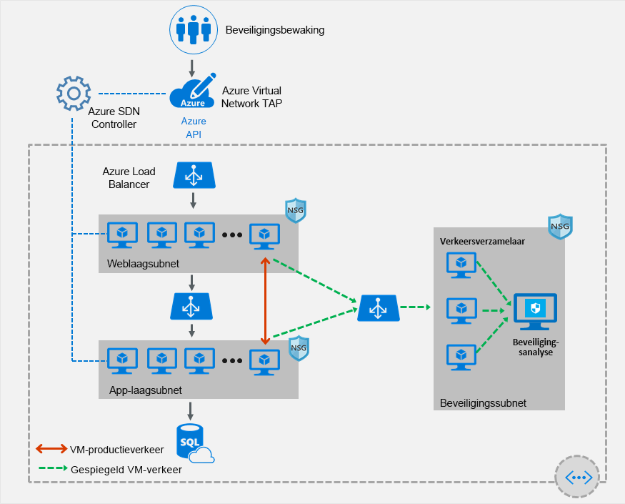

# Virtual Network TAP

Azure virtual network TAP (Terminal Access Point) stelt u in staat om uw netwerkverkeer voor virtuele machines continu te streamen naar een netwerkpakketverzamelaar of analysetool. De collector- of analysetool wordt geleverd door een [netwerkpartner voor virtuele apparaten.](https://azure.microsoft.com/solutions/network-appliances/) Zie [partneroplossingen](#virtual-network-tap-partner-solutions)voor een lijst met partneroplossingen die zijn gevalideerd om met het virtuele netwerk TAP te werken.

> [!IMPORTANT]
> Virtueel netwerk TAP is momenteel in preview in alle Azure-regio's. Als u het virtuele netwerk TAP wilt gebruiken, moet <azurevnettap@microsoft.com> u zich inschrijven voor het voorbeeld door een e-mail te sturen naar uw abonnements-ID. U ontvangt een e-mailbevestiging zodra uw abonnement is geregistreerd. U de mogelijkheid pas gebruiken als u een bevestigingsmail hebt ontvangen. Deze preview wordt zonder serviceniveau geleverd en mag niet worden gebruikt voor productieworkloads. Bepaalde functies worden mogelijk niet ondersteund, zijn mogelijk beperkt of zijn mogelijk niet beschikbaar in alle Azure-locaties. Zie [de aanvullende gebruiksvoorwaarden voor Microsoft Azure Previews](https://azure.microsoft.com/support/legal/preview-supplemental-terms/) voor meer informatie.

## Tap-partneroplossingen voor virtueel netwerk

### Netwerkpakketmakelaars

- [Big Switch Big Monitoring Fabric](https://www.bigswitch.com/products/big-monitoring-fabric/public-cloud/microsoft-azure)
- [Gigamon GigaSECURE](https://blog.gigamon.com/2018/09/13/why-microsofts-new-vtap-service-works-even-better-with-gigasecure-for-azure)
- [Ixia CloudLens](https://www.ixiacom.com/cloudlens/cloudlens-azure)
- [Nubeva Prisma's](https://www.nubeva.com/azurevtap)

### Beveiligingsanalyses, netwerk-/applicatieprestatiebeheer

- [Wakkere Veiligheid](https://awakesecurity.com/technology-partners/microsoft-azure/)
- [Cisco Stealthwatch Cloud](https://blogs.cisco.com/security/cisco-stealthwatch-cloud-and-microsoft-azure-reliable-cloud-infrastructure-meets-comprehensive-cloud-security)
- [Darktrace Darktrace](https://www.darktrace.com/en/azure/)
- [ExtraHop Reveal(x)](https://www.extrahop.com/partners/tech-partners/microsoft/)
- [Fidelis Cybersecurity](https://www.fidelissecurity.com/technology-partners/microsoft-azure )
- [Flowmon Flowmon](https://www.flowmon.com/blog/azure-vtap)
- [NetFort LANGuardian](https://www.netfort.com/languardian/solutions/visibility-in-azure-network-tap/)
- [Netscout vSTREAM]( https://www.netscout.com/technology-partners/microsoft/azure-vtap)
- [Riverbed SteelCentral AppResponse]( https://www.riverbed.com/products/steelcentral/steelcentral-appresponse-11.html)
- [RSA NetWitness® Platform](https://www.rsa.com/azure)
- [Vectra Cognito](https://vectra.ai/microsoftazure)

In de volgende afbeelding ziet u hoe het virtuele netwerk TAP werkt. U een TAP-configuratie toevoegen aan een [netwerkinterface](virtual-network-network-interface.md) die is gekoppeld aan een virtuele machine die in uw virtuele netwerk is geïmplementeerd. De bestemming is een virtueel netwerk-IP-adres in hetzelfde virtuele netwerk als de bewaakte netwerkinterface of een [peered virtueel](virtual-network-peering-overview.md) netwerk. De verzameloplossing voor virtueel netwerk TAP kan worden geïmplementeerd achter een Azure Internal Load-balancer voor hoge beschikbaarheid. Zie [partneroplossingen](#virtual-network-tap-partner-solutions)om implementatieopties voor afzonderlijke oplossingen te evalueren.

## Vereisten

Voordat u een eenvoudig netwerk TAP maakt, moet u een bevestigingsmail hebben ontvangen die u in de preview hebt ingeschreven en een of meer virtuele machines hebben gemaakt met behulp van [het Azure Resource Manager-implementatiemodel](../azure-resource-manager/management/overview.md?toc=%2fazure%2fvirtual-network%2ftoc.json) en een partneroplossing voor het aggregeren van het TAP-verkeer in dezelfde azure-regio. Als u geen partneroplossing in uw virtuele netwerk hebt, raadpleegt u [partneroplossingen](#virtual-network-tap-partner-solutions) om er een te implementeren. U dezelfde tap-bron voor virtueel netwerk gebruiken om verkeer van meerdere netwerkinterfaces in dezelfde of verschillende abonnementen te verzamelen. Als de bewaakte netwerkinterfaces zich in verschillende abonnementen bevinden, moeten de abonnementen worden gekoppeld aan dezelfde Azure Active Directory-tenant. Bovendien kunnen de bewaakte netwerkinterfaces en het doeleindpunt voor het aggregeren van het TAP-verkeer zich in peered virtuele netwerken in dezelfde regio bevinden. Als u dit implementatiemodel gebruikt, moet u ervoor zorgen dat het [virtuele netwerkpeering](virtual-network-peering-overview.md) is ingeschakeld voordat u het virtuele netwerk TAP configureert.

## Machtigingen

De accounts die u gebruikt om TAP-configuratie toe te passen op netwerkinterfaces, moeten worden toegewezen aan de [rol van netwerkinzender](../role-based-access-control/built-in-roles.md?toc=%2fazure%2fvirtual-network%2ftoc.json#network-contributor) of aan een [aangepaste rol](../role-based-access-control/custom-roles.md?toc=%2fazure%2fvirtual-network%2ftoc.json) waaraan de nodige acties uit de volgende tabel zijn toegewezen:

| Actie | Name |
|---|---|
| Microsoft.Network/virtualNetworkTaps/* | Vereist voor het maken, bijwerken, lezen en verwijderen van een TAP-bron voor virtueel netwerk |
| Microsoft.Network/networkInterfaces/read | Vereist om de netwerkinterfacebron te lezen waarop de TAP wordt geconfigureerd |
| Microsoft.Network/tapConfiguraties/* | Vereist voor het maken, bijwerken, lezen en verwijderen van de TAP-configuratie op een netwerkinterface |

## Volgende stappen

- Meer informatie over het [maken van een virtueel netwerk TAP](tutorial-tap-virtual-network-cli.md).
