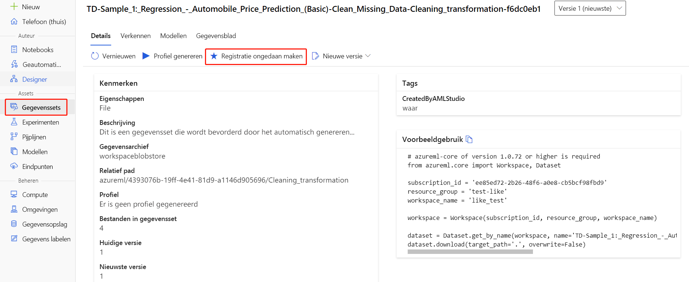

>[!IMPORTANT]
>U de resources die u hebt gemaakt gebruiken als vereisten voor andere Azure Machine Learning-zelfstudies en instructieartikelen.

### Alles verwijderen

Als u niet van plan bent iets te gebruiken dat u hebt gemaakt, verwijdert u de hele brongroep, zodat u geen kosten in rekening brengt.

1. Selecteer **resourcegroepen** aan de linkerkant van het venster in de Azure-portal.
 
   

1. Selecteer in de lijst de resourcegroep die u hebt gemaakt.

1. Selecteer **Resourcegroep verwijderen**.

Als u de brongroep verwijdert, worden ook alle resources verwijderd die u in de ontwerper hebt gemaakt. 

### Afzonderlijke elementen verwijderen

Verwijder afzonderlijke elementen in de ontwerper waar u uw experiment hebt gemaakt door ze te selecteren en vervolgens de knop **Verwijderen te** selecteren.

Het rekendoel dat u hier hebt *gemaakt, wordt automatisch automatisch geschaald* naar nulknooppunten wanneer het niet wordt gebruikt. Deze actie wordt ondernomen om de kosten te minimaliseren.Als u het rekendoel wilt verwijderen, neemt u de volgende stappen uit:

U gegevenssets uituw halen uit uw werkruimte door elke gegevensset te selecteren en **Het registreren van u uit te**schakelen.

Als u een gegevensset wilt verwijderen, gaat u naar het opslagaccount met behulp van de Azure-portal of Azure Storage Explorer en verwijdert u deze elementen handmatig.

