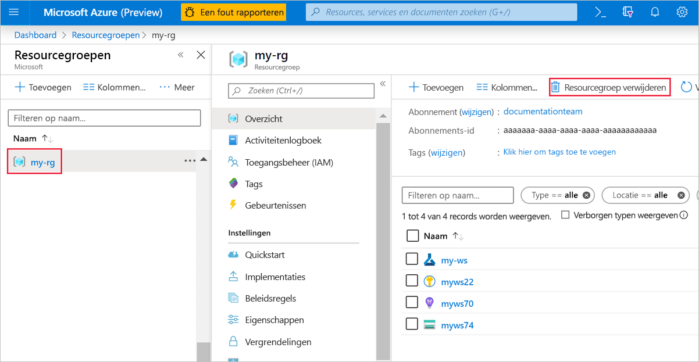
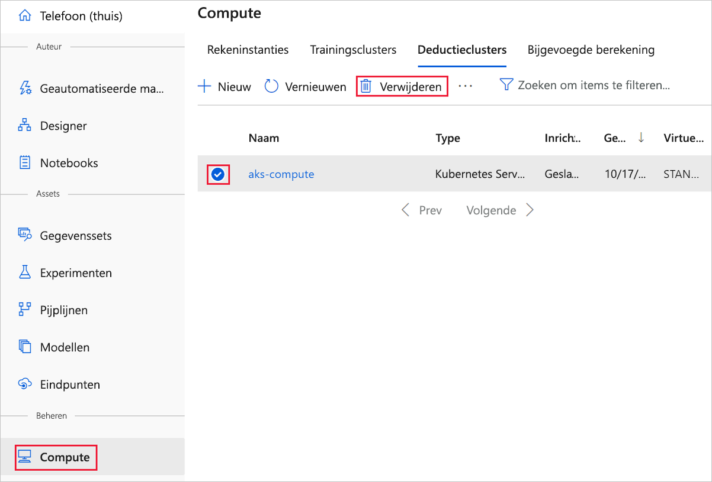

>[!IMPORTANT]
>U kunt de resources die u hebt gemaakt als vereisten voor andere Azure Machine Learning zelf studies en artikelen met instructies gebruiken.

### Alles verwijderen

Als u niet van plan bent om iets te gebruiken dat u hebt gemaakt, verwijdert u de hele resource groep, zodat u geen kosten meer hebt:

1. Selecteer in de Azure Portal **resource groepen** aan de linkerkant van het venster.
 
   

1. Selecteer in de lijst de resource groep die u hebt gemaakt.

1. Selecteer de knop met het weglatings teken ( **...** ) aan de rechter kant van het venster.

1. Selecteer **Resourcegroep verwijderen**.

Als u de resource groep verwijdert, worden ook alle resources die u in de ontwerp functie hebt gemaakt, verwijderd.  

### Alleen het reken doel verwijderen

Het reken doel dat u hier hebt gemaakt, wordt *automatisch geschaald* naar nul knoop punten wanneer het niet wordt gebruikt. Dit is om de kosten te minimaliseren. Als u het berekenings doel wilt verwijderen, voert u de volgende stappen uit:

1. Open uw werk ruimte in de [Azure Portal](https://portal.azure.com).

    

1. Selecteer de resource in het gedeelte **berekenen** van uw werk ruimte.

1. Selecteer **Verwijderen**.

### Afzonderlijke assets verwijderen

In de ontwerp functie waar u uw experiment hebt gemaakt, verwijdert u afzonderlijke assets door ze te selecteren en vervolgens de knop **verwijderen** te selecteren.

U kunt de registratie van gegevens sets ongedaan maken in uw werk ruimte door elke gegevensset te selecteren en **registratie verwijderen**te selecteren.

