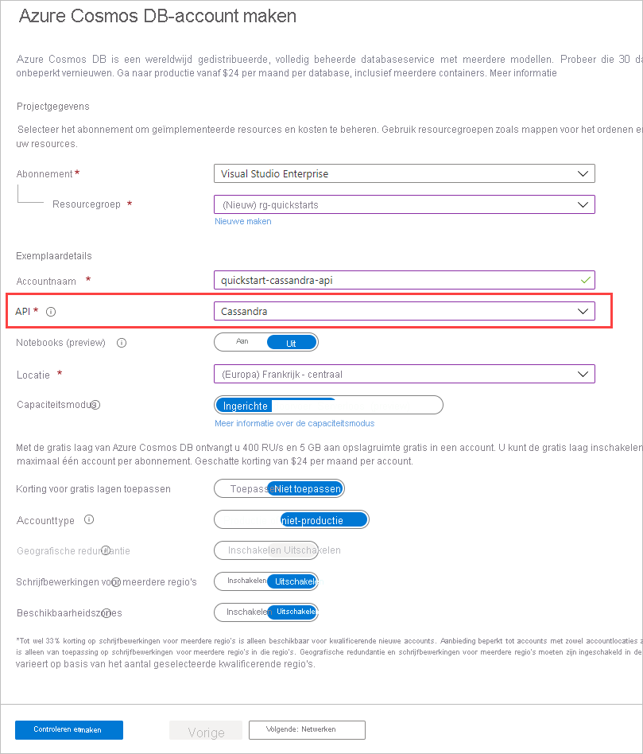

1. Meld u in een nieuw browservenster aan bij [Azure Portal](https://portal.azure.com/).

2. Selecteer in het menu links de optie **een resource maken**.
   
   
   
3. Selecteer op de pagina **Nieuw** de optie **data bases** > **Azure Cosmos DB**.
   
   
   
3. Voer op de pagina **Azure Cosmos DB account maken** de instellingen voor het nieuwe Azure Cosmos DB-account in. 
 
    Instelling|Waarde|Beschrijving
    ---|---|---
    Abonnement|Uw abonnement|Selecteer het Azure-abonnement dat u voor dit Azure Cosmos DB-account wilt gebruiken. 
    Resourcegroep|Nieuwe maken  Voer dezelfde naam in als de account naam|Selecteer **Nieuw maken**. Voer vervolgens een nieuwe naam voor de resource groep voor uw account in. Gebruik voor eenvoud dezelfde naam als uw Azure Cosmos-account naam. 
    Accountnaam|Voer een unieke naam in|Voer een unieke naam in om uw Azure Cosmos DB-account te identificeren. Uw account-URI wordt *Cassandra.Cosmos.Azure.com* toegevoegd aan uw unieke account naam.  De account naam mag alleen kleine letters, cijfers en afbreek streepjes (-) gebruiken en moet tussen de 3 en 31 tekens lang zijn.
    API|Cassandra|De API bepaalt het type te maken account. Azure Cosmos DB biedt vijf Api's: core (SQL) voor document databases, Gremlin voor Graph-data bases, MongoDB voor document databases, Azure Table en Cassandra. U moet voor elke API een afzonderlijk account maken.   Selecteer **Cassandra**, omdat u in deze Snelstartgids een tabel maakt die werkt met de Cassandra-API.   [Meer informatie over de Cassandra-API](../articles/cosmos-db/cassandra-introduction.md).|
    Locatie|Selecteer de regio het dichtst in de buurt van uw gebruikers|Selecteer een geografische locatie waar u het Azure Cosmos DB-account wilt hosten. Gebruik de locatie die zich het dichtst bij uw gebruikers bevindt, zodat ze de snelst mogelijke toegang tot de gegevens hebben.

    Selecteer **Beoordelen en maken**. U kunt de secties **Netwerk** en **Tags** overslaan. 

    

4. Het duurt enkele minuten om het account te maken. Wacht tot de Portal de pagina met **Gefeliciteerd weer gegeven. Uw Azure Cosmos DB-account is gemaakt**.

