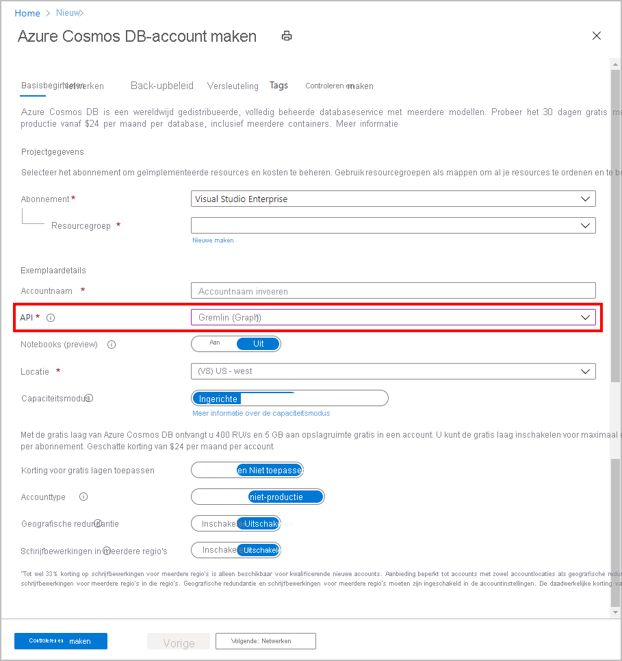

1. Meld u in een nieuw browservenster aan bij [Azure Portal](https://portal.azure.com/).

2. Selecteer in het linkermenu De optie **Een resource maken**.
   
   
   
3. Selecteer op de pagina **Nieuw** **de** > optie**Databases Azure Cosmos DB**.
   
   
   
3. Voer op de pagina **Azure Cosmos DB-account** maken de instellingen in voor het nieuwe Azure Cosmos DB-account. 
 
    Instelling|Waarde|Beschrijving
    ---|---|---
    Abonnement|Uw abonnement|Selecteer het Azure-abonnement dat u voor dit Azure Cosmos DB-account wilt gebruiken. 
    Resourcegroep|Nieuwe maken  Voer vervolgens dezelfde naam in als accountnaam|Selecteer **Nieuw maken**. Voer vervolgens een nieuwe naam van de resourcegroep in voor uw account. Gebruik voor de eenvoud dezelfde naam als de naam van uw Azure Cosmos DB-account. 
    Accountnaam|Voer een unieke naam in|Voer een unieke naam in om uw Azure Cosmos DB-account te identificeren. Uw account URI wordt *gremlin.azure.com* toegevoegd aan uw unieke accountnaam.  De accountnaam mag alleen kleine letters, cijfers en koppeltekens (-) gebruiken en moet tussen de 3 en 31 tekens lang zijn.
    API|Gremlin (Graph)|De API bepaalt het type te maken account. Azure Cosmos DB biedt vijf API's: Core (SQL) voor documentdatabases, Gremlin voor grafiekdatabases, MongoDB voor documentdatabases, Azure Table en Cassandra. U moet voor elke API een apart account aanmaken.   Selecteer **Gremlin (grafiek),** omdat u in deze quickstart een tabel maakt die werkt met de Gremlin API.   [Meer informatie over de Gremlin API](../articles/cosmos-db/graph-introduction.md).|
    Locatie|Selecteer de regio het dichtst in de buurt van uw gebruikers|Selecteer een geografische locatie waar u het Azure Cosmos DB-account wilt hosten. Gebruik de locatie die zich het dichtst bij uw gebruikers bevindt, zodat ze de snelst mogelijke toegang tot de gegevens hebben.

    Selecteer **Beoordelen en maken**. U kunt de secties **Netwerk** en **Tags** overslaan. 

    

4. Het duurt enkele minuten om het account te maken. Wacht tot het portaal de **Felicitaties weergeeft! Uw Azure Cosmos DB-account is gemaakt pagina.**
   
   

