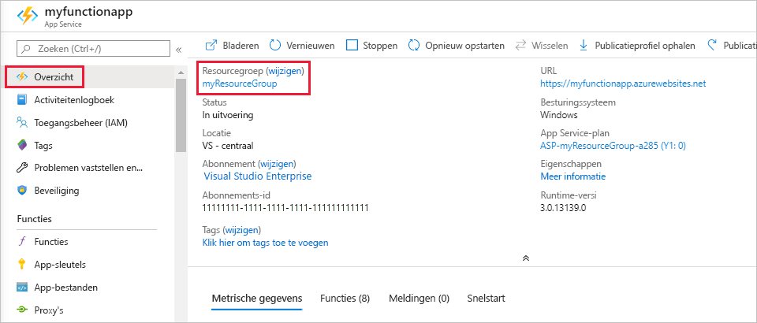

1. Druk in Visual Studio Code op F1 om het opdrachtpalet te openen. Zoek en selecteer `Azure Functions: Open in portal`in het opdrachtpalet .

1. Kies de functie-app en druk op Enter. De pagina met de functie-app wordt geopend in de [Azure-portal.](https://portal.azure.com)

1. Selecteer op het tabblad **Overzicht** de naamkoppeling onder **Resourcegroep**.

    

1. Bekijk op de pagina **Resourcegroep** de lijst met opgenomen resources en controleer of dit de resources zijn die u wilt verwijderen.
 
1. Selecteer **Resourcegroep verwijderen** en volg de instructies.

   Verwijderen kan enkele minuten duren. Wanneer dit is voltooid, verschijnt een aantal seconden een melding in beeld. U kunt ook het belpictogram boven aan de pagina selecteren om de melding te bekijken.