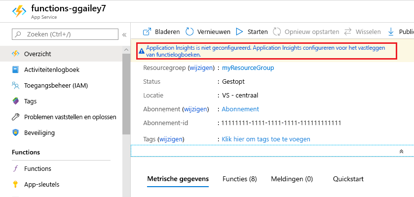
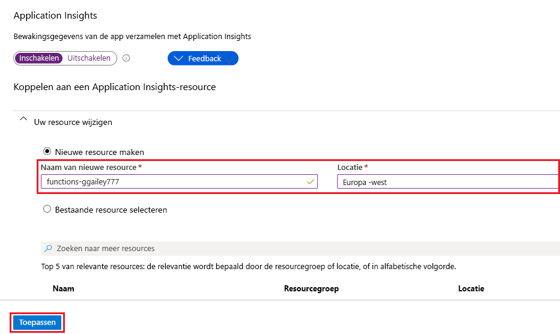

Met Functions kun je eenvoudig Application Insights-integratie toevoegen aan een functie-app vanuit de [Azure-portal.]

1. Typ `Function Apps` in de [portal][Azure Portal]in de zoekbalk boven aan de pagina, kies uw functie-app en selecteer vervolgens de **toepassingsinzichten is niet geconfigureerdbanner** boven aan het venster. Als u deze banner niet ziet, heeft uw app application insights al ingeschakeld.

    

1. Maak een Application Insights-bron met behulp van de instellingen die zijn opgegeven in de tabel onder de afbeelding.

   

    | Instelling      | Voorgestelde waarde  | Beschrijving                                        |
    | ------------ |  ------- | -------------------------------------------------- |
    | **Naam** | Unieke app-naam | Het is het gemakkelijkst om dezelfde naam te gebruiken als uw functie-app, die uniek moet zijn in uw abonnement. | 
    | **Locatie** | Europa -west | Gebruik indien mogelijk dezelfde [regio](https://azure.microsoft.com/regions/) als de functie-app of een regio die zich in de buurt van die regio bevindt. |

1. Selecteer **OK**. De bron Application Insights wordt gemaakt in dezelfde resourcegroep en een abonnement als uw functie-app. Nadat de resource is gemaakt, sluit u het venster Toepassingsinzichten.

1. Terug in de functie-app selecteert u **Toepassingsinstellingen**en blader t/m naar beneden naar **toepassingsinstellingen**. Als u een `APPINSIGHTS_INSTRUMENTATIONKEY`instelling met de naam ziet, wordt de integratie van Application Insights ingeschakeld voor uw functie-app die wordt uitgevoerd in Azure.

[Azure-portal]: https://portal.azure.com
