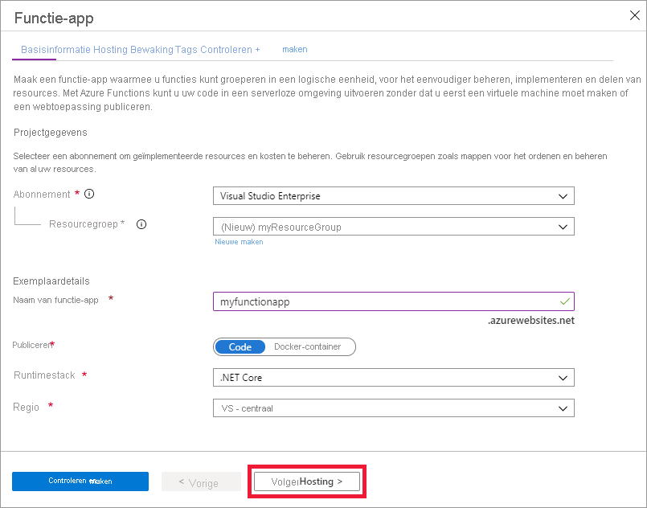

1. Selecteer vanuit het menu van Azure Portal of op de **startpagina** de optie **Een resource maken**.

1. Selecteer op de pagina **Nieuw** **Reken** > **functie-app**.

1. Gebruik de instellingen voor de functie-app, zoals opgegeven in de volgende tabel, op de pagina **basis informatie** :

    | Instelling      | Voorgestelde waarde  | Beschrijving |
    | ------------ | ---------------- | ----------- |
    | **Abonnement** | Uw abonnement | Het abonnement waarmee deze nieuwe functie-app is gemaakt. |
    | **[Resourcegroep](../articles/azure-resource-manager/management/overview.md)** |  *myResourceGroup* | Naam voor de nieuwe resourcegroep waarin uw functie-app moet worden gemaakt. |
    | **Naam van de functie-app** | Wereldwijd unieke naam | Naam waarmee uw nieuwe functie-app wordt aangeduid. Geldige tekens zijn `a-z` (hoofdlettergevoelig), `0-9` en `-`.  |
    |**Publiceren**| Code | Optie voor het publiceren van codebestanden of een Docker-container. |
    | **Runtimestack** | Voorkeurstaal | Kies een runtime die uw favoriete functieprogrammeertaal ondersteunt. Kies **.NET** voor C#- en F#-functies. |
    |**Regio**| Voorkeursregio | Kies een [regio](https://azure.microsoft.com/regions/) in de buurt of in de buurt van andere services die door uw functie worden gebruikt. |

    

1. Selecteer **volgende: hosten**. Voer op de **Hosting** pagina de volgende instellingen in:

    | Instelling      | Voorgestelde waarde  | Beschrijving |
    | ------------ | ---------------- | ----------- |
    | **[Opslagaccount](../articles/storage/common/storage-account-create.md)** |  Wereldwijd unieke naam |  Maak een opslagaccount die wordt gebruikt door uw functie-app. Namen van opslagaccounts moeten tussen 3 en 24 tekens lang zijn en mogen alleen cijfers en kleine letters bevatten. U kunt ook een bestaand account gebruiken dat voldoet aan de [vereisten voor een opslagaccount](../articles/azure-functions/functions-scale.md#storage-account-requirements). |
    |**Besturingssysteem**| Voorkeurbesturingssysteem | Er wordt vooraf een besturingssysteem geselecteerd voor u op basis van de selectie van de runtimestack, maar u kunt de instelling wijzigen, indien nodig. Python wordt alleen ondersteund in Linux. |
    | **[Plannen](../articles/azure-functions/functions-scale.md)** | Premium | Hostingabonnement dat definieert hoe resources worden toegewezen aan uw functie-app. Selecteer **Premium**. Er wordt standaard een nieuw App Service plan gemaakt. De standaard- **SKU en-grootte** is **EP1**, waarbij EP staat voor _elastisch Premium_. Zie de [lijst met Premium-sku's](../articles/azure-functions/functions-premium-plan.md#available-instance-skus)voor meer informatie. Wanneer u Java script-functies uitvoert op een Premium-abonnement, kiest u een instantie met minder Vcpu's. Zie voor meer informatie [enkelvoudige Premium-abonnementen kiezen](../articles/azure-functions/functions-reference-node.md#considerations-for-javascript-functions).  |

    

1. Selecteer **volgende: bewaken**. Voer op de pagina **controle** de volgende instellingen in:

    | Instelling      | Voorgestelde waarde  | Beschrijving |
    | ------------ | ---------------- | ----------- |
    | **[Application Insights](../articles/azure-functions/functions-monitoring.md)** | Standaard | Hiermee maakt u een Application Insights-resource van dezelfde *app-naam* in de dichtstbijzijnde ondersteunde regio. Door deze instelling uit te breiden, kunt u de **nieuwe resource naam** wijzigen of een andere **locatie** in een [Azure-regio](https://azure.microsoft.com/global-infrastructure/geographies/) kiezen om uw gegevens op te slaan. |

    

1. Selecteer **Beoordelen + maken** om de selecties van appconfiguratie te controleren.

1. Controleer uw instellingen op de pagina **Beoordelen en maken** en selecteer vervolgens **Maken** om de functie-app in te richten en te implementeren.

1. Selecteer het **Meldingspictogram** in de rechterbovenhoek van de portal en zoek het bericht **Implementatie voltooid**.

1. Selecteer **Naar de resource gaan** om uw nieuwe functie-app te bekijken. U kunt ook **Vastmaken aan dashboard** selecteren. Vastmaken maakt het gemakkelijker om terug te gaan naar deze functie-app-resource vanuit uw dashboard.

    
