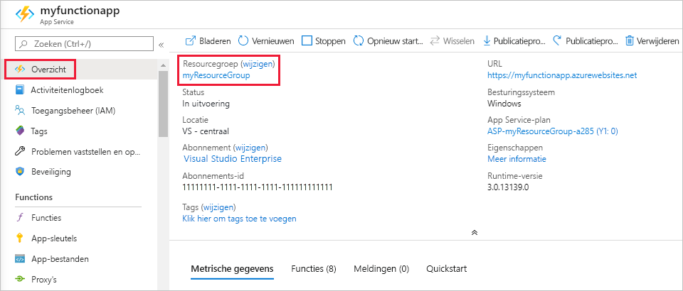

Andere Quick Starts in deze verzameling zijn op deze Quick Start gebaseerd. Als u van plan bent om te werken met volgende Quick starts, zelf studies of met een van de services die u in deze Quick Start hebt gemaakt, moet u de resources niet opschonen.

*Resources* in azure verwijzen naar functie-apps, functies, opslag accounts, enzovoort. Ze worden gegroepeerd in *resource groepen*en u kunt alles in een groep verwijderen door de groep te verwijderen. 

U hebt resources gemaakt om deze snelstartgidsen te voltooien. Deze resources kunnen bij u in rekening worden gebracht, afhankelijk van de [accountstatus](https://azure.microsoft.com/account/) en [serviceprijzen](https://azure.microsoft.com/pricing/). Als u de resources niet meer nodig hebt, kunt u ze als volgt verwijderen:

1. Ga in Azure Portal naar de pagina **Resourcegroep**. 

   Selecteer het tabblad **Overzicht** en selecteer vervolgens de koppeling onder **Resourcegroep** om deze pagina te openen vanaf de pagina Functie-app.

   

   Selecteer **Resourcegroepen** en selecteer vervolgens de resourcegroep die u hebt gebruikt voor deze snelstartgids, om deze pagina te openen vanuit het dashboard.

2. Bekijk op de pagina **resource groep** de lijst met opgenomen resources en controleer of ze zijn die u wilt verwijderen.
 
3. Selecteer **Resourcegroep verwijderen** en volg de instructies.

   Verwijderen kan enkele minuten duren. Wanneer dit is voltooid, verschijnt een aantal seconden een melding in beeld. U kunt ook het belpictogram boven aan de pagina selecteren om de melding te bekijken.
