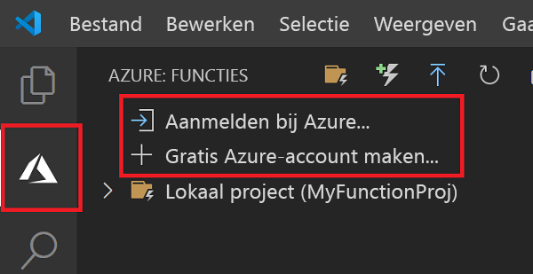

## Aanmelden bij Azure

Voordat u de app kunt publiceren, moet u zich aanmelden bij Azure. Als u al bent aangemeld, gaat u naar de volgende sectie.

1. Kies het pictogram van Azure in de activiteiten balk en kies in het gebied **Azure: functions** de optie **Aanmelden bij Azure...** . Als u er nog geen hebt, kunt u **een gratis Azure-account maken**.

    

1. Wanneer u hierom wordt gevraagd, kiest u uw Azure-account en meldt u zich aan met de referenties van uw Azure-account. 

1. Nadat u zich hebt aangemeld, kunt u het nieuwe browser venster sluiten. De abonnementen die deel uitmaken van uw Azure-account worden weer gegeven op de balk aan de zijkant.
