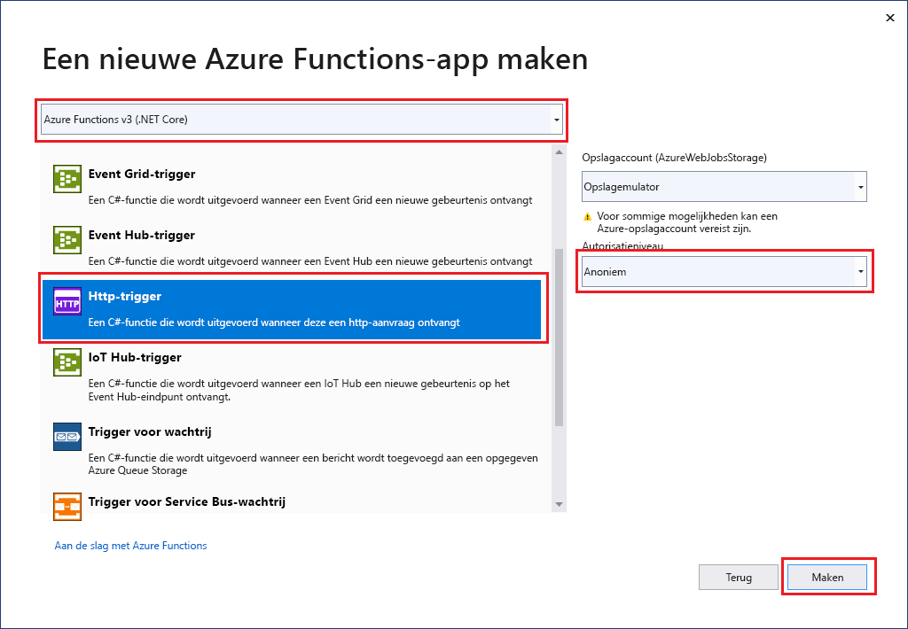

De Azure Functions-projectsjabloon in Visual Studio maakt een project dat u kunt publiceren in een functie-app in Azure. U kunt een functie-app gebruiken om functies te groeperen in een logische eenheid, zodat u resources eenvoudiger kunt beheren, implementeren, schalen en delen.

1. Selecteer in Visual Studio-menu **Bestand** > **Nieuw** > **Project**.

1. Voer in **Een nieuw project maken** *functies* in het zoekvenster in, kies de sjabloon **Azure Functions** en selecteer vervolgens **Volgende**.

1. Voer in **Uw nieuwe project configureren** een **projectnaam** in voor uw project en selecteer vervolgens **Maken**. De functie-appnaam moet geldig zijn als een C#-naamruimte. Gebruik dus geen onderstrepingstekens, afbreekstreepjes of andere niet-alfanumerieke tekens.

1. Gebruik de waarden in de volgende tabel voor de instellingen van **Een nieuw Azure Functions-toepassing**:

    | Instelling      | Waarde  | Beschrijving                      |
    | ------------ |  ------- |----------------------------------------- |
    | **Functions-runtime** | **Azure Functions v3  (.NET Core)** | Met deze waarde wordt er een functieproject gemaakt dat gebruikmaakt van versie 3.x van de runtime van Azure Functions, die ondersteuning biedt voor .NET Core 3.x. Azure Functions 1.x ondersteunt .NET Framework. Raadpleeg [Overzicht van Azure Functions-runtime](../articles/azure-functions/functions-versions.md) voor meer informatie.   |
    | **Functiesjabloon** | **HTTP-trigger** | Met deze waarde wordt er een functie gemaakt die wordt geactiveerd door een HTTP-aanvraag. |
    | **Opslagaccount (AzureWebJobsStorage)**  | **Opslagemulator** | Omdat er voor een Azure-functie een opslagaccount nodig is, wordt er een toegewezen of gemaakt als u uw project in Azure publiceert. Een HTTP-trigger gebruikt geen Azure Storage-accountverbindingsreeks. Alle andere triggers vereisen een geldige Azure Storage-accountverbindingsreeks.  |
    | **Verificatieniveau** | **Anoniem** | De gemaakte functie kan door iedere client worden geactiveerd zonder een sleutel op te geven. Met deze autorisatie-instelling kunt u eenvoudig uw nieuwe functie testen. Raadpleeg [Autorisatiesleutels](../articles/azure-functions/functions-bindings-http-webhook-trigger.md#authorization-keys) in de [HTTP- en webhookbindingen](../articles/azure-functions/functions-bindings-http-webhook.md) voor meer informatie over sleutels en autorisatie. |
    
    
    

    Zorg ervoor dat u het **Autorisatieniveau** instelt op **Anoniem**. Wanneer u het standaardniveau van **Functie** kiest, moet u de [functiesleutel](../articles/azure-functions/functions-bindings-http-webhook-trigger.md#authorization-keys) opnemen in aanvragen om toegang te krijgen tot het eindpunt van de functie.

1. Selecteer **OK** om het functieproject en de door HTTP geactiveerde functie te maken.
