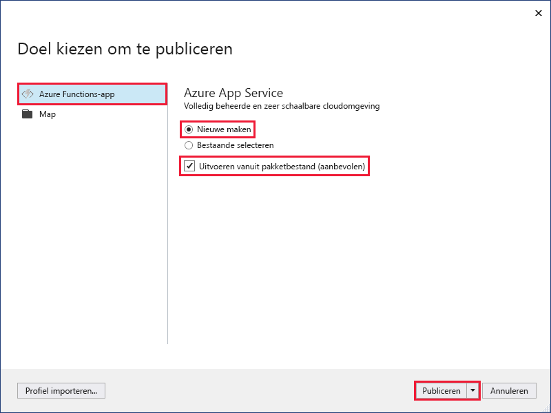
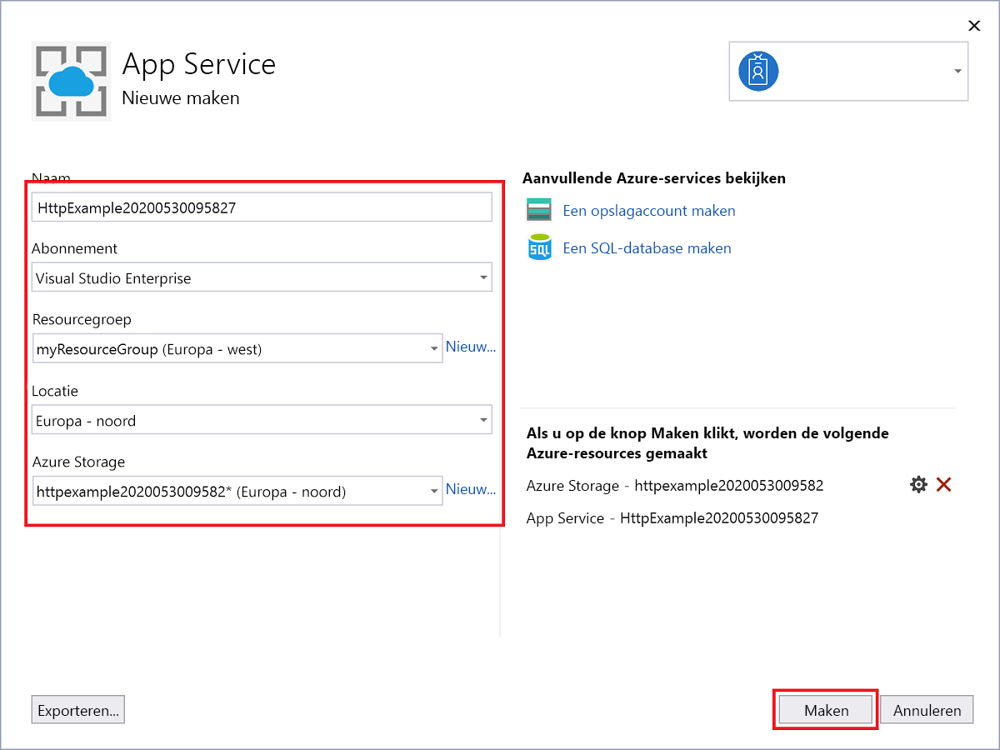
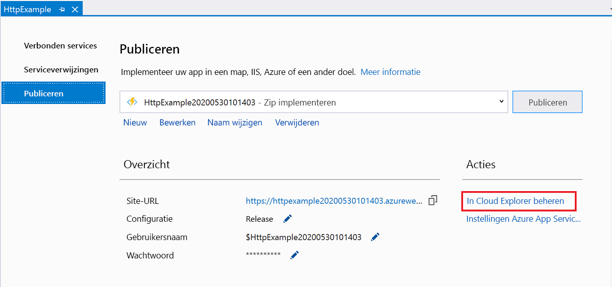

1. Klik in **Solution Explorer** met de rechtermuisknop op het project en selecteer **Publiceren**.

2. Gebruik **in Een publicatiedoel kiezen**de publicatieopties die in de volgende tabel zijn opgegeven: 

    | Optie      | Beschrijving                                |
    | ------------ |  -------------------------------------------------- |
    | **Azure-functie-app** | Maak een functie-app in een Azure-cloudomgeving. | 
    | **Nieuwe maken** | Er wordt een nieuwe functie-app met bijbehorende resources gemaakt in Azure.  Als u **Bestaand selecteren**kiest, worden alle bestanden in de bestaande functie-app in Azure overschreven door bestanden uit het lokale project. Gebruik deze optie alleen wanneer u updates opnieuw publiceert naar een bestaande functie-app. |
    | **Uitvoeren vanaf pakketbestand** | Uw functie-app wordt geïmplementeerd met [Zip Deploy](../articles/azure-functions/functions-deployment-technologies.md#zip-deploy) met [run-from-package-modus](../articles/azure-functions/run-functions-from-deployment-package.md) ingeschakeld. Deze implementatie, die resulteert in betere prestaties, is de aanbevolen manier om uw functies uit te voeren.  Als u deze optie niet gebruikt, moet u ervoor zorgen dat het project van de functie-app niet lokaal wordt uitgevoerd voordat u publiceert naar Azure. |

    

3. Selecteer **Publiceren**. Als u zich nog niet hebt aangemeld bij uw Azure-account vanuit Visual Studio, selecteert u **Aanmelden**. U ook een gratis Azure-account maken.

4. In **Azure App Service: Nieuw maken,** gebruik de waarden die zijn opgegeven in de volgende tabel:

    | Instelling      | Waarde  | Beschrijving                                |
    | ------------ |  ------- | -------------------------------------------------- |
    | **Naam** | Wereldwijd unieke naam | Naam waarmee uw nieuwe functie-app uniek wordt aangeduid. Accepteer deze naam of voer een nieuwe naam in. Geldige tekens `a-z`zijn: `0-9` `-`, , en . |
    | **Abonnement** | Uw abonnement | Het te gebruiken Azure-abonnement. Accepteer dit abonnement of selecteer een nieuw abonnement in de vervolgkeuzelijst. |
    | **[Resourcegroep](../articles/azure-resource-manager/management/overview.md)** | Naam van uw resourcegroep |  De resourcegroep waarin u de functie-app maken. Selecteer een bestaande resourcegroep in de vervolgkeuzelijst of kies **Nieuw** om een nieuwe resourcegroep te maken.|
    | **[Hostingplan](../articles/azure-functions/functions-scale.md)** | Naam van uw hostingplan | Selecteer **Nieuw** om een serverloos abonnement te configureren. Zorg ervoor dat u het **verbruik** onder **Grootte**kiest. Wanneer u uw project publiceert naar een functie-app die wordt uitgevoerd in een [verbruiksplan,](../articles/azure-functions/functions-scale.md#consumption-plan)betaalt u alleen voor uitvoeringen van uw functie-app. Andere hostingplannen brengen hogere kosten met zich mee. Als u een ander plan dan **verbruik uitvoert,** moet u de [schaling van uw functie-app](../articles/azure-functions/functions-scale.md)beheren. Kies een **locatie** in een [regio](https://azure.microsoft.com/regions/) bij u in de buurt of andere services waartoe uw functies toegang hebben.  |
    | **[Azure-opslag](../articles/storage/common/storage-account-create.md)** | Opslagaccount voor algemene doeleinden | Een Azure Storage-account is vereist door de runtime Van Functies. Selecteer **Nieuw** om een opslagaccount voor algemene doeleinden te configureren. U ook een bestaand account kiezen dat voldoet aan de [vereisten voor opslagaccount.](../articles/azure-functions/functions-scale.md#storage-account-requirements)  |

    

5. Selecteer **Maken** om een functie-app en de bijbehorende resources in Azure te maken met deze instellingen en implementeer uw functieprojectcode. 

6. Nadat de implementatie is voltooid, moet u een notitie maken van de waarde van de url van de **site,** het adres van uw functie-app in Azure.

    
