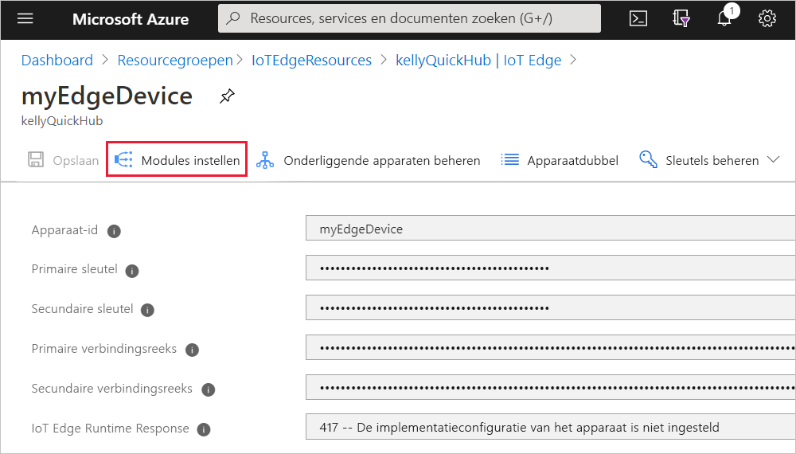
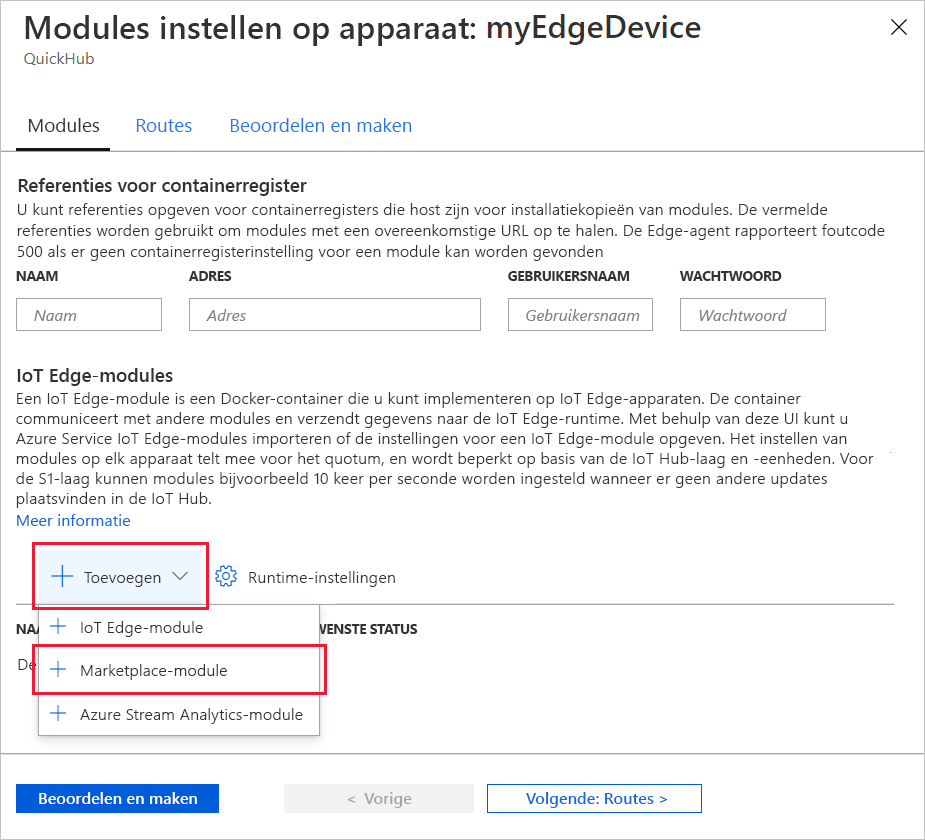
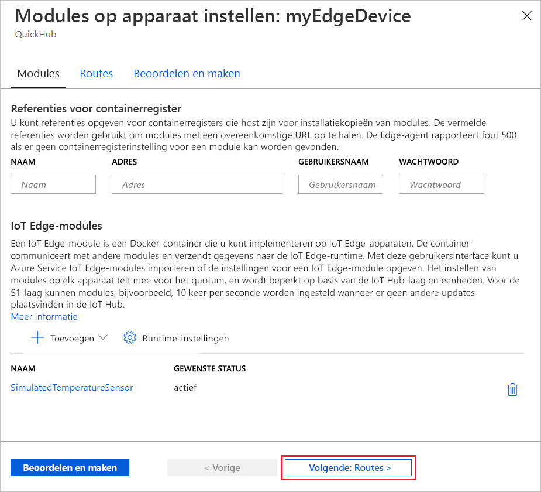
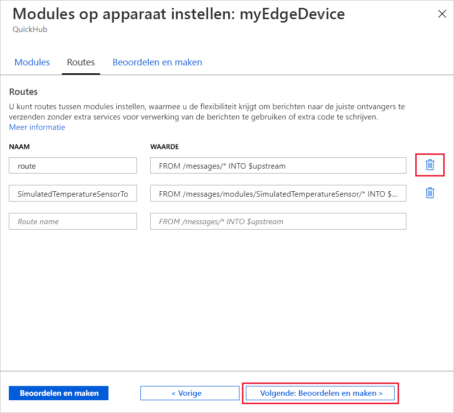
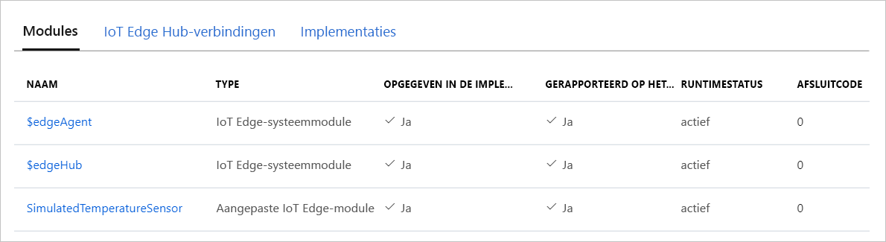

Een van de belangrijkste mogelijkheden van Azure IoT Edge is dat u er code voor uw IoT Edge-apparaten mee kunt implementeren vanuit de cloud. *IoT Edge-modules* zijn uitvoerbare pakketten die zijn geïmplementeerd als containers. In deze sectie implementeert u rechtstreeks vanuit uw Azure IoT Hub een vooraf samengestelde module vanuit de [sectie IoT Edge-modules van de Azure Marketplace](https://azuremarketplace.microsoft.com/marketplace/apps/category/internet-of-things?page=1&subcategories=iot-edge-modules).

De module die u in deze sectie implementeert, simuleert een sensor en verzendt gegenereerde gegevens. Deze module is een handig stukje code wanneer u aan de slag gaat met IoT Edge, omdat u de gesimuleerde gegevens kunt gebruiken voor ontwikkel- en testdoeleinden. Als u precies wilt zien wat deze module doet, kunt u de [broncode van de gesimuleerde temperatuursensor bekijken](https://github.com/Azure/iotedge/blob/027a509549a248647ed41ca7fe1dc508771c8123/edge-modules/SimulatedTemperatureSensor/src/Program.cs).

Voer de volgende stappen uit als u uw eerste module vanuit de Microsoft Azure Marketplace wilt implementeren:

1. Meld u aan bij de [Azure-portal](https://portal.azure.com) en ga naar uw IoT Hub.

1. Selecteer in het menu in het linkerdeelvenster, onder **Automatisch apparaatbeheer**, de optie **IoT Edge**.

1. Klik in de lijst met apparaten op de apparaat-id van het doelapparaat.

1. Selecteer op de bovenste balk **Modules instellen**.

   

1. Klik in het gedeelte **IoT Edge-modules** van de pagina op **Toevoegen** en selecteer **Marketplace-module** in de vervolgkeuzelijst.

   

1. Zoek in **Marketplace van IoT Edge module** op Gesimuleerde temperatuursensor en selecteer die module.

1. U ziet dat de SimulatedTemperatureSensor-module wordt toegevoegd aan het gedeelte IoT Edge-modules, met de gewenste status **running**.

   Selecteer **Volgende: Routes** om door te gaan naar de volgende stap in de wizard.

   

1. Op het tabblad **Routes** in de wizard definieert u hoe berichten tussen modules en IoT Hub worden uitgewisseld. Routes worden gemaakt met behulp van naam/waarde-paren. Op deze pagina ziet u twee routes. De standaardroute met de naam **route** verzendt alle berichten naar IoT Hub (dit wordt `$upstream` genoemd). Er is automatisch een tweede route met de naam **SimulatedTemperatureSensorToIoTHub** gemaakt toen u de module van de Marketplace hebt toegevoegd. Met deze route worden alle berichten die specifiek afkomstig zijn van de gesimuleerde temperatuurmodule, verzonden naar IoT Hub. U kunt de standaardroute verwijderen, omdat deze in dit geval overbodig is.

   Selecteer **Volgende: Beoordelen en maken** om door te gaan naar de volgende stap in de wizard.

   

1. Op het tabblad **Beoordelen en maken** in de wizard kunt u een voorbeeld bekijken van het JSON-bestand waarmee alle modules worden gedefinieerd die op uw IoT Edge-apparaat worden geïmplementeerd. U ziet dat zowel de module **SimulatedTemperatureSensor** als de twee runtimemodules **edgeAgent** en **edgeHub** zijn opgenomen. Selecteer **Maken** wanneer u klaar bent met de beoordeling.

   Wanneer u een nieuwe implementatie bij een IoT Edge-apparaat indient, wordt er niets naar uw apparaat gepusht. In plaats daarvan voert het apparaat regelmatig query’s uit naar eventuele nieuwe instructies. Als het apparaat een manifest van een bijgewerkte implementatie vindt, wordt de informatie over de nieuwe implementatie gebruikt om installatiekopieën van de module op te halen uit de cloud en wordt een lokale uitvoering van de modules gestart. Dit proces kan enkele minuten duren.

1. Nadat u de informatie over de implementatie van de module hebt gemaakt, gaat de wizard terug naar de pagina met apparaatdetails. Bekijk op de pagina met apparaatdetails de implementatiestatus op het tabblad **Modules**. U ziet hier drie modules: $edgeAgent, $edgeHub en SimulatedTemperatureSensor. Als bij een of meer modules wordt vermeld dat ze worden geïmplementeerd maar niet per apparaat worden gerapporteerd, worden ze nog door uw IoT Edge-apparaat opgestart. Wacht enkele momenten en selecteer **Vernieuwen** bovenaan de pagina.

   
