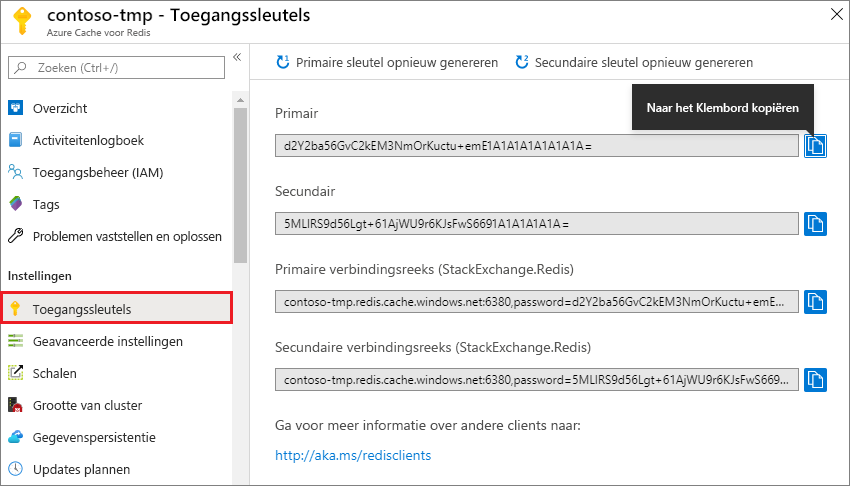
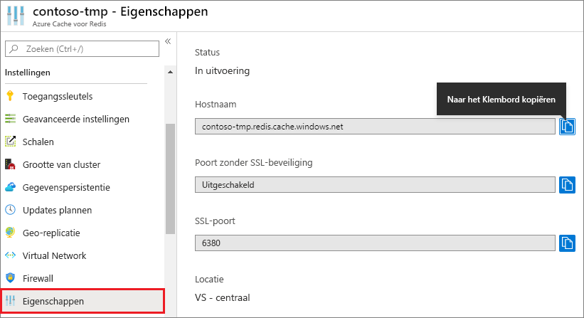

### Hostnaam, poorten en toegangssleutels ophalen uit de Azure-portal

Als u verbinding wilt maken met een Azure-cache voor een instantie van Redis, hebben cacheclients de hostnaam, poorten en een sleutel voor de cache nodig. Sommige clients kunnen enigszins andere namen gebruiken om naar deze items te verwijzen. U de hostnaam, poorten en sleutels ophalen via de [Azure-portal.](https://portal.azure.com)

- Als u de toegangssleutels wilt ophalen, selecteert u **Access-sleutels**in de linkercache. 
  
  

- Als u de hostnaam en -poorten wilt ophalen, selecteert u **Eigenschappen**in de linkernavigatie in de cache . De hostnaam is van de DNS-naam van het formulier * \<>.redis.cache.windows.net*.

  

