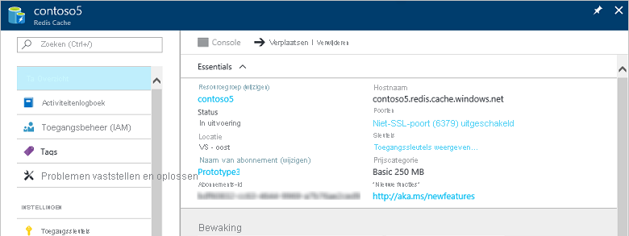

Indien u uw cache niet aan het dashboard hebt vastgemaakt, kunt u deze vinden in [Azure Portal](https://portal.azure.com), onder **Alle services**.

Als u uw caches wilt weer geven, klikt u op **alle services** en zoekt u naar **Azure cache voor redis**. 

Selecteer de gewenste cache om de instellingen voor die cache weer te geven en te configureren.

U kunt uw cache weer geven en configureren op basis van de Blade **Azure-cache voor redis** .

