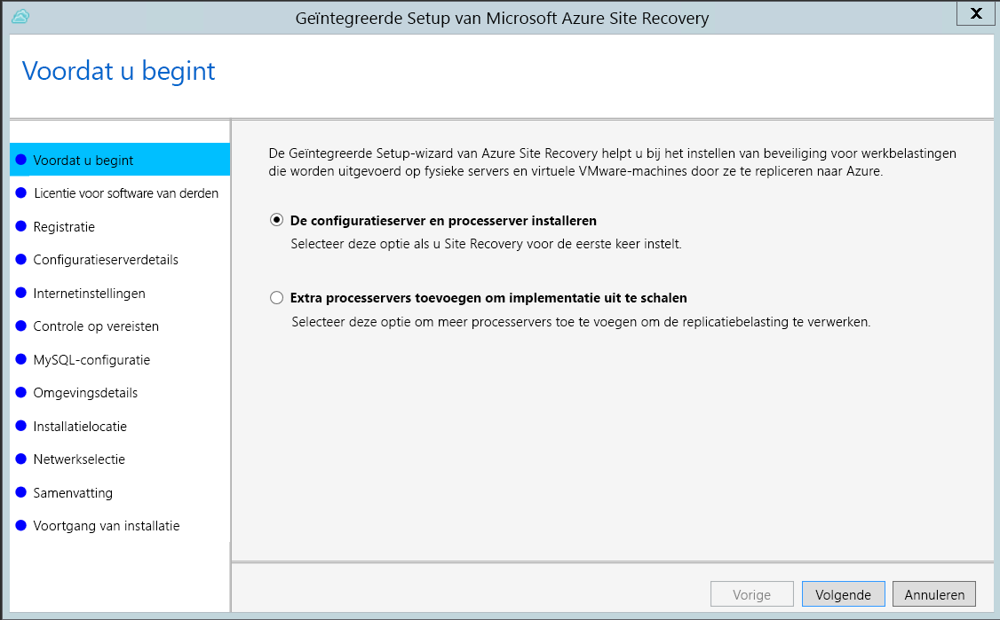
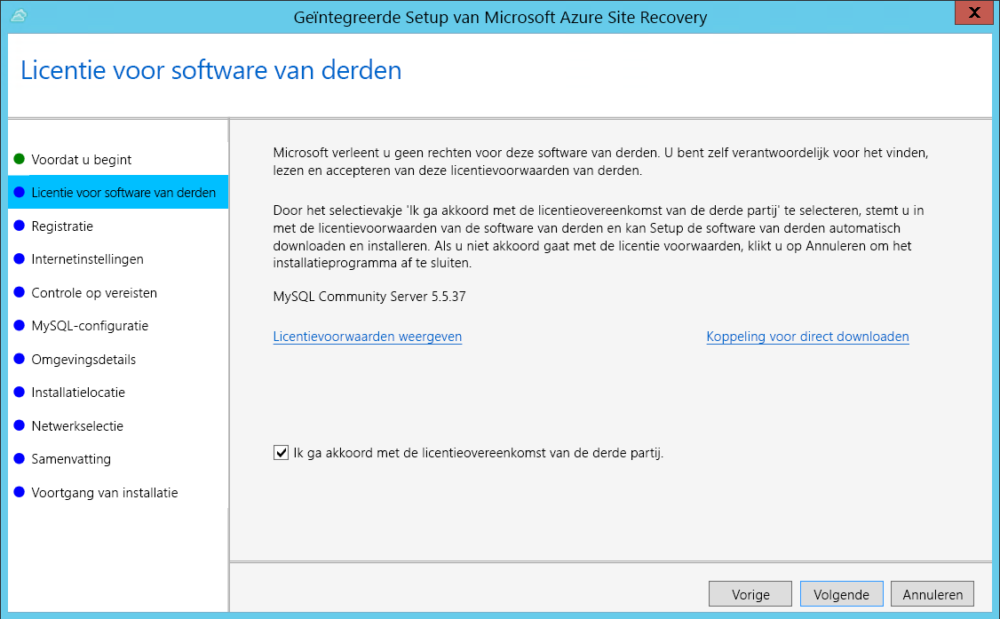
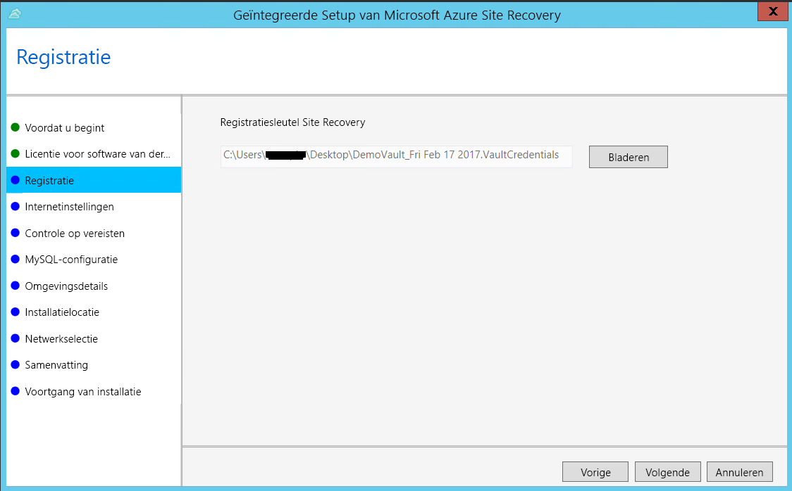
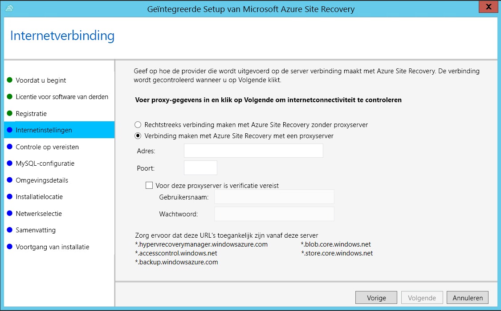
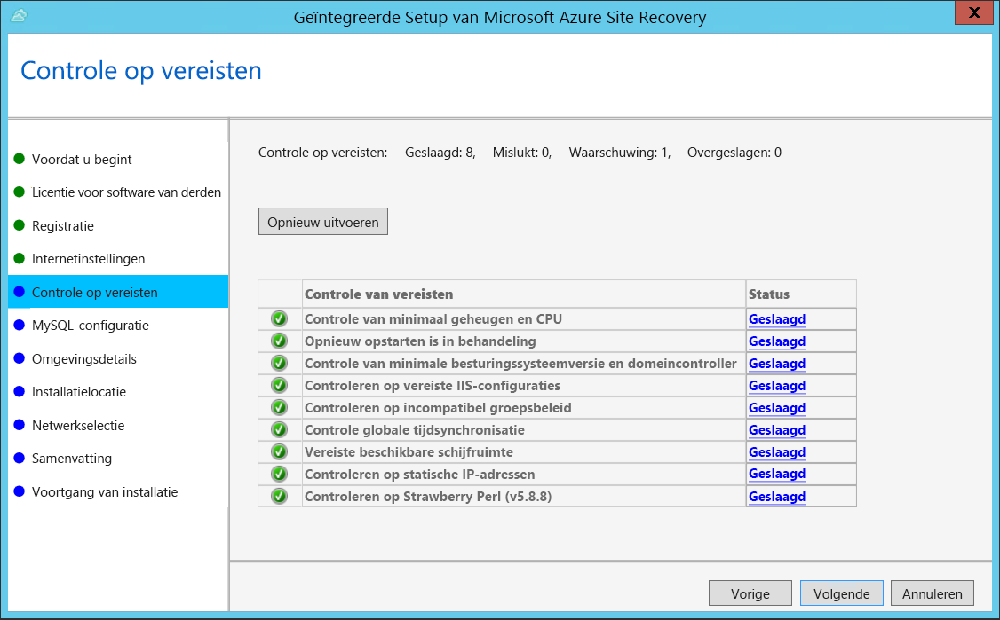
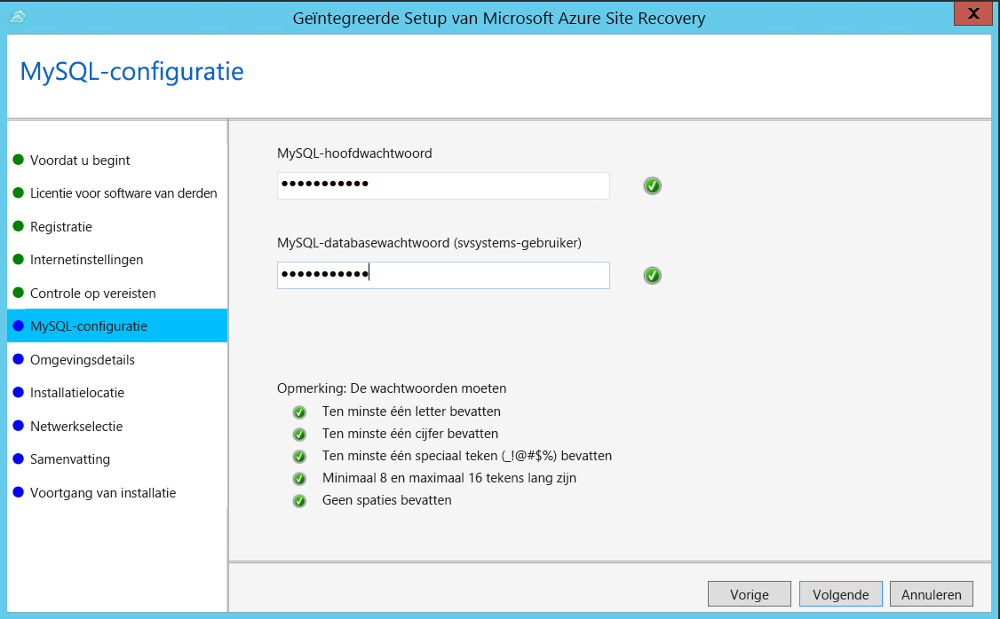
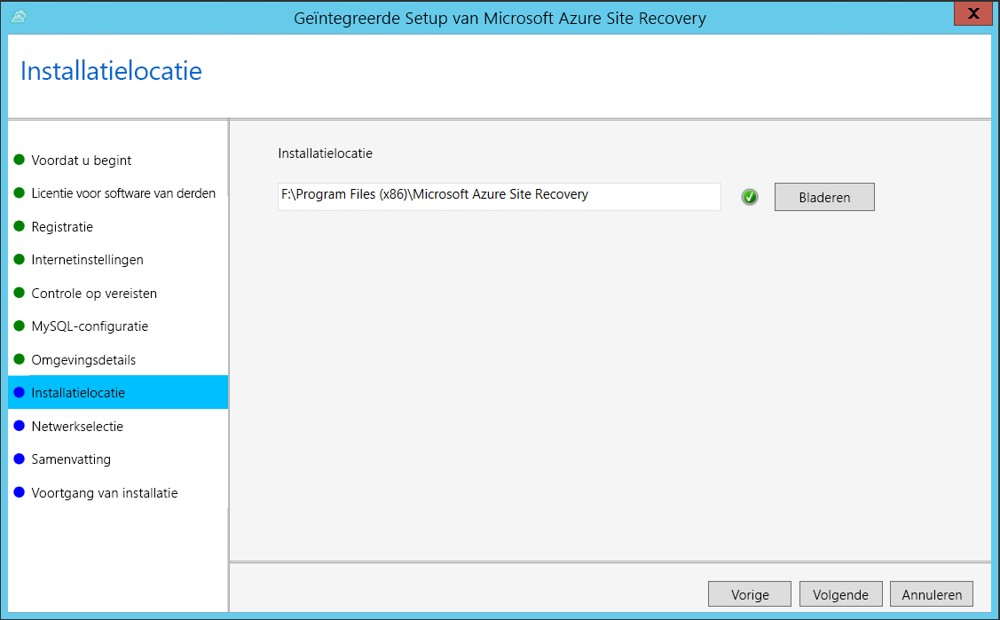
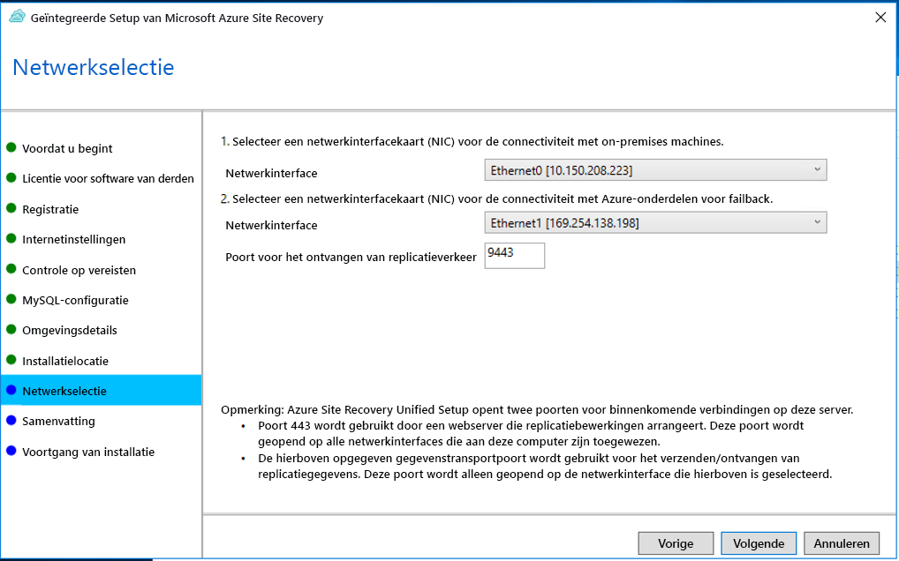
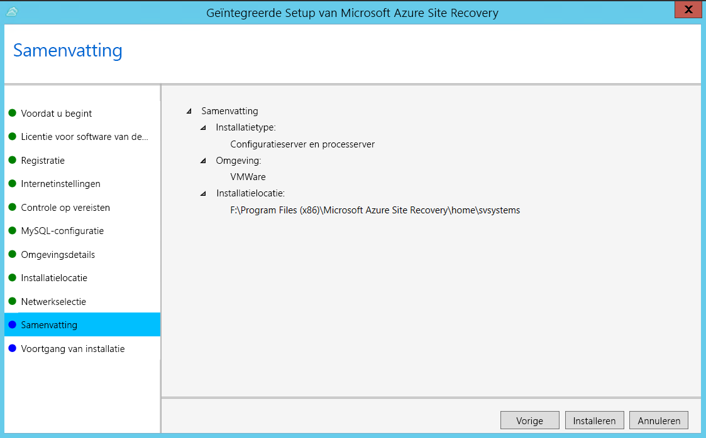

1. Voer het installatiebestand voor de geïntegreerde Setup uit.
2. Selecteer bij **Voordat u begint** de optie **De configuratieserver en processerver installeren**.

    

3. Klik bij **Licentievoorwaarden voor software van derden** op **Ik ga akkoord** om MySQL te downloaden en te installeren.

    
4. Selecteer bij **Registratie** de registratiesleutel die u hebt gedownload uit de kluis.

    
5. Geef bij **Internetinstellingen** op hoe de provider die op de configuratieserver wordt uitgevoerd, via internet verbinding moet maken met Azure Site Recovery. Zorg ervoor dat u de vereiste URL's hebt.

    - Als u verbinding wilt maken met de proxy die momenteel op de computer is ingesteld, selecteert u **Verbinding maken met Azure Site Recovery via een proxyserver**.
    - Als u wilt dat de provider rechtstreeks verbinding maakt, selecteert u **Rechtstreeks verbinding maken met Azure Site Recovery zonder proxyserver**.
    - Als voor de bestaande proxy verificatie is vereist of als u voor de verbinding met de provider een aangepaste proxy wilt gebruiken, selecteert u **Verbinding maken met aangepaste proxyinstellingen** en geeft u het adres, de poort en referenties op.
     
6. Tijdens Setup wordt in **Controle op vereisten** gecontroleerd of de installatie kan worden uitgevoerd. Als er een waarschuwing wordt weergegeven over **Synchronisatiecontrole voor algemene tijd**, moet u controleren of de tijd op de systeemklok (instellingen voor **datum en tijd**) overeenkomt met de tijdzone.

    
7. Maak bij **MySQL-configuratie** referenties voor aanmelden bij de MySQL-serverinstantie die is geïnstalleerd.

    
8. Selecteer in **Omgevingsdetails** de optie Nee als u Azure Stack-VM's of fysieke servers wilt repliceren. 
9. Selecteer bij **Installatielocatie** waar u de binaire bestanden wilt installeren en de cache wilt opslaan. Het station dat u selecteert, moet ten minste 5 GB vrije schijfruimte bevatten, maar wij raden u aan een cachestation te gebruiken met minstens 600 GB vrije ruimte.

    
10. Selecteer in **Netwerkselectie** eerst de NIC die de ingebouwde processerver gebruikt voor herstel na noodgeval en push installatie van de mobiliteitsservice op de bronmachines. Selecteer vervolgens de NIC die de configuratieserver gebruikt voor de connectiviteit met Azure. Poort 9443 is de standaardpoort voor het verzenden en ontvangen van replicatieverkeer, maar u kunt dit poortnummer aanpassen aan de vereisten van de omgeving. Naast poort 9443 wordt ook poort 443 geopend. Deze wordt door een webserver gebruikt om replicatiebewerkingen in te delen. Gebruik poort 443 niet voor het verzenden of ontvangen van replicatieverkeer.

    

11. Lees de informatie bij **Samenvatting** en klik op **Installeren**. Wanneer de installatie is voltooid, wordt er een wachtwoordzin gegenereerd. U hebt deze nodig bij het inschakelen van de replicatie. Kopieer de wachtwoordzin daarom en bewaar deze op een veilige locatie.

    

Na voltooiing van de registratie wordt de server weergegeven op de blade **Instellingen** > **Servers** in de kluis.
