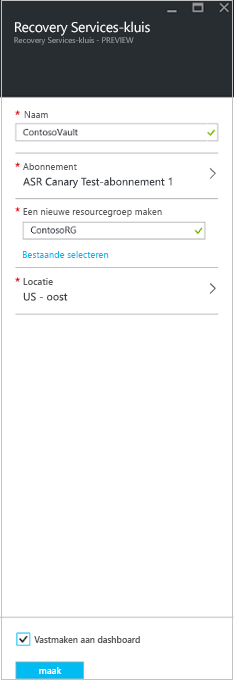

1. Meld u aan bij de [Azure Portal](https://portal.azure.com)-  >  **Recovery Services**.
2. Klik op **een resource maken**  >  **controle en beheer**  >  **back-up en site Recovery**.
3. Geef bij **naam**een beschrijvende naam op om de kluis aan te duiden. Als u meer dan één abonnement hebt, selecteert u het gewenste abonnement.
4. [Maak een resource groep](../articles/azure-resource-manager/templates/deploy-portal.md)of selecteer een bestaande. Geef een Azure-regio op. 
5. Om snel toegang te krijgen tot de kluis vanuit het dash board, klikt **u op aan dash board**  >  **maken**koppelen.

   

   De nieuwe kluis wordt weer gegeven op het **dash board**  >  **alle resources**en op de hoofd pagina van **Recovery Services-kluizen** .
