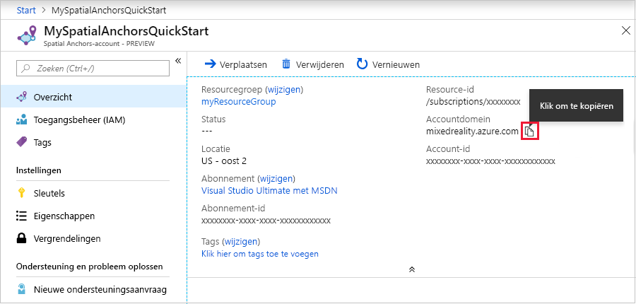

## Een Spatial Anchors-resource maken

Ga naar de <a href="https://portal.azure.com" target="_blank">Azure Portal</a>.

Selecteer **Een resource maken** in het navigatiedeelvenster aan de linkerkant van de Azure-portal.

Gebruik het zoekvak om te zoeken naar **Spatial Anchors**.

   

Selecteer **Spatial Anchors**. Selecteer **Maken** in het dialoogvenster.

In het dialoogvenster **Spatial Anchors-account**:

- Voer een unieke resourcenaam in, met reguliere alfanumerieke tekens.
- Selecteer het abonnement waaraan u de resource wilt koppelen.
- Maak een resourcegroep door **Nieuwe maken** te selecteren. Noem het **myResourceGroup** en selecteer **OK**.
      [!INCLUDE [resource group intro text](resource-group.md)]
- Selecteer de locatie (regio) waarin u de resource wilt plaatsen.
- Selecteer **Nieuw** om te beginnen met het maken van de resource.

   

Nadat de resource is gemaakt, toont de Azure-portal dat uw implementatie is voltooid. Klik op **Ga naar resource**.

Vervolgens kunt u de resource-eigenschappen bekijken. Kopieer de waarde bij **Account-ID** van de resource naar een teksteditor. U hebt deze later nodig.

   

Kopieer ook de waarde bij **Accountdomein** van de resource naar een teksteditor. U hebt deze later nodig.

   

Selecteer onder **Instellingen** de optie **Sleutel**. Kopieer de waarde bij **Primaire sleutel** naar een teksteditor. Deze waarde is de `Account Key`. U hebt deze later nodig.

   
