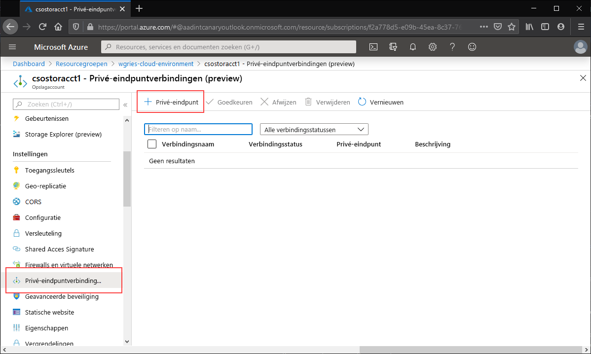
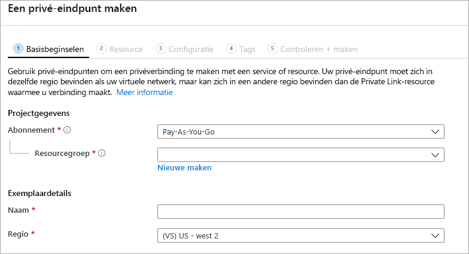
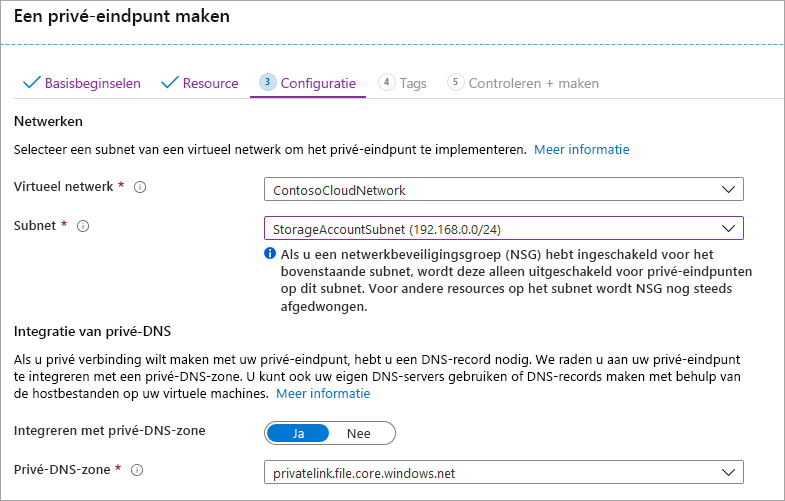

Ga naar het opslagaccount waarvoor u een privé-eindpunt wilt maken. Selecteer **Privé-eindpuntverbindingen** in de inhoudsopgave van het opslagaccount en selecteer vervolgens **+ Privé-eindpunt** om een nieuw privé-eindpunt te maken. 

Er wordt een wizard gestart waarin u meerdere pagina's moet invullen.

Selecteer op de blade **Algemeen** de gewenste resourcegroep, geef een naam op en selecteer de regio voor het privé-eindpunt. U kunt hier kiezen wat u wilt. De waarden hoeven niet overeen te komen met die van het opslagaccount. U moet het privé-eindpunt wel maken in dezelfde regio als het virtuele netwerk waarin u het privé-eindpunt wilt maken.

Schakel op de blade **Resource** het keuzerondje **Verbinding maken met een Azure-resource in mijn directory** in. Selecteer onder **Resourcetype** **Microsoft.Storage/storageAccounts** als het type resource. Geef in het veld **Resource** het opslagaccount op met de Azure-bestandsshare waarmee u verbinding wilt maken. Selecteer voor Subresource van doel de waarde **bestand**, aangezien dit voor Azure Files is.

Op de blade **Configuratie** kunt u het specifieke virtuele netwerk en het subnet selecteren waaraan u het privé-eindpunt wilt toevoegen. U moet een ander subnet selecteren dan het subnet waaraan u hierboven het service-eindpunt hebt toegevoegd. De blade Configuratie bevat ook de gegevens voor het maken/bijwerken van de privé-DNS-zone. We adviseren om de standaardzone `privatelink.file.core.windows.net` te gebruiken.

Klik op **Beoordelen en maken** om het privé-eindpunt te maken. 