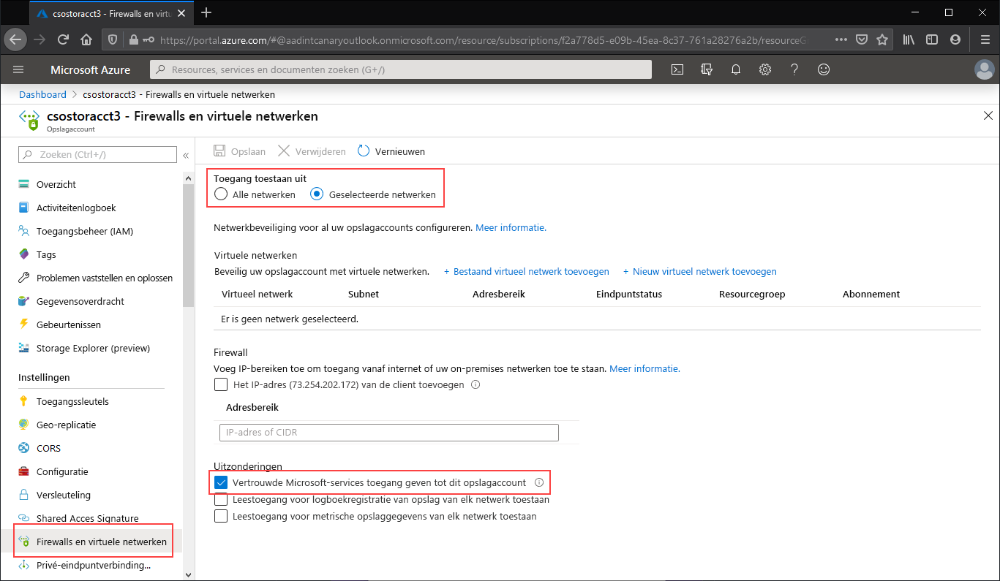

Ga naar het opslagaccount waarvoor u alle toegang tot het openbare eindpunt wilt beperken. Selecteer in de inhoudsopgave voor het opslagaccount **Firewalls en virtuele netwerken**.

Selecteer bovenaan de pagina het keuzerondje **Geselecteerde netwerken**. Hierdoor komen er een aantal instellingen beschikbaar voor het beperken van de toegang tot het openbare eindpunt. Selecteer **Vertrouwde Microsoft-services toegang geven tot dit serviceaccount** om vertrouwde Microsoft-services, zoals Azure File Sync, toegang te geven tot het opslagaccount.

