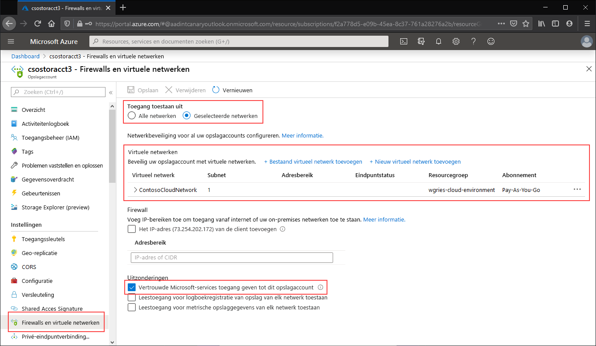

Ga naar het opslagaccount waarvoor u het openbare eindpunt wilt beperken tot bepaalde virtuele netwerken. Selecteer in de inhoudsopgave voor het opslagaccount **Firewalls en virtuele netwerken**. 

Selecteer bovenaan de pagina het keuzerondje **Geselecteerde netwerken**. Hierdoor komen er een aantal instellingen beschikbaar voor het beperken van de toegang tot het openbare eindpunt. Klik op **+ Bestaand virtueel netwerk toevoegen** om het specifieke virtuele netwerk te selecteren dat toegang mag hebben tot het opslagaccount via het openbare eindpunt. Hiervoor moet u een virtueel netwerk en een subnet selecteren voor dat virtuele netwerk. 

Selecteer **Vertrouwde Microsoft-services toegang geven tot dit serviceaccount** om vertrouwde Microsoft-services, zoals Azure File Sync, toegang te geven tot het opslagaccount.

