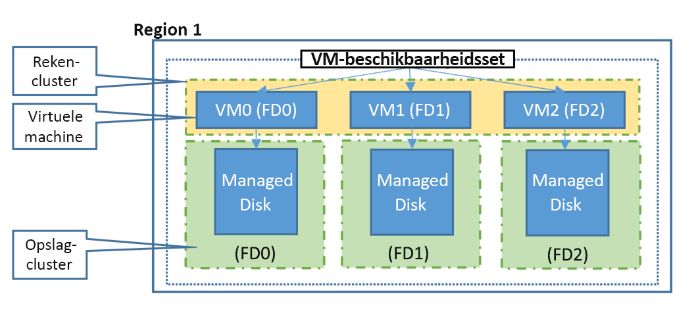

## <a name="understand-vm-reboots---maintenance-vs-downtime"></a>Informatie over het opnieuw opstarten van VM's - onderhoud versus downtime
Er zijn drie scenario's die van invloed kunnen zijn op de virtuele machine in Azure: ongepland onderhoud van hardware, onverwachte downtime en gepland onderhoud.

* **Gebeurtenis voor niet-gepland hardwareonderhoud** treedt op wanneer via het Azure-platform een fout wordt voorspeld op de hardware of in een platformonderdeel dat is gekoppeld aan een fysieke computer. Wanneer via het platform een fout wordt voorspeld, wordt een gebeurtenis voor niet-gepland hardwareonderhoud vrijgegeven om de impact op de virtuele machines die worden gehost op deze hardware, te beperken. Azure gebruikt [Livemigratie](https://docs.microsoft.com/azure/virtual-machines/linux/maintenance-and-updates) technologie om de virtual machines van de defecte hardware te migreren naar een gezonde fysieke machine. Livemigratie is een bewerking ter behoud van VM's waardoor de werking van een virtuele machine slechts korte tijd wordt onderbroken. Het geheugen, de geopende bestanden en de netwerkverbindingen blijven behouden, maar de prestaties vóór en/of na de gebeurtenis kunnen minder zijn. In gevallen waarbij livemigratie niet kan worden gebruikt, treedt er onverwachte downtime op de VM op, zoals hieronder wordt beschreven.


* **Een onverwachte downtime** is wanneer de hardware of de fysieke infra structuur voor de virtuele machine onverwacht mislukt. Dit kan lokale netwerk fouten, storingen op de lokale schijf of andere storingen op rack niveau omvatten. Wanneer gedetecteerd, wordt uw virtuele machine door het Azure-platform automatisch gemigreerd naar een gezonde fysieke machine in hetzelfde Data Center. Tijdens deze procedure treedt downtime (opnieuw opstarten) op de virtuele machines op en in sommige gevallen gaat de tijdelijke schijf verloren. Het besturingssysteem en de gegevensschijven die zijn bijgevoegd, blijven altijd behouden.

  Virtuele machines kunnen ook downtime ondervinden in het onwaarschijnlijke geval van een storing of ramp die invloed heeft op een volledig Data Center of zelfs een hele regio. Voor deze scenario's biedt Azure beveiligings opties, waaronder [beschikbaarheids zones](../articles/availability-zones/az-overview.md) en [gekoppelde regio's](../articles/best-practices-availability-paired-regions.md#what-are-paired-regions).

* **Geplande onderhouds gebeurtenissen** zijn periodieke updates die door micro soft zijn aangebracht in het onderliggende Azure-platform om de algehele betrouw baarheid, prestaties en beveiliging van de platform infrastructuur waarop uw virtuele machines worden uitgevoerd, te verbeteren. Veel van deze updates worden uitgevoerd zonder dat dit van invloed is op uw virtuele machines of Cloud Services (zie [Onderhoud ter behoud van VM's](https://docs.microsoft.com/azure/virtual-machines/windows/preserving-maintenance)). Wanneer mogelijk maakt het Azure-platform gebruik van Onderhoud ter behoud van VM's. In zeldzame gevallen kan het echter noodzakelijk zijn om de virtuele machine opnieuw op te starten om de vereiste updates toe te passen op de onderliggende infrastructuur. In dit geval kunt u gepland onderhoud van Azure gebruiken met de bewerking Onderhoud-Opnieuw implementeren door het onderhoud voor de betrokken VM's te initiëren in het geschikte tijdvenster. Zie [Gepland onderhoud voor virtuele machines](https://docs.microsoft.com/azure/virtual-machines/windows/planned-maintenance/) voor meer informatie.


Om de gevolgen van downtime vanwege een of meer van deze gebeurtenissen te beperken, raden we aan voor uw virtuele machines de volgende aanbevolen procedures voor hoge beschikbaarheid te volgen:

* [Configureer meerdere virtuele machines in een beschikbaarheidsset voor redundantie]
* [Beheerde schijven voor VM's in een beschikbaarheidsset gebruiken]
* [Geplande gebeurtenissen gebruiken om proactief te reageren op gebeurtenissen die invloed hebben op VM'S](https://docs.microsoft.com/azure/virtual-machines/virtual-machines-scheduled-events)
* [Configureer elke toepassingslaag in afzonderlijke beschikbaarheidssets]
* [Combineer het gebruik van een load balancer met beschikbaarheidssets]
* [Beschikbaarheids zones gebruiken om te beschermen tegen fouten op datacenter niveau]

## <a name="use-availability-zones-to-protect-from-datacenter-level-failures"></a>Beschikbaarheids zones gebruiken om te beschermen tegen fouten op datacenter niveau

[Beschikbaarheids zones](../articles/availability-zones/az-overview.md) breiden het beheer niveau uit dat u nodig hebt om de beschik baarheid van de toepassingen en gegevens op uw vm's te behouden. Beschikbaarheidszones zijn unieke, fysieke locaties binnen een Azure-regio. Elke zone bestaat uit een of meer datacenters die zijn voorzien van een onafhankelijke stroomvoorziening, koeling en netwerken. Om tolerantie te garanderen, zijn er mini maal drie afzonderlijke zones in alle ingeschakelde regio's. De fysieke scheiding tussen beschikbaarheidszones binnen een Azure-regio beschermt toepassingen en gegevens tegen storingen op zoneniveau. Zone-redundante Services repliceren uw toepassingen en gegevens op Beschikbaarheidszones om te beschermen tegen enkele punten van een storing.

Een beschikbaarheids zone in een Azure-regio is een combi natie van een **fout domein** en een **update domein**. Als u bijvoorbeeld drie of meer virtuele machines in drie zones in een Azure-regio maakt, worden uw virtuele machines effectief over drie foutdomeinen en drie updatedomeinen verdeeld. Het Azure-platform herkent deze verdeling over updatedomeinen om ervoor te zorgen dat virtuele machines in verschillende zones niet op hetzelfde moment worden bijgewerkt.

Met beschikbaarheidszones biedt Azure de beste uptime SLA voor VM’s van de branche, van 99,99%. Door uw oplossingen te ontwikkelen voor het gebruik van gerepliceerde Vm's in zones, kunt u uw toepassingen en gegevens beveiligen tegen verlies van een Data Center. Als er een zone wordt aangetast, zijn de gerepliceerde apps en gegevens direct beschikbaar in een andere zone.


Meer informatie over het implementeren van een virtuele [Windows](../articles/virtual-machines/windows/create-powershell-availability-zone.md) -of [Linux](../articles/virtual-machines/linux/create-cli-availability-zone.md) -machine in een beschikbaarheids zone.

## <a name="configure-multiple-virtual-machines-in-an-availability-set-for-redundancy"></a>Configureer meerdere virtuele machines in een beschikbaarheidsset voor redundantie
Beschikbaarheids sets zijn een andere datacenter configuratie om VM-redundantie en beschik baarheid te bieden. Deze configuratie binnen een Data Center zorgt ervoor dat tijdens een geplande of niet-geplande onderhouds gebeurtenis ten minste één virtuele machine beschikbaar is en voldoet aan de 99,95% Azure SLA. Zie de [SLA voor virtuele machines](https://azure.microsoft.com/support/legal/sla/virtual-machines/) voor meer informatie.

> [!IMPORTANT]
> Een virtuele machine met één exemplaar in een beschikbaarheidsset die zelfstandig is ingesteld, moet Premium-SSD of Ultra Disk gebruiken voor alle besturingssysteem schijven en gegevens schijven om in aanmerking te komen voor de SLA voor de connectiviteit van de virtuele machine van ten minste 99,9%.

Elke virtuele machine in uw beschikbaarheidsset krijgt een **updatedomein** en een **foutdomein** toegewezen door het onderliggende Azure-platform. Voor iedere beschikbaarheidsset worden standaard vijf updatedomeinen toegewezen die niet door gebruiker te bewerken zijn (voor Resource Manager-implementaties kan dit aantal worden opgehoogd tot 20 updatedomeinen), om groepen virtuele machines en onderliggende fysieke hardware aan te duiden die op hetzelfde moment opnieuw kunnen worden opgestart. Wanneer in één beschikbaarheidsset meer dan vijf virtuele machines worden geconfigureerd, wordt de zesde virtuele machine in hetzelfde updatedomein geplaatst als de eerste virtuele machine, de zevende in hetzelfde updatedomein als de tweede virtuele machine, enzovoort. De volgorde waarin updatedomeinen opnieuw worden opgestart, verloopt tijdens gepland onderhoud niet altijd sequentieel, maar er wordt slechts één updatedomein tegelijk opnieuw opgestart. Een updatedomein dat opnieuw is opgestart, heeft 30 minuten om te herstellen voordat onderhoud wordt geïnitieerd op een ander updatedomein.

Foutdomeinen duiden de groep virtuele machines aan die een gemeenschappelijke voeding en switch delen. Standaard worden bij Resource Manager-implementaties de virtuele machines die zijn geconfigureerd in uw beschikbaarheidsset verdeeld over maximaal drie foutdomeinen (twee foutdomeinen bij klassieke implementaties). Hoewel het in een beschikbaarheidsset plaatsen van uw virtuele machines uw toepassing niet beschermt tegen problemen met het besturingssysteem of de toepassing zelf, worden zo wel de gevolgen van mogelijke problemen met de fysieke hardware, netwerkstoringen of stroomonderbrekingen beperkt.

<!--Image reference-->
   

## <a name="use-managed-disks-for-vms-in-an-availability-set"></a>Beheerde schijven voor VM's in een beschikbaarheidsset gebruiken
Als u momenteel VM's met niet-beheerde schijven gebruikt, raden wij u ten zeerste aan [VM's in een beschikbaarheidsset te converteren voor het gebruik van beheerde schijven](../articles/virtual-machines/windows/convert-unmanaged-to-managed-disks.md).

[Beheerde schijven](../articles/virtual-machines/windows/managed-disks-overview.md) bieden een betere betrouwbaarheid voor beschikbaarheidssets door ervoor te zorgen dat de schijven van VM's in een beschikbaarheidsset voldoende van elkaar zijn verwijderd, waardoor een SPOF (Single Point Of Failure) wordt voorkomen. Dit doet u door automatisch de schijven in verschillende opslag fout domeinen (opslag clusters) te plaatsen en ze te uitlijnen met het domein van de VM-fout. Als een opslag fout domein niet kan worden veroorzaakt door hardware-of software storing, mislukt alleen het VM-exemplaar met schijven op het opslag fout domein.


> [!IMPORTANT]
> Het aantal foutdomeinen voor beheerde beschikbaarheidssets varieert per regio: twee of drie per regio. U kunt het fout domein voor elke regio weer geven door de volgende scripts uit te voeren.

```azurepowershell-interactive
Get-AzComputeResourceSku | where{$_.ResourceType -eq 'availabilitySets' -and $_.Name -eq 'Aligned'}
```

```azurecli-interactive 
az vm list-skus --resource-type availabilitySets --query '[?name==`Aligned`].{Location:locationInfo[0].location, MaximumFaultDomainCount:capabilities[0].value}' -o Table
```

> [!NOTE]
> Onder bepaalde omstandigheden kan 2 Vm's in dezelfde Beschikbaarheidsset dezelfde FaultDomain delen. U kunt dit bevestigen door naar uw beschikbaarheidsset te gaan en de kolom **fout domein** te controleren.
> Dit kan het gevolg zijn van de volgende reeks tijdens het implementeren van de virtuele machines:
> - De eerste VM implementeren
> - De eerste VM stoppen/de toewijzing ervan ongedaan maken
> - De tweede VM onder deze omstandigheden implementeren, kan de besturingssysteem schijf van de tweede virtuele machine worden gemaakt in hetzelfde fout domein als de eerste VM, waardoor de tweede VM ook op dezelfde FaultDomain wordt gegrond. 
> Om dit probleem te voor komen, wordt u aangeraden de Vm's tussen implementaties niet te stoppen/te detoewijzen.

Als u Vm's met niet-beheerde schijven wilt gebruiken, volgt u de aanbevolen procedures voor opslag accounts waarin virtuele harde schijven (Vhd's) van Vm's worden opgeslagen als [pagina-blobs](https://docs.microsoft.com/rest/api/storageservices/Understanding-Block-Blobs--Append-Blobs--and-Page-Blobs#about-page-blobs).

1. **Zorg dat alle schijven (gegevens en besturingssysteem) worden gekoppeld aan een virtuele machine op hetzelfde opslagaccount**
2. **Controleer de [limieten](../articles/storage/blobs/scalability-targets-premium-page-blobs.md) voor het aantal niet-beheerde schijven in een Azure Storage-account** voordat u meer vhd's toevoegt aan een opslag account
3. **Gebruik een afzonderlijk opslag account voor elke virtuele machine in een Beschikbaarheidsset.** Deel opslagaccounts met meerdere VM's niet in dezelfde beschikbaarheidsset. Het is geschikt voor Vm's in verschillende beschikbaarheids sets om opslag accounts te delen als de aanbevolen procedures 

## <a name="use-scheduled-events-to-proactively-respond-to-vm-impacting-events"></a>Geplande gebeurtenissen gebruiken om proactief te reageren op gebeurtenissen die invloed hebben op VM'S

Wanneer u zich abonneert op [geplande gebeurtenissen](https://docs.microsoft.com/azure/virtual-machines/virtual-machines-scheduled-events), wordt uw virtuele machine op de hoogte gesteld van aanstaande onderhouds gebeurtenissen die van invloed kunnen zijn op uw VM. Wanneer geplande gebeurtenissen zijn ingeschakeld, krijgt de virtuele machine een minimale hoeveelheid tijd voordat de onderhouds activiteit wordt uitgevoerd. Zo kunnen host-OS-updates die van invloed zijn op uw virtuele machine, in de wachtrij worden geplaatst als gebeurtenissen waarmee de impact wordt opgegeven, evenals een tijd waarop het onderhoud wordt uitgevoerd als er geen actie wordt ondernomen. Schedule-gebeurtenissen worden ook in de wachtrij geplaatst wanneer Azure een onmiddellijke hardwarefout detecteert die van invloed kan zijn op uw virtuele machine, zodat u kunt bepalen wanneer het herstel moet worden uitgevoerd. Klanten kunnen de gebeurtenis gebruiken om taken uit te voeren vóór het onderhoud, zoals het opslaan van de status, het uitvoeren van een failover naar de secundaire, enzovoort. Nadat u uw logica hebt voltooid voor het op de juiste wijze verwerken van de onderhouds gebeurtenis, kunt u de uitstaande geplande gebeurtenis goed keuren zodat het platform kan door gaan met onderhoud.

## <a name="configure-each-application-tier-into-separate-availability-zones-or-availability-sets"></a>Elke toepassingslaag configureren in afzonderlijke beschikbaarheids zones of beschikbaarheids sets
Als uw virtuele machines bijna identiek zijn en hetzelfde doel hebben als uw toepassing, kunt u het beste een beschikbaarheids zone of beschikbaarheidsset configureren voor elke laag van uw toepassing.  Als u twee verschillende lagen in dezelfde beschikbaarheids zone of set plaatst, kunnen alle virtuele machines in dezelfde toepassingslaag tegelijk opnieuw worden opgestart. Door ten minste twee virtuele machines in een beschikbaarheids zone of set voor elke laag te configureren, garandeert u dat ten minste één virtuele machine in elke laag beschikbaar is.

U kunt bijvoorbeeld alle virtuele machines in de front-end van uw toepassing waarop IIS, Apache en nginx worden uitgevoerd, in één beschikbaarheids zone of set zetten. Zorg ervoor dat alleen front-end virtuele machines in dezelfde beschikbaarheids zone of set worden geplaatst. Zorg er ook voor dat alleen virtuele machines met de gegevenslaag in hun eigen beschikbaarheids zone of set worden geplaatst, zoals uw gerepliceerde SQL Server virtuele machines, of uw virtuele machines met MySQL.

<!--Image reference-->
   

## <a name="combine-a-load-balancer-with-availability-zones-or-sets"></a>Een load balancer met beschikbaarheids zones of sets combi neren
Combi neer de [Azure Load Balancer](../articles/load-balancer/load-balancer-overview.md) met een beschikbaarheids zone of stel in om de meeste toepassings tolerantie te verkrijgen. De Azure Load Balancer verdeelt het verkeer tussen meerdere virtuele machines. De Azure Load Balancer is voor virtuele machines uit de prijscategorie Standard bij de prijs inbegrepen. De Azure Load Balancer is niet bij alle prijscategorieën voor virtuele machines inbegrepen. Zie voor meer informatie over het gebruik van load balancers voor uw virtuele machines [Taakverdeling voor virtuele machines](../articles/virtual-machines/virtual-machines-linux-load-balance.md).

Als de load balancer niet is geconfigureerd om het verkeer te verdelen over meerdere virtuele machines, heeft iedere geplande onderhoudsgebeurtenis invloed op de enkele virtuele machine die uw verkeer afhandelt, waardoor uw applicatielaag onbeschikbaar wordt. Door meerdere virtuele machines van dezelfde laag onder te brengen bij dezelfde load balancer en beschikbaarheidsset, zorgt u ervoor dat verkeer altijd door ten minste één instantie kan worden afgehandeld.

Zie [Load Balancing vm's voor alle beschikbaarheids zones met behulp van de Azure cli](../articles/load-balancer/load-balancer-standard-public-zone-redundant-cli.md)voor een zelf studie over het verdelen van de taak verdeling over de beschik bare zones.


<!-- Link references -->
[Configureer meerdere virtuele machines in een beschikbaarheidsset voor redundantie]: #configure-multiple-virtual-machines-in-an-availability-set-for-redundancy
[Configureer elke toepassingslaag in afzonderlijke beschikbaarheidssets]: #configure-each-application-tier-into-separate-availability-zones-or-availability-sets
[Combineer het gebruik van een load balancer met beschikbaarheidssets]: #combine-a-load-balancer-with-availability-zones-or-sets
[Avoid single instance virtual machines in availability sets]: #avoid-single-instance-virtual-machines-in-availability-sets
[Beheerde schijven voor VM's in een beschikbaarheidsset gebruiken]: #use-managed-disks-for-vms-in-an-availability-set
[Beschikbaarheids zones gebruiken om te beschermen tegen fouten op datacenter niveau]: #use-availability-zones-to-protect-from-datacenter-level-failures
