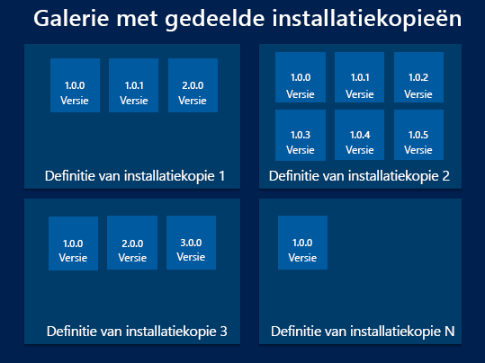
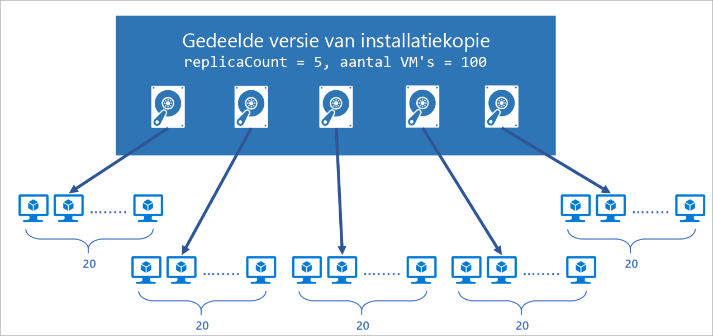
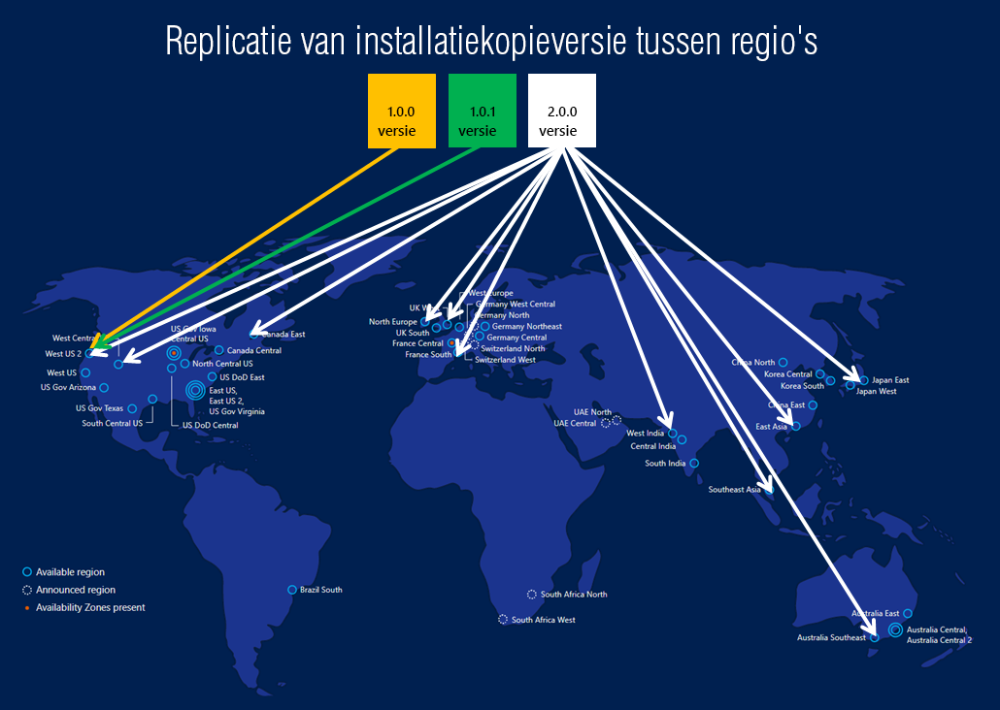

Galerie met gedeelde afbeeldingen is een service die u helpt bij het bouwen van structuur en organisatie rond uw beheerde installatie kopieën. Galerieën met gedeelde afbeeldingen bieden:

- Beheerde algemene replicatie van installatie kopieën.
- Versie beheer en groepering van installatie kopieën voor eenvoudiger beheer.
- Maxi maal beschik bare installatie kopieën met ZRS-accounts (zone redundant Storage) in regio's die Beschikbaarheidszones ondersteunen. ZRS biedt betere flexibiliteit tegen zonegebonden-fouten.
- Het delen van meerdere abonnementen en zelfs tussen Active Directory (AD)-tenants met behulp van RBAC.
- Het schalen van uw implementaties met afbeeldings replica's in elke regio.

Met behulp van een galerie met gedeelde afbeeldingen kunt u uw installatie kopieën delen met verschillende gebruikers, service-principals of AD-groepen binnen uw organisatie. Gedeelde installatie kopieën kunnen worden gerepliceerd naar meerdere regio's, zodat u uw implementaties sneller kunt schalen.

Een beheerde installatie kopie is een kopie van een volledige virtuele machine (inclusief eventuele gekoppelde gegevens schijven) of alleen de besturingssysteem schijf, afhankelijk van hoe u de installatie kopie maakt. Wanneer u een virtuele machine maakt op basis van de installatie kopie, wordt een kopie van de Vhd's in de installatie kopie gebruikt voor het maken van de schijven voor de nieuwe virtuele machine. De beheerde installatie kopie blijft in de opslag en kan opnieuw worden gebruikt voor het maken van nieuwe Vm's.

Als u een groot aantal beheerde installatie kopieën hebt dat u wilt behouden en deze beschikbaar wilt maken in het hele bedrijf, kunt u een galerie met gedeelde afbeeldingen gebruiken als opslag plaats waarmee u gemakkelijk uw installatie kopieën kan delen. 

De functie gedeelde installatie kopie galerie heeft meerdere bron typen:

| Resource | Beschrijving|
|----------|------------|
| **Beheerde installatie kopie** | Een basis installatie kopie die alleen kan worden gebruikt of gebruikt om een **installatie kopie versie** in een galerie met installatie kopieën te maken. Beheerde installatie kopieën worden gemaakt op basis van [gegeneraliseerde](#generalized-and-specialized-images) vm's. Een beheerde installatie kopie is een speciaal type VHD dat kan worden gebruikt om meerdere virtuele machines te maken en kan nu worden gebruikt om versies van gedeelde installatie kopieën te maken. |
| **Snapshot** | Een kopie van een VHD die kan worden gebruikt om een **installatie kopie versie**te maken. Moment opnamen kunnen worden gemaakt op basis van een [gespecialiseerde](#generalized-and-specialized-images) virtuele machine (een die niet is gegeneraliseerd) en vervolgens alleen worden gebruikt of met moment opnamen van gegevens schijven, om een gespecialiseerde installatie kopie versie te maken.
| **Galerie met installatie kopieën** | Net als de Azure Marketplace is een **afbeeldings galerie** een opslag plaats voor het beheren en delen van installatie kopieën, maar u bepaalt wie toegang heeft. |
| **Definitie van installatie kopie** | Installatie kopieën worden in een galerie gedefinieerd en bevatten informatie over de installatie kopie en vereisten voor het gebruik ervan binnen uw organisatie. U kunt informatie toevoegen zoals of de installatie kopie wordt gegeneraliseerd of gespecialiseerd, het besturings systeem, de minimale en maximale geheugen vereisten en release opmerkingen. Het is een definitie van een type installatie kopie. |
| **Versie van installatie kopie** | Een **installatie kopie versie** is wat u gebruikt om een virtuele machine te maken wanneer u een galerie gebruikt. U kunt meerdere versies van een installatie kopie naar behoefte hebben voor uw omgeving. Net als bij een beheerde installatie kopie wordt de versie van de installatie kopie gebruikt voor het maken van nieuwe schijven voor de virtuele machine wanneer u een **installatie kopie** gebruikt voor het maken van een virtuele machine. Installatie kopie versies kunnen meerdere keren worden gebruikt. |

<br>



## <a name="image-definitions"></a>Afbeeldings definities

Afbeeldings definities zijn een logische groepering voor versies van een installatie kopie. De definitie van de installatie kopie bevat informatie over waarom de installatie kopie is gemaakt, waarvoor het besturings systeem is en informatie over het gebruik van de installatie kopie. Een definitie van een installatie kopie is een plan voor alle details over het maken van een specifieke installatie kopie. U implementeert geen VM op basis van een definitie van een installatie kopie, maar vanuit de installatie kopie versie die is gemaakt op basis van de definitie.

Er zijn drie para meters voor elke definitie van de installatie kopie die worden gebruikt in combi natie: **Publisher**, **aanbieding** en **SKU**. Deze worden gebruikt om een specifieke definitie van een installatie kopie te vinden. U kunt installatie kopie versies die een of twee delen, maar niet alle drie waarden bevatten.  Dit zijn bijvoorbeeld drie afbeeldings definities en hun waarden:

|Definitie van installatiekopie|Uitgever|Aanbieding|Sku|
|---|---|---|---|
|myImage1|Contoso|Finance|Back-end|
|myImage2|Contoso|Finance|Front|
|myImage3|Testen|Finance|Front|

Alle drie deze hebben unieke sets waarden. De indeling is vergelijkbaar met de manier waarop u op dit moment Publisher, aanbieding en SKU kunt opgeven voor [installatie kopieën van Azure Marketplace](../articles/virtual-machines/windows/cli-ps-findimage.md) in azure PowerShell om de nieuwste versie van een Marketplace-installatie kopie te verkrijgen. Elke afbeeldings definitie moet een unieke set van deze waarden hebben.

Hieronder ziet u andere para meters die kunnen worden ingesteld voor de definitie van uw installatie kopie, zodat u uw resources gemakkelijker kunt bijhouden:

* Status van besturings systeem: u kunt de besturingssysteem status instellen op [gegeneraliseerd of gespecialiseerd](#generalized-and-specialized-images).
* Besturings systeem: dit kan Windows of Linux zijn.
* Beschrijving: gebruik beschrijving om meer gedetailleerde informatie te geven over waarom de definitie van de installatie kopie bestaat. U kunt bijvoorbeeld een definitie van een installatie kopie hebben voor de front-end-server waarop de toepassing vooraf is geïnstalleerd.
* EULA: kan worden gebruikt om te verwijzen naar een gebruiksrecht overeenkomst die specifiek is voor de definitie van de installatie kopie.
* Privacyverklaring en opmerkingen bij de release: Sla release opmerkingen en privacyverklaringen op in azure Storage en geef een URI op om ze te openen als onderdeel van de definitie van de installatie kopie.
* Datum van einde van de levens duur: koppel een einddatum datum aan de definitie van uw installatie kopie om oude afbeeldings definities te kunnen verwijderen.
* Tag: u kunt labels toevoegen wanneer u de definitie van de installatie kopie maakt. Zie [Tags gebruiken om uw resources te organiseren](../articles/azure-resource-manager/management/tag-resources.md) voor meer informatie over tags.
* Minimale en maximale vCPU-en geheugen aanbevelingen: als uw installatie kopie vCPU en geheugen aanbevelingen heeft, kunt u die gegevens koppelen aan de definitie van uw installatie kopie.
* Niet-toegestane schijf typen: u kunt informatie geven over de opslag behoeften voor uw VM. Als de installatie kopie bijvoorbeeld niet geschikt is voor standaard HDD-schijven, voegt u deze toe aan de lijst niet toegestaan.

## <a name="generalized-and-specialized-images"></a>Gegeneraliseerde en gespecialiseerde installatie kopieën

Er zijn twee statussen van het besturings systeem die worden ondersteund door de galerie met gedeelde afbeeldingen. Normaal gesp roken moeten installatie kopieën ervoor zorgen dat de virtuele machine die wordt gebruikt om de installatie kopie te maken, wordt gegeneraliseerd voordat de installatie kopie wordt gemaakt. Generalisatie is een proces waarbij computer-en gebruikersspecifieke gegevens van de virtuele machine worden verwijderd. Voor Windows wordt ook het Sysprep-bestand gebruikt. Voor Linux kunt u [waagent](https://github.com/Azure/WALinuxAgent) -`-deprovision` of `-deprovision+user`-para meters gebruiken.

Gespecialiseerde Vm's zijn niet via een proces voor het verwijderen van computerspecifieke informatie en-accounts. Daarnaast hebben Vm's die zijn gemaakt op basis van gespecialiseerde installatie kopieën geen `osProfile` gekoppeld. Dit betekent dat gespecialiseerde installatie kopieën enkele beperkingen zullen hebben.

- Accounts die kunnen worden gebruikt om zich aan te melden bij de virtuele machine, kunnen ook worden gebruikt op elke virtuele machine die is gemaakt met behulp van de gespecialiseerde installatie kopie die is gemaakt op basis van die VM.
- Vm's krijgen de **computer naam** van de virtuele machine waaruit de installatie kopie is gemaakt. Wijzig de computer naam om conflicten te voor komen.
- De `osProfile` is hoe gevoelige informatie wordt door gegeven aan de virtuele machine met behulp van `secrets`. Dit kan problemen veroorzaken met behulp van de sleutel kluis, WinRM en andere functionaliteit die gebruikmaakt van `secrets` in de `osProfile`. In sommige gevallen kunt u de beheerde service-identiteiten (MSI) gebruiken om deze beperkingen te omzeilen.

> [!IMPORTANT]
> Gespecialiseerde installatie kopieën zijn momenteel beschikbaar als open bare preview.
> Deze preview-versie wordt aangeboden zonder service level agreement en wordt niet aanbevolen voor productieworkloads. Misschien worden bepaalde functies niet ondersteund of zijn de mogelijkheden ervan beperkt. Zie [Supplemental Terms of Use for Microsoft Azure Previews (Aanvullende gebruiksvoorwaarden voor Microsoft Azure-previews)](https://azure.microsoft.com/support/legal/preview-supplemental-terms/) voor meer informatie.
>
> **Bekende preview-beperkingen** Vm's kunnen alleen worden gemaakt op basis van gespecialiseerde installatie kopieën met behulp van de portal of API. De is geen CLI-of Power Shell-ondersteuning voor de preview-versie.


## <a name="regional-support"></a>Regionale ondersteuning

De bron regio's worden weer gegeven in de volgende tabel. Alle open bare regio's kunnen doel regio's zijn, maar om naar Australië-centraal te repliceren en Australië-centraal 2 moet u uw abonnement white list. Als u White List wilt aanvragen, gaat u naar: https://azure.microsoft.com/global-infrastructure/australia/contact/


| Bron regio's        |                   |                    |                    |
| --------------------- | ----------------- | ------------------ | ------------------ |
| Australië - centraal     | China East        | India - zuid        | Europa -west        |
| Australië - centraal 2   | China-oost 2      | Azië - zuidoost     | Verenigd Koninkrijk Zuid           |
| Australië - oost        | China - noord       | Japan - oost         | Verenigd Koninkrijk West            |
| Australië - zuidoost   | China-noord 2     | Japan - west         | US DoD Central     |
| Brazilië - zuid          | Azië - oost         | Korea - centraal      | US DoD East        |
| Canada - midden        | VS - oost           | Korea - zuid        | VS (overheid) - Arizona     |
| Canada - oost           | VS - oost 2         | VS - noord-centraal   | VS (overheid) - Texas       |
| India - centraal         | VS-Oost 2 EUAP    | Europa - noord       | VS (overheid) - Virginia    |
| VS - centraal            | Frankrijk - centraal    | VS - zuid-centraal   | India - west         |
| Centrale VS-EUAP       | Frankrijk - zuid      | VS - west-centraal    | VS - west            |
|                       |                   |                    | VS - west 2          |


## <a name="limits"></a>Limieten 

Er zijn limieten, per abonnement, voor het implementeren van resources met behulp van de galerie met gedeelde afbeeldingen:
- 100 gedeelde afbeeldings galerieën, per abonnement, per regio
- 1\.000 installatie kopie definities, per abonnement, per regio
- 10.000 installatie kopie versies, per abonnement, per regio
- Schijven die zijn gekoppeld aan de installatie kopie moeten kleiner zijn dan of gelijk zijn aan 1 TB groot

Zie voor meer informatie [resource gebruik controleren op limieten](https://docs.microsoft.com/azure/networking/check-usage-against-limits) voor voor beelden van het controleren van uw huidige gebruik.
 
## <a name="scaling"></a>Schalen
Met de galerie voor gedeelde afbeeldingen kunt u het aantal replica's opgeven dat door Azure moet worden bewaard voor de installatie kopieën. Dit helpt bij implementatie scenario's met meerdere VM'S als de VM-implementaties kunnen worden gespreid naar verschillende replica's, waardoor de kans dat verwerking van het proces voor het maken van exemplaren wordt beperkt door overbelasting van één replica wordt verkleind.

Met de galerie voor gedeelde afbeeldingen kunt u nu tot 1.000 VM-exemplaren implementeren in een schaalset voor virtuele machines (tot 600 met beheerde installatie kopieën). Image replica's bieden betere implementatie prestaties, betrouw baarheid en consistentie.  U kunt in elke doel regio een ander aantal replica's instellen, op basis van de schaal behoeften voor de regio. Omdat elke replica een diepe kopie van uw installatie kopie is, kunt u hiermee uw implementaties lineair schalen met elke extra replica. We begrijpen dat er niet twee installatie kopieën of regio's hetzelfde zijn. Hier volgt onze algemene richt lijnen voor het gebruik van replica's in een regio:

- Voor implementaties met een niet-virtuele machine Scale set (VMSS): voor elke 20 Vm's die u gelijktijdig maakt, raden we u aan één replica te blijven gebruiken. Als u 120 Vm's gelijktijdig maakt met behulp van dezelfde installatie kopie in een regio, wordt u aangeraden minstens 6 replica's van uw installatie kopie te gebruiken. 
- Voor implementaties van Virtual Machine Scale set (VMSS): voor elke implementatie van een schaalset met Maxi maal 600 exemplaren, raden we u aan ten minste één replica te gebruiken. Als u bijvoorbeeld vijf schaal sets gelijktijdig maakt, waarbij elk 600 VM-exemplaren dezelfde installatie kopie in één regio gebruikt, wordt u aangeraden ten minste vijf replica's van uw installatie kopie te gebruiken. 

We raden u altijd aan het aantal replica's te overtreffen door factoren zoals afbeeldings grootte, inhoud en type besturings systeem.



## <a name="make-your-images-highly-available"></a>Uw afbeeldingen Maxi maal beschikbaar maken

[Azure zone redundant Storage (ZRS)](https://azure.microsoft.com/blog/azure-zone-redundant-storage-in-public-preview/) biedt een tolerantie voor een fout in de beschikbaarheids zone in de regio. Met de algemene Beschik baarheid van de galerie gedeelde afbeeldingen kunt u ervoor kiezen om uw installatie kopieën op te slaan in ZRS-accounts in regio's met Beschikbaarheidszones. 

U kunt ook het account type kiezen voor elk van de doel regio's. Het standaard type opslag account is Standard_LRS, maar u kunt Standard_ZRS voor regio's met Beschikbaarheidszones kiezen. Controleer [hier](https://docs.microsoft.com/azure/storage/common/storage-redundancy-zrs)de regionale beschik BAARHEID van ZRS.


## <a name="replication"></a>Replicatie
Met de galerie voor gedeelde afbeeldingen kunt u ook automatisch uw installatie kopieën naar andere Azure-regio's repliceren. Elke versie van een gedeelde installatie kopie kan worden gerepliceerd naar verschillende regio's, afhankelijk van wat voor uw organisatie zinvol is. Een voor beeld is om altijd de nieuwste afbeelding in meerdere regio's te repliceren terwijl alle oudere versies alleen beschikbaar zijn in één regio. Dit kan helpen besparen op opslag kosten voor gedeelde installatie kopie versies. 

De regio's waarvan een versie van de gedeelde installatie kopie wordt gerepliceerd naar, kunnen worden bijgewerkt na de aanmaak tijd. De tijd die nodig is om naar verschillende regio's te repliceren, is afhankelijk van de hoeveelheid gegevens die wordt gekopieerd en het aantal regio's waarnaar de versie wordt gerepliceerd. Dit kan in sommige gevallen enkele uren duren. Terwijl de replicatie plaatsvindt, kunt u de status van de replicatie per regio weer geven. Zodra de replicatie van de installatie kopie in een regio is voltooid, kunt u een virtuele machine of schaalset implementeren met behulp van de installatie kopie versie in de regio.



## <a name="access"></a>Access

Aangezien de galerie met gedeelde afbeeldingen, de afbeeldings definitie en de versie van de installatie kopie alle resources zijn, kunnen ze worden gedeeld met behulp van de ingebouwde systeem eigen Azure RBAC-besturings elementen. Met RBAC kunt u deze resources delen met andere gebruikers, service-principals en groepen. U kunt zelfs toegang delen voor personen buiten de Tenant waarin deze zijn gemaakt. Zodra een gebruiker toegang heeft tot de versie van de gedeelde installatie kopie, kunnen ze een virtuele machine of een VM-Schaalset implementeren.  Dit is de matrix voor delen waarmee u begrijpt waarover de gebruiker toegang krijgt:

| Gedeeld met gebruiker     | Galerie met gedeelde installatiekopieën | Definitie van installatiekopie | Versie van installatiekopie |
|----------------------|----------------------|--------------|----------------------|
| Galerie met gedeelde installatiekopieën | Ja                  | Ja          | Ja                  |
| Definitie van installatiekopie     | Nee                   | Ja          | Ja                  |

U wordt aangeraden op Galerie niveau te delen voor de beste ervaring. Het is niet raadzaam om afzonderlijke versies van een installatie kopie te delen. Zie [toegang tot Azure-resources beheren met RBAC](../articles/role-based-access-control/role-assignments-portal.md)voor meer informatie over RBAC.

Installatie kopieën kunnen ook worden gedeeld, op schaal, zelfs via tenants met behulp van een multi tenant-app-registratie. Zie [Galerie-VM-installatie kopieën delen in azure-tenants](../articles/virtual-machines/linux/share-images-across-tenants.md)voor meer informatie over het delen van installatie kopieën tussen tenants.

## <a name="billing"></a>Facturering
Er worden geen extra kosten in rekening gebracht voor het gebruik van de service voor de gedeelde afbeeldingen galerie. Er worden kosten in rekening gebracht voor de volgende resources:
- Opslag kosten voor het opslaan van de versies van de gedeelde installatie kopieën. De kosten zijn afhankelijk van het aantal replica's van de versie van de installatie kopie en het aantal regio's waarnaar de versie wordt gerepliceerd. Als u bijvoorbeeld twee installatie kopieën hebt en beide worden gerepliceerd naar drie regio's, worden er 6 beheerde schijven in rekening gebracht op basis van de grootte. Zie [Managed disks prijzen](https://azure.microsoft.com/pricing/details/managed-disks/)voor meer informatie.
- Uitgaande netwerk kosten voor replicatie van de eerste versie van de installatie kopie van de bron regio naar de gerepliceerde regio's. Volgende replica's worden binnen de regio verwerkt, zodat er geen extra kosten in rekening worden gebracht. 

## <a name="updating-resources"></a>Resources bijwerken

Nadat u deze hebt gemaakt, kunt u enkele wijzigingen aanbrengen in de afbeeldingen galerie-resources. Deze zijn beperkt tot:
 
Galerie met gedeelde afbeeldingen:
- Beschrijving

Definitie van installatie kopie:
- Aanbevolen Vcpu's
- Aanbevolen geheugen
- Beschrijving
- Einde van de levens duur

Versie van installatie kopie:
- Aantal regionale replica's
- Doel regio's
- Van laatste uitsluiten
- Einde van de levens duur

## <a name="sdk-support"></a>SDK-ondersteuning

Met de volgende Sdk's wordt ondersteuning geboden voor het maken van gedeelde afbeeldings galerieën:

- [.NET](https://docs.microsoft.com/dotnet/api/overview/azure/virtualmachines/management?view=azure-dotnet)
- [Java](https://docs.microsoft.com/java/azure/?view=azure-java-stable)
- [Node.js](https://docs.microsoft.com/javascript/api/@azure/arm-compute)
- [Python](https://docs.microsoft.com/python/api/overview/azure/virtualmachines?view=azure-python)
- [Go](https://docs.microsoft.com/azure/go/)

## <a name="templates"></a>Sjablonen

U kunt een resource voor de galerie met gedeelde afbeeldingen maken met behulp van sjablonen. Er zijn verschillende Azure Quick Start-sjablonen beschikbaar: 

- [Een galerie met gedeelde afbeeldingen maken](https://azure.microsoft.com/resources/templates/101-sig-create/)
- [Een definitie van een installatie kopie maken in een galerie met gedeelde afbeeldingen](https://azure.microsoft.com/resources/templates/101-sig-image-definition-create/)
- [Een installatie kopie versie maken in een galerie met gedeelde afbeeldingen](https://azure.microsoft.com/resources/templates/101-sig-image-version-create/)
- [Een VM maken op basis van de installatie kopie versie](https://azure.microsoft.com/resources/templates/101-vm-from-sig/)

## <a name="frequently-asked-questions"></a>Veelgestelde vragen 

* [Hoe kan ik alle resources van de galerie met gedeelde afbeeldingen in abonnementen weer geven?](#how-can-i-list-all-the-shared-image-gallery-resources-across-subscriptions) 
* [Kan ik mijn bestaande afbeelding verplaatsen naar de galerie met gedeelde afbeeldingen?](#can-i-move-my-existing-image-to-the-shared-image-gallery)
* [Kan ik een installatie kopie versie van een gespecialiseerde schijf maken?](#can-i-create-an-image-version-from-a-specialized-disk)
* [Kan ik de resource van de gedeelde afbeeldingen galerie verplaatsen naar een ander abonnement nadat deze is gemaakt?](#can-i-move-the-shared-image-gallery-resource-to-a-different-subscription-after-it-has-been-created)
* [Kan ik mijn afbeeldings versies in Clouds, zoals Azure China 21Vianet of Azure Duitsland of Azure Government Cloud, repliceren?](#can-i-replicate-my-image-versions-across-clouds-such-as-azure-china-21vianet-or-azure-germany-or-azure-government-cloud)
* [Kan ik mijn installatie kopie versies in abonnementen repliceren?](#can-i-replicate-my-image-versions-across-subscriptions)
* [Kan ik installatie kopie versies delen in azure AD-tenants?](#can-i-share-image-versions-across-azure-ad-tenants)
* [Hoe lang duurt het om installatie kopieën in de doel regio's te repliceren?](#how-long-does-it-take-to-replicate-image-versions-across-the-target-regions)
* [Wat is het verschil tussen bron gebied en doel regio?](#what-is-the-difference-between-source-region-and-target-region)
* [Hoe kan ik de bron regio opgeven tijdens het maken van de installatie kopie versie?](#how-do-i-specify-the-source-region-while-creating-the-image-version)
* [Hoe kan ik geeft u het aantal afbeeldings versie replica's op dat in elke regio moet worden gemaakt?](#how-do-i-specify-the-number-of-image-version-replicas-to-be-created-in-each-region)
* [Kan ik de galerie met gedeelde afbeeldingen maken op een andere locatie dan die voor de definitie van de installatie kopie en de versie van de installatie kopie?](#can-i-create-the-shared-image-gallery-in-a-different-location-than-the-one-for-the-image-definition-and-image-version)
* [Wat zijn de kosten voor het gebruik van de galerie met gedeelde afbeeldingen?](#what-are-the-charges-for-using-the-shared-image-gallery)
* [Welke API-versie moet ik gebruiken voor het maken van een galerie met gedeelde afbeeldingen en een afbeeldings definitie en installatie kopie versie?](#what-api-version-should-i-use-to-create-shared-image-gallery-and-image-definition-and-image-version)
* [Welke API-versie moet ik gebruiken om een gedeelde VM of schaal van een virtuele machine te maken op de installatie kopie versie?](#what-api-version-should-i-use-to-create-shared-vm-or-virtual-machine-scale-set-out-of-the-image-version)

### <a name="how-can-i-list-all-the-shared-image-gallery-resources-across-subscriptions"></a>Hoe kan ik alle resources van de galerie met gedeelde afbeeldingen in abonnementen weer geven?

Volg de onderstaande stappen om alle resources van de gedeelde installatie kopie galerie weer te geven in abonnementen waartoe u toegang hebt op de Azure Portal:

1. Open de [Azure-portal](https://portal.azure.com).
1. Ga naar **alle resources**.
1. Selecteer alle abonnementen waaronder u alle resources wilt weer geven.
1. Zoek naar bronnen van het type **persoonlijke galerie**.
 
   Als u de afbeeldings definities en afbeeldings versies wilt zien, moet u ook **verborgen typen weer geven**selecteren.
 
   Als u alle resources van de galerie met gedeelde afbeeldingen wilt weer geven voor alle abonnementen waarvoor u machtigingen hebt, gebruikt u de volgende opdracht in de Azure CLI:

   ```bash
   az account list -otsv --query "[].id" | xargs -n 1 az sig list --subscription
   ```

### <a name="can-i-move-my-existing-image-to-the-shared-image-gallery"></a>Kan ik mijn bestaande afbeelding verplaatsen naar de galerie met gedeelde afbeeldingen?
 
Ja. Er zijn drie scenario's die zijn gebaseerd op de typen installatie kopieën die u mogelijk hebt.

 Scenario 1: als u een beheerde installatie kopie hebt in hetzelfde abonnement als uw SIG, kunt u een afbeeldings definitie en een installatie kopie versie van de afbeelding maken.

 Scenario 2: als u een niet-beheerde installatie kopie hebt in hetzelfde abonnement als uw SIG, kunt u er een beheerde installatie kopie van maken en vervolgens een installatie kopie-en afbeeldings versie maken. 

 Scenario 3: als u een VHD in het lokale bestands systeem hebt, moet u de VHD uploaden naar een beheerde installatie kopie, waarna u een installatie kopie en afbeeldings versie van de virtuele harde schijf kunt maken.

- Zie [een VHD uploaden](https://docs.microsoft.com/azure/virtual-machines/windows/upload-generalized-managed)als de VHD van een Windows-virtuele machine is.
- Zie [een VHD uploaden](https://docs.microsoft.com/azure/virtual-machines/linux/upload-vhd#option-1-upload-a-vhd) als de VHD voor een virtuele Linux-machine is.

### <a name="can-i-create-an-image-version-from-a-specialized-disk"></a>Kan ik een installatie kopie versie van een gespecialiseerde schijf maken?

Ja, ondersteuning voor speciale schijven als installatie kopieën is in de preview-versie. U kunt alleen een virtuele machine maken op basis van een gespecialiseerde installatie kopie met behulp van de portal ([Windows](../articles/virtual-machines/linux/shared-images-portal.md) of [Linux](../articles/virtual-machines/linux/shared-images-portal.md)) en de API. Er is geen Power Shell-ondersteuning voor de preview-versie.

### <a name="can-i-move-the-shared-image-gallery-resource-to-a-different-subscription-after-it-has-been-created"></a>Kan ik de resource van de gedeelde afbeeldingen galerie verplaatsen naar een ander abonnement nadat deze is gemaakt?

Nee, u kunt de resource van de gedeelde afbeeldings galerie niet naar een ander abonnement verplaatsen. U kunt de installatie kopieën in de galerie echter naar andere regio's repliceren.

### <a name="can-i-replicate-my-image-versions-across-clouds-such-as-azure-china-21vianet-or-azure-germany-or-azure-government-cloud"></a>Kan ik mijn afbeeldings versies in Clouds, zoals Azure China 21Vianet of Azure Duitsland of Azure Government Cloud, repliceren?

Nee, u kunt geen afbeeldings versies van Clouds repliceren.

### <a name="can-i-replicate-my-image-versions-across-subscriptions"></a>Kan ik mijn installatie kopie versies in abonnementen repliceren?

Nee, u kunt de installatie kopie versies van de verschillende regio's in een abonnement repliceren en deze gebruiken in andere abonnementen via RBAC.

### <a name="can-i-share-image-versions-across-azure-ad-tenants"></a>Kan ik installatie kopie versies delen in azure AD-tenants? 

Ja, u kunt RBAC gebruiken om te delen met personen in een Tenant. Als u echter op schaal wilt delen, raadpleegt u ' Galerie-installatie kopieën delen in azure-tenants ' met [Power shell](../articles/virtual-machines/windows/share-images-across-tenants.md) of [cli](../articles/virtual-machines/linux/share-images-across-tenants.md).

### <a name="how-long-does-it-take-to-replicate-image-versions-across-the-target-regions"></a>Hoe lang duurt het om installatie kopieën in de doel regio's te repliceren?

De replicatie tijd van de installatie kopie is geheel afhankelijk van de grootte van de installatie kopie en het aantal regio's waarnaar deze wordt gerepliceerd. Als best practice, kunt u echter het beste de installatie kopie klein en de bron-en doel regio's sluiten voor optimale resultaten. U kunt de status van de replicatie controleren met de vlag-ReplicationStatus.

### <a name="what-is-the-difference-between-source-region-and-target-region"></a>Wat is het verschil tussen bron gebied en doel regio?

Bron regio is de regio waarin de versie van de installatie kopie wordt gemaakt en de doel regio's zijn de regio's waarin een kopie van de afbeeldings versie wordt opgeslagen. Voor elke installatie kopie versie kunt u slechts één bron regio hebben. Zorg er ook voor dat u de locatie van het bron gebied als een van de doel regio's doorgeeft wanneer u een installatie kopie versie maakt.

### <a name="how-do-i-specify-the-source-region-while-creating-the-image-version"></a>Hoe kan ik de bron regio opgeven tijdens het maken van de installatie kopie versie?

Tijdens het maken van een installatie kopie, kunt u de **-locatie-** tag in CLI en de tag **-Location** in Power shell gebruiken om de bron regio op te geven. Zorg ervoor dat de beheerde installatie kopie die u als basis installatie kopie gebruikt voor het maken van de installatie kopie versie, zich op dezelfde locatie bevindt als de locatie waar u de installatie kopie versie wilt maken. Zorg er ook voor dat u de locatie van het bron gebied als een van de doel regio's doorgeeft wanneer u een installatie kopie versie maakt.  

### <a name="how-do-i-specify-the-number-of-image-version-replicas-to-be-created-in-each-region"></a>Hoe kan ik geeft u het aantal afbeeldings versie replica's op dat in elke regio moet worden gemaakt?

Er zijn twee manieren waarop u kunt opgeven hoeveel afbeeldings versie replica's er moeten worden gemaakt in elke regio:
 
1. Het regionale aantal replica's waarmee het aantal replica's wordt opgegeven dat u per regio wilt maken. 
2. Het aantal algemene replica's dat de standaard waarde per regio is, in het geval dat het aantal regionale replica's is opgegeven. 

Als u het aantal regionale replica's wilt opgeven, geeft u de locatie door, samen met het aantal replica's dat u wilt maken in die regio: "Zuid-Centraal VS = 2". 

Als er voor elke locatie geen regionaal aantal replica's is opgegeven, is het standaard aantal replica's het aantal gemeen schappelijke replica's dat u hebt opgegeven. 

Als u het aantal algemene replica's in CLI wilt opgeven, gebruikt u het argument **--replica-Count** in de opdracht `az sig image-version create`.

### <a name="can-i-create-the-shared-image-gallery-in-a-different-location-than-the-one-for-the-image-definition-and-image-version"></a>Kan ik de galerie met gedeelde afbeeldingen maken op een andere locatie dan die voor de definitie van de installatie kopie en de versie van de installatie kopie?

Ja, dat is mogelijk. Maar als best practice, raden we u aan de resource groep, de galerie met gedeelde installatie kopieën, de definitie van de installatie kopie en de installatie kopie versie op dezelfde locatie te laten staan.

### <a name="what-are-the-charges-for-using-the-shared-image-gallery"></a>Wat zijn de kosten voor het gebruik van de galerie met gedeelde afbeeldingen?

Er worden geen kosten in rekening gebracht voor het gebruik van de service voor de gedeelde installatie kopie galerie, met uitzonde ring van de opslag kosten voor het opslaan van de installatie kopie versies en de kosten van het netwerk uitgaand voor het repliceren van de installatie kopieën van de bron regio

### <a name="what-api-version-should-i-use-to-create-shared-image-gallery-and-image-definition-and-image-version"></a>Welke API-versie moet ik gebruiken voor het maken van een galerie met gedeelde afbeeldingen en een afbeeldings definitie en installatie kopie versie?

Als u wilt werken met de gemeen schappelijke afbeeldings galerieën, afbeeldings definities en afbeeldings versies, raden we u aan API-versie 2018-06-01 te gebruiken. Voor zone redundant Storage (ZRS) is versie 2019-03-01 of hoger vereist.

### <a name="what-api-version-should-i-use-to-create-shared-vm-or-virtual-machine-scale-set-out-of-the-image-version"></a>Welke API-versie moet ik gebruiken om een gedeelde VM of schaal van een virtuele machine te maken op de installatie kopie versie?

Voor VM-en virtuele-machine schaal sets die gebruikmaken van een installatie kopie versie raden we u aan om API-versie 2018-04-01 of hoger te gebruiken.
