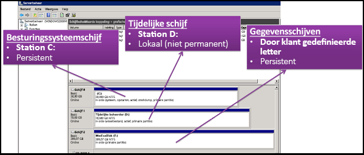
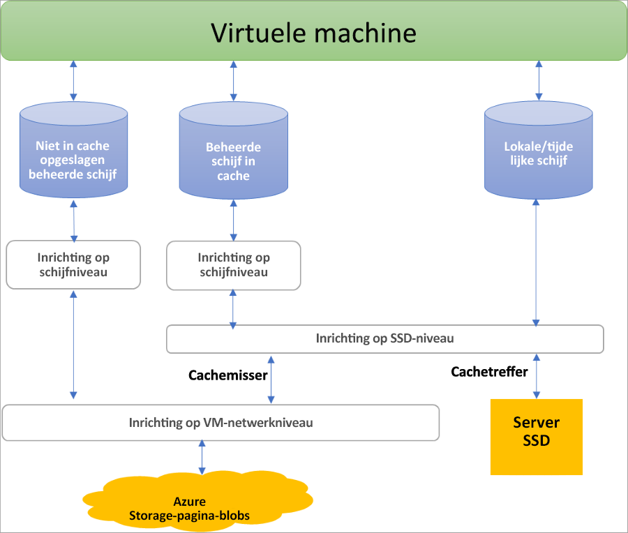

## Voordelen van beheerde schijven

We gaan enkele van de voordelen van het gebruik van beheerde schijven bespreken.

### Uiterst duurzaam en beschikbaar

Beheerde schijven zijn ontworpen voor een beschikbaarheid van 99,999%. Beheerde schijven realiseren dit door u drie replica's van uw gegevens te bieden, zodat ze uiterst duurzaam zijn. Als een of zelfs twee replica's problemen ondervinden, zorgen de overige replica's voor persistentie van uw gegevens en een hoge tolerantie tegen fouten. Deze architectuur heeft ertoe bijgedragen dat Azure consistente duurzaamheid levert voor IaaS-schijven (Infrastructure as a Service), met een toonaangevende storing van NUL % per jaar.

### Eenvoudige en schaalbare VM-implementatie

Met beheerde schijven kunt u maximaal 50.000 VM-**schijven** van een type in een abonnement per regio maken, zodat u duizenden **VM's** kunt maken in één abonnement. Deze functie verhoogt ook de schaalbaarheid van [schaalsets voor virtuele machines](../articles/virtual-machine-scale-sets/virtual-machine-scale-sets-overview.md) omdat u maximaal 1.000 VM's in een schaalset voor virtuele machines kunt maken met behulp van een Marketplace-installatiekopie.

### Integratie met beschikbaarheidssets

Beheerde schijven zijn geïntegreerd met beschikbaarheidssets om ervoor te zorgen dat de schijven van [VM's in een beschikbaarheidsset](../articles/virtual-machines/windows/manage-availability.md#use-managed-disks-for-vms-in-an-availability-set) voldoende van elkaar zijn verwijderd, waardoor een SPOF (Single Point Of Failure) wordt voorkomen. Schijven worden automatisch in verschillende schaaleenheden voor opslag (stempels) geplaatst. Wanneer een hardware- of softwarefout optreedt in een stempel, worden alleen de VM-exemplaren met schijven op deze stempels beïnvloed. Stel bijvoorbeeld dat u een toepassing hebt die op vijf VM's wordt uitgevoerd en dat de VM's zich in een beschikbaarheidsset bevinden. De schijven voor deze VM's worden niet allemaal opgeslagen in dezelfde stempel, dus als de ene stempel uitvalt, worden de andere exemplaren van de toepassing nog steeds uitgevoerd.

### Integratie met beschikbaarheidszones

Beheerde schijven ondersteunen [beschikbaarheidszones](../articles/availability-zones/az-overview.md). Dit is een oplossing met hoge beschikbaarheid die uw toepassingen beschermt tegen datacenterfouten. Beschikbaarheidszones zijn unieke, fysieke locaties binnen een Azure-regio. Elke zone bestaat uit een of meer datacenters die zijn voorzien van een onafhankelijke stroomvoorziening, koeling en netwerken. Tolerantie wordt gegarandeerd door aanwezigheid van minimaal drie afzonderlijke zones in alle actieve regio's. Met beschikbaarheidszones biedt Azure de beste uptime SLA voor VM’s van de branche, van 99,99%.

### Ondersteuning voor Azure Backup

[Azure Backup](../articles/backup/backup-overview.md) kan ter bescherming tegen regionale noodgevallen worden gebruikt om een back-uptaak te maken met back-ups op basis van tijd en beleidsregels voor het bewaren van back-ups. Op die manier kunt u naar wens herstelbewerkingen voor VM's of beheerde schijven uitvoeren. Momenteel ondersteunt Azure Backup schijfgrootten tot 32 TiB (tebibytes). [Meer informatie](../articles/backup/backup-support-matrix-iaas.md) over ondersteuning voor Azure VM-back-ups.

### Gedetailleerd toegangsbeheer

U kunt [op rollen gebaseerd toegangsbeheer (Azure RBAC)](../articles/role-based-access-control/overview.md) van Azure gebruiken om specifieke machtigingen voor een beheerde schijf aan een of meer gebruikers toe te wijzen. Beheerde schijven bieden verschillende bewerkingen, waaronder lezen, schrijven (maken/bijwerken), verwijderen en ophalen van een [SAS-URI (Shared Access Signature)](../articles/storage/common/storage-dotnet-shared-access-signature-part-1.md) voor de schijf. U kunt alleen toegang verlenen tot de bewerkingen die een persoon nodig heeft om de taak uit te voeren. Als u bijvoorbeeld niet wilt dat een persoon een beheerde schijf naar een opslagaccount kopieert, kunt u ervoor kiezen geen toegang te verlenen tot de exportbewerking voor die beheerde schijf. En als u niet wilt dat een gebruiker een SAS-URI gebruikt om een beheerde schijf te kopiëren, kunt u ervoor kiezen deze machtiging niet te verlenen aan de beheerde schijf.

### Uw vhd uploaden

Direct uploaden maakt het eenvoudig om uw vhd over te zetten naar een door Azure beheerde schijf. Voorheen moest u een complexer proces volgen dat de fasering van uw gegevens in een opslagaccount bevatte. Nu zijn er minder stappen. Het is nu eenvoudiger om on-premises VM's naar Azure te uploaden, te uploaden naar grote beheerde schijven en het back-up- en herstelproces is vereenvoudigd. Het vermindert ook de kosten omdat u gegevens rechtstreeks naar beheerde schijven kunt uploaden zonder ze aan VM's toe te voegen. U kunt direct uploaden gebruiken om vhd's met een grootte van maximaal 32 TiB te uploaden.

Zie de [CLI](../articles/virtual-machines/linux/disks-upload-vhd-to-managed-disk-cli.md)- of [PowerShell](../articles/virtual-machines/windows/disks-upload-vhd-to-managed-disk-powershell.md)-artikelen voor meer informatie over het overdragen van uw vhd naar Azure.

## Beveiliging

### Privékoppelingen

Private Link-ondersteuning voor beheerde schijven is momenteel in preview en kan worden gebruikt om een beheerde interne schijf naar uw netwerk te importeren of exporteren. Met privékoppelingen kunt u een tijdsgebonden Shared Access Signature-URI (SAS) genereren voor niet-gekoppelde beheerde schijven en momentopnamen die u kunt gebruiken voor het exporteren van de gegevens naar een andere regio voor regionale expansie, herstel na noodgevallen en forensische analyse. U kunt ook de SAS-URI gebruiken om de VHD rechtstreeks naar een lege schijf van on-premises te uploaden. U kunt [Privékoppelingen](../articles/private-link/private-link-overview.md) nu gebruiken om het exporteren en importeren van beheerde schijven te beperken zodat dit alleen kan worden uitgevoerd in uw virtuele Azure-netwerk. Met privékoppelingen kunt u ervoor zorgen dat uw gegevens alleen binnen het beveiligde Microsoft-backbone-netwerk worden verplaatst.

Zie de artikelen over de [CLI](../articles/virtual-machines/linux/disks-export-import-private-links-cli.md) of [Portal](../articles/virtual-machines/disks-enable-private-links-for-import-export-portal.md) voor meer informatie over het inschakelen van privékoppelingen voor het importeren of exporteren van een beheerde schijf.

### Versleuteling

Beheerde schijven bieden twee verschillende soorten versleuteling. De eerste is SSE (Server Side Encryption), die door de opslagservice wordt uitgevoerd. De tweede is Azure Disk Encryption (ADE), dat u kunt inschakelen op het besturingssysteem en de gegevensschijven voor uw virtuele machines.

#### Versleuteling aan de serverzijde

Met versleuteling aan serverzijde kunt u inactieve gegevens versleutelen en kunt u uw gegevens zodanig beschermen dat wordt voldaan aan de beveiligings- en nalevingsverplichtingen van de organisatie. SSE is standaard ingeschakeld voor alle beheerde schijven, momentopnamen en installatiekopieën in alle regio's waar beheerde schijven beschikbaar zijn. (Tijdelijke schijven worden daarentegen niet versleuteld door versleuteling aan serverzijde tenzij u versleuteling inschakelt op de host; zie [Schijfrollen: tijdelijke schijven](#temporary-disk)).

U kunt Azure toestaan uw sleutels voor u te beheren (dit zijn door het platform beheerde sleutels) of u kunt de sleutels zelf beheren (door de klant beheerde sleutels). Lees het artikel [Versleuteling aan serverzijde van Azure Disk Storage](../articles/virtual-machines/windows/disk-encryption.md) voor meer informatie.

#### Azure Disk Encryption

Met Azure Disk Encryption kunt u het besturingssysteem en de gegevensschijven versleutelen die worden gebruikt door een virtuele IaaS-machine. Deze versleuteling omvat beheerde schijven. Voor Windows worden de stations versleuteld met behulp van de standaard BitLocker-versleutelingstechnologie. Voor Linux worden de schijven versleuteld met behulp van de DM-Crypt-technologie. Het versleutelingsproces is geïntegreerd met Azure Key Vault zodat u de schijfversleutelingssleutels kunt controleren en beheren. Zie [Azure Disk Encryption voor virtuele Linux-machines](../articles/virtual-machines/linux/disk-encryption-overview.md) of [Azure Disk Encryption voor virtuele Windows-machines](../articles/virtual-machines/windows/disk-encryption-overview.md) voor meer informatie.

## Schijfrollen

Er zijn drie belangrijke schijfrollen in Azure: de gegevensschijf, de besturingssysteemschijf en de tijdelijke schijf. Deze rollen worden toegewezen aan schijven die zijn gekoppeld aan de virtuele machine.

### Gegevensschijf

Een gegevensschijf is een beheerde schijf die is gekoppeld aan een virtuele machine om toepassingsgegevens op te slaan, of andere gegevens die u moet bewaren. Gegevensschijven worden geregistreerd als SCSI-station en zijn voorzien van een door u gekozen letter. Elke gegevensschijf heeft een maximale capaciteit van 32.767 GiB (gibibytes). De grootte van de virtuele machine bepaalt hoeveel gegevensschijven u kunt koppelen en welk type opslag u kunt gebruiken om de schijven te hosten.

### Besturingssysteemschijf

Elke virtuele machine heeft een gekoppelde besturingssysteemschijf. Die besturingssysteemschijf heeft een vooraf geïnstalleerd besturingssysteem dat is geselecteerd toen de virtuele machine werd gemaakt. Deze schijf bevat het opstartvolume.

Deze gegevensschijf heeft een maximale capaciteit van 2.048 GiB.

### Tijdelijke schijf

Elke VM bevat een tijdelijke schijf, die geen beheerde schijf is. De tijdelijke schijf biedt langdurige opslag voor toepassingen en processen en is alleen bedoeld om gegevens op te slaan, zoals pagina- of wisselbestanden. Gegevens op de tijdelijke schijf kunnen verloren gaan tijdens een [onderhoudsgebeurtenis](../articles/virtual-machines/windows/manage-availability.md?toc=%2fazure%2fvirtual-machines%2fwindows%2ftoc.json#understand-vm-reboots---maintenance-vs-downtime) of wanneer u een [virtuele machine opnieuw implementeert](../articles/virtual-machines/troubleshooting/redeploy-to-new-node-windows.md?toc=%2Fazure%2Fvirtual-machines%2Fwindows%2Ftoc.json). Tijdens een geslaagde standaardherstart van de virtuele machine blijven de gegevens op de tijdelijke schijf behouden.  

Op virtuele machines van Azure Linux is de tijdelijke schijf doorgaans /dev/sdb en op virtuele Windows-machines is de tijdelijke schijf standaard D:. De tijdelijke schijf wordt niet versleuteld door versleuteling aan serverzijde tenzij u versleuteling inschakelt op de host.

## Momentopnamen van beheerde schijf

Een momentopname van een beheerde schijf is een alleen-lezen, crashconsistente volledige kopie van een beheerde schijf die standaard wordt opgeslagen als standaard beheerde schijf. Met momentopnamen kunt u op elk moment een back-up maken van uw beheerde schijven. Deze momentopnamen bestaan onafhankelijk van de bronschijf en kunnen worden gebruikt om nieuwe beheerde schijven te maken. 

Momentopnamen worden gefactureerd op basis van de gebruikte grootte. Als u bijvoorbeeld een momentopname maakt van een beheerde schijf met een ingerichte capaciteit van 64 GiB en een daadwerkelijk gebruikte gegevensgrootte van 10 GiB, wordt die momentopname alleen gefactureerd voor de gebruikte gegevensgrootte van 10 GiB. U kunt de gebruikte grootte van uw momentopnamen bekijken in het [Azure-gebruiksrapport](https://docs.microsoft.com/azure/billing/billing-understand-your-bill). Als de gebruikte gegevensgrootte van een momentopname bijvoorbeeld 10 GiB is, wordt in het **dagelijkse** gebruiksrapport 10 GiB/(31 dagen) = 0,3226 als verbruikte hoeveelheid weergegeven.

Raadpleeg de volgende bronnen voor meer informatie over het maken van momentopnamen voor beheerde schijven:

* [Een momentopname van een beheerde schijf maken in Windows](../articles/virtual-machines/windows/snapshot-copy-managed-disk.md)
* [Een momentopname van een beheerde schijf maken in Linux](../articles/virtual-machines/linux/snapshot-copy-managed-disk.md)

### Installatiekopieën

Beheerde schijven bieden ook ondersteuning voor het maken van een beheerde aangepaste installatiekopie. U kunt een installatiekopie maken van uw aangepaste VHD in een opslagaccount of rechtstreeks vanuit een gegeneraliseerde (sysprepped) VM. Door dit proces wordt één installatie kopie vastgelegd. Deze installatiekopie bevat alle beheerde schijven die zijn gekoppeld aan een virtuele machine, inclusief het besturingssysteem en de gegevensschijven. Met deze beheerde aangepaste installatiekopie kunt u honderden VM's maken met behulp van uw aangepaste installatiekopie zonder dat u opslagaccounts hoeft te kopiëren of te beheren.

Zie de volgende artikelen voor meer informatie over het maken van installatiekopieën:

* [Een beheerde installatiekopie van een gegeneraliseerde VM vastleggen in Azure](../articles/virtual-machines/windows/capture-image-resource.md)
* [Een virtuele Linux-machine generaliseren en vastleggen met de Azure CLI](../articles/virtual-machines/linux/capture-image.md)

#### Installatiekopieën versus momentopnamen

Het is belangrijk dat u begrijpt wat het verschil is tussen installatiekopieën en momentopnamen. Met beheerde schijven kunt u een installatiekopie maken van een gegeneraliseerde virtuele machine waarvan de toewijzing ongedaan is gemaakt. Deze installatiekopie bevat alle schijven die aan de virtuele machine zijn gekoppeld. U kunt deze installatiekopie gebruiken om een virtuele machine te maken, en deze bevat alle schijven.

Een momentopname is een kopie van een schijf op het moment dat de momentopname wordt gemaakt. Deze is alleen van toepassing op één schijf. Als u een virtuele machine hebt die één schijf (de besturingssysteemschijf) heeft, kunt u een momentopname of een installatiekopie maken en een virtuele machine maken van de momentopname of de installatiekopie.

Een momentopname is zich niet bewust van de aanwezigheid van andere schijven dan de schijf die deze bevat. Dit maakt het problematisch om een momentopname te gebruiken in scenario's die de coördinatie van meerdere schijven vereisen, zoals striping. Momentopnamen moeten met elkaar kunnen worden gecoördineerd en dit wordt momenteel niet ondersteund.

## Schijftoewijzing en prestaties

In het volgende diagram ziet u de realtime toewijzing van bandbreedte en IOPS voor schijven met behulp van een inrichtingssysteem met drie niveaus:

In de inrichting op het eerste niveau is het aantal IOPS per schijf en de bandbreedtetoewijzing ingesteld.  Op het tweede niveau implementeert de rekenserverhost de SSD-inrichting en past deze alleen toe op gegevens die zijn opgeslagen op de SSD van de server, inclusief schijven met caching (ReadWrite en ReadOnly), evenals lokale en tijdelijke schijven. Ten slotte vindt er een VM-netwerkinrichting plaats op het derde niveau voor alle I/O die de rekenhost naar de back-end van de Azure Storage verzendt. Met dit schema zijn de prestaties van een virtuele machine afhankelijk van verschillende factoren, van de manier waarop de virtuele machine gebruikmaakt van de lokale SSD, het aantal gekoppelde schijven, evenals de prestaties en het cachetype van de schijven die zijn gekoppeld.

Een voorbeeld van deze beperkingen: er wordt voorkomen dat een Standard_DS1v1 VM het potentieel van 5.000 IOPS van een P30-schijf haalt, ongeacht of deze in de cache is opgeslagen, vanwege limieten op het niveau van de SSD en het netwerk:

Azure maakt gebruik van een netwerkkanaal met prioriteit voor schijfverkeer, dat de prioriteit krijgt boven een ander netwerkverkeer met een lage prioriteit. Op die manier kunnen schijven hun verwachte prestaties behouden in het geval van netwerkconflicten. Op dezelfde manier worden resourceconflicten en andere problemen door Azure Storage op de achtergrond verwerkt met automatische taakverdeling. Azure Storage wijst de vereiste bronnen toe wanneer u een schijf maakt en past proactieve en reactieve verdeling van resources toe om het verkeersniveau af te handelen. Zo zorgt u ervoor dat schijven hun verwachte IOPS- en doorvoerdoelen kunnen behouden. U kunt de metrische gegevens op het niveau van de virtuele machine en op schijfniveau gebruiken om de prestatie- en configuratiemeldingen naar behoefte bij te houden.

Raadpleeg ons artikel [Ontwerp voor hoge prestaties](../articles/virtual-machines/windows/premium-storage-performance.md) voor meer informatie over de aanbevolen procedures voor het optimaliseren van VM- en schijfconfiguraties, zodat u de gewenste prestaties kunt garanderen

## Volgende stappen

Zie voor een video met meer gedetailleerde informatie over beheerde schijven: [Betere tolerantie van Azure-VM's met beheerde schijven](https://channel9.msdn.com/Blogs/Azure/Managed-Disks-for-Azure-Resiliency).

Meer informatie over de afzonderlijke schijftypen van Azure biedt, welk type geschikt is voor uw behoeften en meer informatie over hun prestatiedoelen vindt u in ons artikel over schijftypen.
