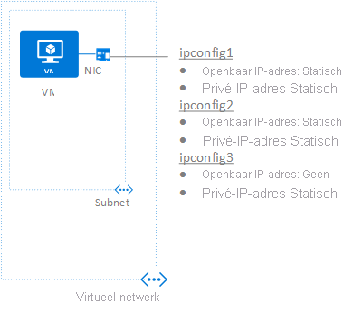

## Scenario
Er wordt een VM met een enkele NIC gemaakt en verbonden met een virtueel netwerk. De VM vereist drie verschillende *privé* IP-adressen en twee *openbare* IP-adressen. De IP-adressen worden toegewezen aan de volgende IP-configuraties:

* **IPConfig-1:** Wijst een *statisch* privé IP-adres toe en een *statisch* openbaar IP-adres.
* **IPConfig-2:** Wijst een *statisch* privé IP-adres toe en een *statisch* openbaar IP-adres.
* **IPConfig-3:** Wijst een *statisch* privé IP-adres toe en geen openbaar IP-adres.
  
    

De IP-configuraties worden gekoppeld aan de NIC wanneer de NIC wordt gemaakt. De NIC wordt gekoppeld aan de VM wanneer de VM wordt gemaakt. De soorten IP-adressen die worden gebruikt voor het scenario dienen ter illustratie. U kunt alle gewenste IP-adressen en toewijzingstypen toewijzen.

> [!NOTE]
> Hoewel u met de stappen in dit alle IP-configuraties toewijst aan een enkele NIC, kunt u ook meerdere IP-configuraties toewijzen aan een NIC in een VM met meerdere NIC's. Voor meer informatie over hoe u een VM met meerdere NIC's maakt, leest u het artikel [Een VM met meerdere NIC's maken](../articles/virtual-machines/windows/multiple-nics.md).