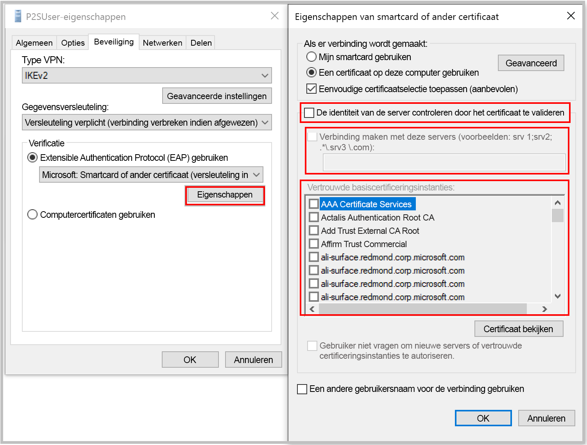

[!INCLUDE [P2S FAQ All](vpn-gateway-faq-p2s-all-include.md)]

### Wat moet ik doen als ik een certificaat krijg dat niet overeenkomt bij het verbinding maken met behulp van certificaat verificatie?

Schakel het selectie vakje **de identiteit van de server controleren door het certificaat te valideren** uit of **Voeg de server-FQDN samen met het certificaat toe** wanneer u een profiel hand matig maakt. U kunt dit doen door **Rasphone** uit te voeren vanaf een opdracht prompt en het profiel te selecteren in de vervolg keuzelijst.

Het overs laan van de validatie van server identiteiten wordt niet aanbevolen in het algemeen, maar met Azure-certificaat authenticatie wordt hetzelfde certificaat gebruikt voor Server validatie in het VPN-tunnelingprotocol (IKEv2/SSTP) en het EAP-protocol. Omdat het server certificaat en de FQDN al door het protocol VPN-tunneling zijn gevalideerd, is het overbodig om het opnieuw te valideren in EAP.

### Kan ik mijn eigen interne PKI-basis certificerings instantie gebruiken voor het genereren van certificaten voor punt-naar-site-connectiviteit?

Ja. Voorheen konen alleen zelfondertekende basiscertificaten worden gebruikt. U kunt nog steeds 20 basiscertificaten uploaden.

### Kan ik certificaten van Azure Key Vault gebruiken?

Nee.

### Welke hulpprogramma's kan ik gebruiken om certificaten te maken?

U kunt uw Enterprise PKI-oplossing (uw interne PKI), Azure PowerShell, MakeCert en OpenSSL gebruiken.

### Zijn er instructies voor het instellen van het certificaat en de parameters?

* **Interne PKI/Enterprise PKI-oplossing:** zie de stappen om [certificaten te genereren](../articles/vpn-gateway/vpn-gateway-howto-point-to-site-resource-manager-portal.md#generatecert).

* **Azure PowerShell:** zie het [Azure PowerShell](../articles/vpn-gateway/vpn-gateway-certificates-point-to-site.md)-artikel voor een stappenplan.

* **MakeCert:** zie het [MakeCert](../articles/vpn-gateway/vpn-gateway-certificates-point-to-site-makecert.md)-artikel voor een stappenplan.

* **OpenSSL:** 

    * Bij het exporteren van certificaten, moet u het basiscertificaat naar Base64 converteren.

    * Voor het clientcertificaat:

      * Bij het maken van de persoonlijke sleutel, moet u de lengte 4096 opgeven.
      * Bij het maken van het certificaat moet u voor de paramter *-extensies* de waarde *usr_cert* opgeven.
